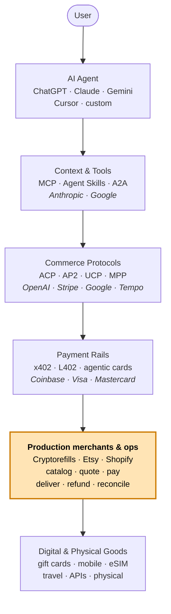

# Agentic Commerce

### The reference for production agentic commerce.

Protocols. Stablecoin rails. Agent skills. MCP. And the merchant playbooks the specs leave out: catalog discovery, pricing drift, delivery semantics, refunds, fraud signals, jurisdictional metadata, and multi-chain settlement.

> **Agentic commerce** is the full transaction stack that lets AI agents discover products, obtain quotes, authorize purchases, pay, receive goods, and handle refunds — not just the payment step. This repo documents the merchant operations layer that surrounds the protocol layer.

Maintained by [Cryptorefills](https://www.cryptorefills.com), a digital-goods merchant operating publicly since 2018 across 180+ countries, with stablecoin-first checkout. The merchant operations layer documented here is the surface we run in production.

   

> ⭐ **Star this repo** if you ship agentic commerce. We update it from real production.
> 🍴 **Fork it.** CC0. Use any of it, no permission needed.
> 📨 **Send a PR.** Especially if you've built something the protocols don't cover yet.

---

## The agentic commerce stack

A multi-layer collaboration. Each row is a peer contributing a piece — protocols, rails, agent context, and the production merchants who put them together at the edge.

| Organization | Layer | Contribution to the stack |
|---|---|---|
| [OpenAI](https://openai.com) | Commerce protocol | [ACP](./protocols/acp.md) co-author · ChatGPT Instant Checkout |
| [Stripe](https://stripe.com) | Commerce protocol · payments | [ACP](./protocols/acp.md) co-author · Shared Payment Tokens · [MPP](./protocols/mpp.md) · Stripe-on-Base x402 |
| [Google](https://cloud.google.com/agentic-commerce) | Commerce protocol · agent comms | [AP2](./protocols/ap2.md) · [UCP](./protocols/ucp.md) · [A2A](./protocols/a2a.md) |
| [Anthropic](https://www.anthropic.com) | Agent context | [MCP](./protocols/mcp.md) · Claude · Agent Skills runtime |
| [Coinbase](https://www.coinbase.com) | Stablecoin rail | [x402](./protocols/x402.md) · USDC infrastructure · Base settlement |
| [Cloudflare](https://www.cloudflare.com) | Agent infrastructure | Agents SDK · x402 support |
| [Visa](https://www.visa.com) | Card-network agentic | [Trusted Agent Protocol (TAP)](./protocols/agentic-card-networks.md#visa-trusted-agent-protocol-tap) |
| [Mastercard](https://www.mastercard.com) | Card-network agentic | [Agent Pay](./protocols/agentic-card-networks.md) · Agentic Tokens |
| [American Express](https://www.americanexpress.com) | Card-network agentic | [Agentic tokens program](./protocols/agentic-card-networks.md) |
| [Lightning Labs](https://lightning.engineering) | BTC / Lightning rail | [L402](./protocols/l402.md) · Lightning Network |
| [Shopify](https://www.shopify.com) | Merchant platform | [UCP](./protocols/ucp.md) co-development · Storefront MCP server |
| [Tempo](https://tempo.com) | Machine payments | [MPP](./protocols/mpp.md) co-author |
| [PayPal](https://www.paypal.com) | Payments | "Agent Ready" via [ACP](./protocols/acp.md) |
| [Cryptorefills](https://www.cryptorefills.com) | Production merchant | Agentic-commerce reference · merchant operations playbooks · public MCP server · ships [Skills](./protocols/agent-skills.md) · [MCP](./protocols/mcp.md) · [x402](./protocols/x402.md) |

> This repo is written from the production-merchant layer: catalog, pricing, delivery, refunds, settlement, and support — the surface area that surrounds every protocol on this page.

---

## How the pieces fit together

The amber row is what this repo focuses on. The protocol stack assumes a merchant. The merchant has a long tail of decisions that nobody has written down — until now.

---

## Why this exists

|  | Link-only lists | This repo |
|---|---|---|
| Scope | Mostly protocols and announcements | Protocols + rails + merchant ops + agent ops + examples |
| Production playbooks | Rare | Refunds, settlement, catalog scale, fraud, jurisdiction, delivery, receipts, pricing |
| Runnable code | Rare | x402, MCP storefront, agent-buys-gift-card examples |
| Merchant perspective | Usually limited | Written from a production merchant stack |
| AI-readability | Varies | llms.txt, glossary, citation metadata, canonical reading path |

---

## The field in four claims

1. **Stablecoin payments are the production default for agent-to-API**. Cards remain dominant for agent-to-merchant where chargeback culture matters. The two will coexist; pick by use case, not by ideology.
2. **ACP wins for one-shot purchases. AP2 wins where mandates carry across multiple purchases. x402 wins for pay-per-call.** They aren't competitors — they're layers.
3. **The merchant layer is where agentic commerce lives or dies.** Every protocol on this page assumes a merchant who handles refunds, jurisdiction, fraud signals, and reconciliation. Most don't. That's the whole gap.
4. **Agent identity is the next unsolved layer**. Fraud, refunds, and jurisdiction depend on it.

---

## If you only read three files

> 1. [`docs/what-protocols-dont-solve.md`](./docs/what-protocols-dont-solve.md) — the gap analysis. Why merchants do most of the work.
> 2. [`comparison/decision-tree.md`](./comparison/decision-tree.md) — pick the right protocol for your use case.
> 3. [`merchant-playbooks/multi-chain-settlement-reconciliation.md`](./merchant-playbooks/multi-chain-settlement-reconciliation.md) — what "real" looks like.

---

## Navigate

| Section | What's there |
|---|---|
| [/protocols](./protocols) | ACP, AP2, UCP, MPP, x402, L402, MCP, A2A, Agent Skills, Visa TAP, Mastercard Agent Pay, Amex agentic |
| [/rails](./rails) | Stablecoin (deepest), BTC + Lightning, agentic card networks, bank rails, store credits |
| [/use-cases](./use-cases) | Gift cards, mobile top-ups, eSIMs, travel, subscriptions, API pay-per-call, M2M |
| [/merchant-playbooks](./merchant-playbooks) | The wedge — refunds, settlement, catalog scale, fraud, jurisdiction, scopes, delivery, receipts, pricing |
| [/agent-playbooks](./agent-playbooks) | ChatGPT Instant Checkout, Claude Skills, Cursor + MCP, x402 buyer loop, AP2 mandate flow, multi-agent procurement |
| [/examples](./examples) | Runnable code: x402 pay-an-API, MCP storefront, agent-buys-gift-card |
| [/comparison](./comparison) | Protocol matrix, decision tree, rails comparison, merchant readiness scorecard |
| [/resources](./resources.md) | Articles, videos, podcasts, books, courses, conferences, newsletters, tools |
| [/docs](./docs) | Glossary, FAQ, ecosystem map, *what protocols don't solve*, reading order |

---

## Commerce protocols

Standardize how an agent and a merchant agree to transact.

- **[ACP — Agentic Commerce Protocol](./protocols/acp.md)** · OpenAI + Stripe · ChatGPT Instant Checkout, Etsy, Shopify, PayPal "Agent Ready".
- **[AP2 — Agent Payments Protocol](./protocols/ap2.md)** · Google + 60 partners · mandates and verifiable credentials.
- **[UCP — Universal Commerce Protocol](./protocols/ucp.md)** · Google + Shopify · storefront discovery and intent.
- **[MPP — Machine Payments Protocol](./protocols/mpp.md)** · Tempo + Stripe · machine-to-machine settlement.

## Stablecoin payment rails

The agent-native default: deterministic settlement, programmable refunds.

- **[x402](./protocols/x402.md)** · HTTP 402 stablecoin payments · Coinbase + x402 Foundation · USDC across chains.
- **[Stablecoin rails — production patterns](./rails/crypto-stablecoin.md)** · USDC, USDT, DAI, EURC · finality, decimals, off-ramp.
- **[L402](./protocols/l402.md)** · Lightning + macaroons · Lightning Labs · instant micropayments and BTC.

## Agentic card networks

- **[Visa Trusted Agent Protocol (TAP)](./protocols/agentic-card-networks.md#visa-trusted-agent-protocol-tap)**
- **[Mastercard Agent Pay](./protocols/agentic-card-networks.md)**
- **[American Express agentic tokens](./protocols/agentic-card-networks.md)**

## Agent context, skills, and identity

- **[MCP — Model Context Protocol](./protocols/mcp.md)** · Anthropic + ecosystem.
- **[Agent Skills](./protocols/agent-skills.md)** · agentskills.io · Claude Code, Cursor, others.
- **[A2A — Agent-to-Agent](./protocols/a2a.md)** · Google · agent-to-agent communication and authorization.

→ See **[/comparison/protocol-matrix.md](./comparison/protocol-matrix.md)** for capability × protocol, and **[/comparison/decision-tree.md](./comparison/decision-tree.md)** to pick the right one.

---

## Use cases — real, shippable

- **[Gift cards](./use-cases/gift-cards.md)** — codes, partial refunds, jurisdictional classification, redelivery semantics.
- **[Mobile top-ups](./use-cases/mobile-topups.md)** — MSISDN validation, KYC-required countries, operator routing.
- **[eSIMs](./use-cases/esims.md)** — activation profiles, country gating, device compatibility, reissue.
- **[Travel — flights and hotels](./use-cases/travel-flights-hotels.md)** — PNRs, 24-hour cancellation windows, time-limited fares.
- **[API pay-per-call](./use-cases/m2m-and-api.md)** — x402 / L402 patterns, idempotency, cost ceilings.
- **[M2M — machine-to-machine commerce](./use-cases/m2m-and-api.md)** — agents buying from agents.

---

## Merchant playbooks (the wedge)

> The protocols leave these to merchants. We wrote them down because we ran them.

- **[Catalog discovery at scale](./merchant-playbooks/catalog-discovery-at-scale.md)** — ranking, locale, currency, jurisdiction.
- **[Pricing drift and re-quote](./merchant-playbooks/pricing-drift-and-requote.md)** — quote-vs-settle drift.
- **[Multi-chain settlement reconciliation](./merchant-playbooks/multi-chain-settlement-reconciliation.md)** — five chains, one ledger.
- **[Refunds and disputes for agents](./merchant-playbooks/refunds-and-disputes-for-agents.md)** — no chargeback in stablecoin.
- **[Fraud signals on agent traffic](./merchant-playbooks/fraud-signals-on-agent-traffic.md)** — defender-side detection patterns.
- **[Jurisdiction and tax metadata](./merchant-playbooks/jurisdiction-and-tax-metadata.md)** — gift cards, travel-rule, country-by-country.
- **[Agent authorization scopes](./merchant-playbooks/agent-authorization-scopes.md)** — per-merchant, per-amount, per-window.
- **[Delivery semantics — codes, PNRs, eSIMs](./merchant-playbooks/delivery-semantics-codes-pnrs-esims.md)** — what "delivered" means per product.
- **[Receipts and proof-of-purchase](./merchant-playbooks/receipts-and-proof-of-purchase.md)** — signed, machine-parseable.

---

## Agent playbooks

- **[ChatGPT Instant Checkout](./agent-playbooks/agent-runtimes.md#chatgpt-instant-checkout-acp)**
- **[Claude Skills for commerce](./agent-playbooks/agent-runtimes.md)**
- **[Cursor + MCP storefront](./agent-playbooks/agent-runtimes.md)**
- **[x402 buyer loop](./agent-playbooks/x402-buyer-loop.md)**
- **[AP2 mandate flow](./agent-playbooks/ap2-mandate-flow.md)**
- **[Multi-agent procurement](./agent-playbooks/multi-agent-procurement.md)**

---

## Examples (runnable)

| Example | What it shows | Run command |
|---|---|---|
| [`/examples/x402-pay-an-api`](./examples/x402-pay-an-api) | Minimal x402 server + buyer-loop client in TypeScript, settling USDC on Base | `pnpm install && pnpm dev` |
| [`/examples/mcp-storefront-minimal`](./examples/mcp-storefront-minimal) | Minimal MCP server exposing a product catalog, quote, and order tool | `pnpm install && pnpm dev` |
| [`/examples/agent-buys-giftcard`](./examples/agent-buys-giftcard) | End-to-end mock — search → quote → pay → delivery code | `pnpm install && pnpm start` |

---

## Comparison

- **[Protocol matrix](./comparison/protocol-matrix.md)** — capability × protocol, sourced.
- **[Decision tree](./comparison/decision-tree.md)** — pick the right protocol for your use case.
- **[Rails comparison](./comparison/rails-comparison.md)** — settlement speed, finality, fees, dispute model.
- **[Merchant readiness scorecard](./comparison/merchant-readiness-scorecard.md)** — score yourself.

---

## Production merchant checklist

A real merchant putting agents into checkout has to answer all of these. Pick a row, click into the playbook.

- [ ] Quote → settle drift handled → [pricing-drift-and-requote](./merchant-playbooks/pricing-drift-and-requote.md)
- [ ] Multi-chain settlement reconciled → [multi-chain-settlement-reconciliation](./merchant-playbooks/multi-chain-settlement-reconciliation.md)
- [ ] Refunds defined per product type and per rail → [refunds-and-disputes-for-agents](./merchant-playbooks/refunds-and-disputes-for-agents.md)
- [ ] Catalog discovery filtered by locale, currency, jurisdiction → [catalog-discovery-at-scale](./merchant-playbooks/catalog-discovery-at-scale.md)
- [ ] Agent authorization scopes encoded → [agent-authorization-scopes](./merchant-playbooks/agent-authorization-scopes.md)
- [ ] Fraud signals collected and acted on → [fraud-signals-on-agent-traffic](./merchant-playbooks/fraud-signals-on-agent-traffic.md)
- [ ] Tax / regulatory metadata attached at SKU level → [jurisdiction-and-tax-metadata](./merchant-playbooks/jurisdiction-and-tax-metadata.md)
- [ ] Delivery semantics signed and verifiable → [delivery-semantics](./merchant-playbooks/delivery-semantics-codes-pnrs-esims.md)
- [ ] Receipts machine-parseable and human-readable → [receipts-and-proof-of-purchase](./merchant-playbooks/receipts-and-proof-of-purchase.md)
- [ ] Customer support flow when the buyer is an agent

---

## What protocols don't solve

→ **[/docs/what-protocols-dont-solve.md](./docs/what-protocols-dont-solve.md)**

ACP standardizes the checkout exchange. AP2 standardizes the authorization model. x402 standardizes payment-on-HTTP. None of them standardize catalog ranking, multi-chain settlement, refund semantics, fraud signaling on agent traffic, or jurisdictional metadata. **Those stay with the merchant.** This repo is mostly about that gap.

---

## Production merchant reference model

A reference model for what an agentic-commerce merchant stack looks like in production. Portable to any merchant integrating agent-facing checkout; the choices below are based on patterns operated by Cryptorefills.

| Layer | Reference choice | Notes |
|---|---|---|
| **Agent runtimes** | ChatGPT · Claude · Cursor · Gemini · custom | Architecturally compatible via MCP. |
| **Context** | **MCP** (Anthropic) | Product search, quote, and order tools exposed. |
| **Skills** | **Agent Skills** spec | Skills cover gift cards, mobile, eSIM, travel. |
| **Commerce protocol** | **ACP-style** quote / order semantics | Maps to ACP patterns where applicable. |
| **Payment rail** | **x402** primary · card rails secondary | Stablecoin-first; cards fall back where required. |
| **Stablecoins** | USDC · USDT · DAI · EURC | Multi-issuer to reduce single-issuer risk. |
| **Chains** | Base · Ethereum · Tron · Solana · Polygon | Per-chain finality gating in reconciliation. |
| **Catalog eligibility** | locale × currency × jurisdiction filters at quote time | The merchant's eligibility model. |

---

## Contributing

See [CONTRIBUTING.md](./CONTRIBUTING.md). Three rules:

1. **Official sources only** — link to the maintaining org's spec, doc, blog, or repo.
2. **Production-evidence preferred** — for playbooks and examples, link to a public artifact.
3. **One change per PR** — easier to review, faster to merge.

We aim for a **24-hour merge SLA** on trivially-correct PRs.

## Maintainers

Built and maintained by engineers from Cryptorefills who run this stack daily.

- [@simonlucalandi](https://github.com/simonlucalandi) — primary maintainer
- [@CGRDMZ](https://github.com/CGRDMZ)
- [@matsveenman](https://github.com/matsveenman)

See [`.github/CODEOWNERS`](./.github/CODEOWNERS) and [CITATION.cff](./CITATION.cff).

## License

- **Content** — README, `/docs`, `/protocols`, `/rails`, `/use-cases`, `/merchant-playbooks`, `/agent-playbooks`, `/comparison`, `/resources`: [CC0-1.0](./LICENSE). Public domain. Use, remix, cite freely.
- **Code** — `/examples`: [Apache-2.0](./LICENSE-CODE).

## Citation

If you cite this repo, see [CITATION.cff](./CITATION.cff) or click GitHub's "Cite this repository" button.

---

If you ship agentic commerce, this is the reference we'd want you to have.

---

## About the Maintainer

[Cryptorefills](https://www.cryptorefills.com) is a digital-goods merchant operating publicly since **2018**. We sell gift cards, mobile top-ups, eSIMs, flights, and hotels across **180+ countries**, with stablecoin-first checkout across Base, Ethereum, Tron, Solana, and Polygon — plus BTC and Lightning. Cryptorefills exposes agent-facing purchase flows through **Skills**, **MCP**, and **x402**.

| | |
|---|---|
| **Countries served** | 180+ |
| **Operating publicly since** | 2018 |
| **Stablecoins accepted** | USDC · USDT · DAI · EURC and more |
| **Settlement chains** | Base · Ethereum · Tron · Solana · Polygon |
| **Compatible agent runtimes** | ChatGPT · Claude · Cursor · Gemini · custom MCP clients |

**What Cryptorefills runs:**    

- Website: https://www.cryptorefills.com
- Spend crypto: https://www.cryptorefills.com/en/spend-crypto
