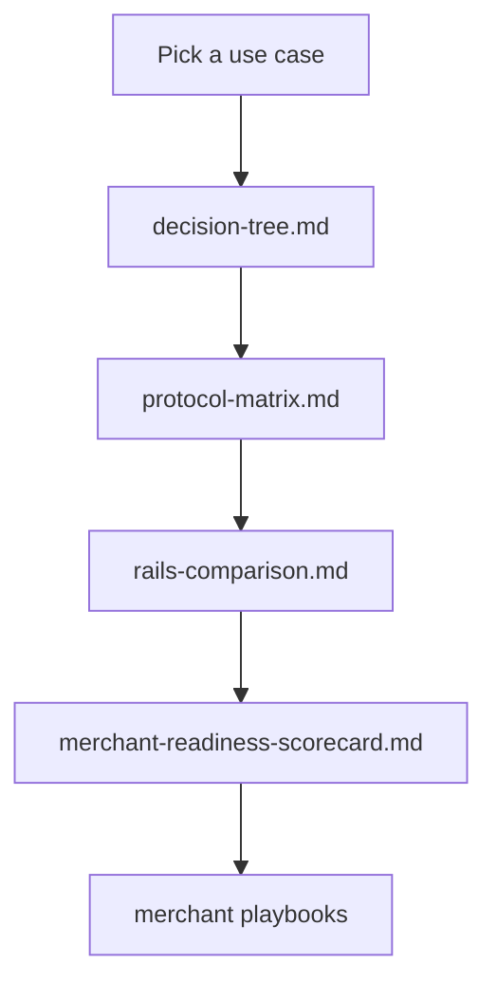

# Comparison

Side-by-side, sourced comparison artifacts for the agentic commerce stack. Use these when picking a protocol, evaluating a settlement rail, or assessing your own merchant readiness.

These pages are deliberately neutral: each non-obvious claim is footnoted to a primary source (a spec, a maintainer doc, or a public announcement). When two protocols overlap, we mark the overlap rather than picking a winner. When a capability is genuinely out of scope, we say so.

## Artifacts

| File | What it answers |
|---|---|
| [protocol-matrix.md](./protocol-matrix.md) | Capability × protocol grid — which protocols cover checkout, authorization, agent identity, recurring mandates, refund support, settlement currency, jurisdictional metadata, and disputes. |
| [decision-tree.md](./decision-tree.md) | "Which protocol should I use?" Prose plus Mermaid flowchart, branched by use case (pay-per-call, agent-led one-shot purchase, mandated agent, agent context, agent-to-agent). |
| [rails-comparison.md](./rails-comparison.md) | Settlement rails side-by-side — speed, finality, fees, dispute model, developer experience. Covers stablecoins (USDC/USDT/DAI/EURC), BTC on-chain and Lightning, agentic card rails, and bank rails (SEPA/ACH/FedNow). |
| [merchant-readiness-scorecard.md](./merchant-readiness-scorecard.md) | ~20 yes/no self-assessment questions across catalog, pricing, settlement, refunds, fraud, jurisdiction, authorization, delivery, receipts, and support. Score interpretation included. |

## How to read these

Start with the decision tree if you do not yet know which protocol applies. Move to the matrix to confirm the protocol covers the capabilities you need. Move to the rails comparison once you know which payment rails the protocol can ride. Run the scorecard last to find the merchant-side gaps the protocol will not solve for you.

## Methodology

- **Sources.** Each non-obvious claim cites the maintaining organization's spec, doc, or public announcement. Vendor blog posts are used only where they document behavior the spec does not.
- **Status as of April 2026.** Protocols evolve quickly; expect drift. PRs welcome — see [CONTRIBUTING.md](../CONTRIBUTING.md).
- **Defender framing on risk.** Risk callouts focus on what a merchant or agent operator should plan for, not on speculative attacks.
- **No marketing language.** No "best", no "leading", no superlatives without a citation.

## What we do not compare here

- Pricing of hosted services (Stripe fees, Coinbase fees, etc.) — too volatile for a static doc.
- Closed pilots without public documentation.
- Forks or vendor-specific extensions that have not been adopted upstream.

If you spot a missing comparison or an outdated cell, open an issue or PR.
