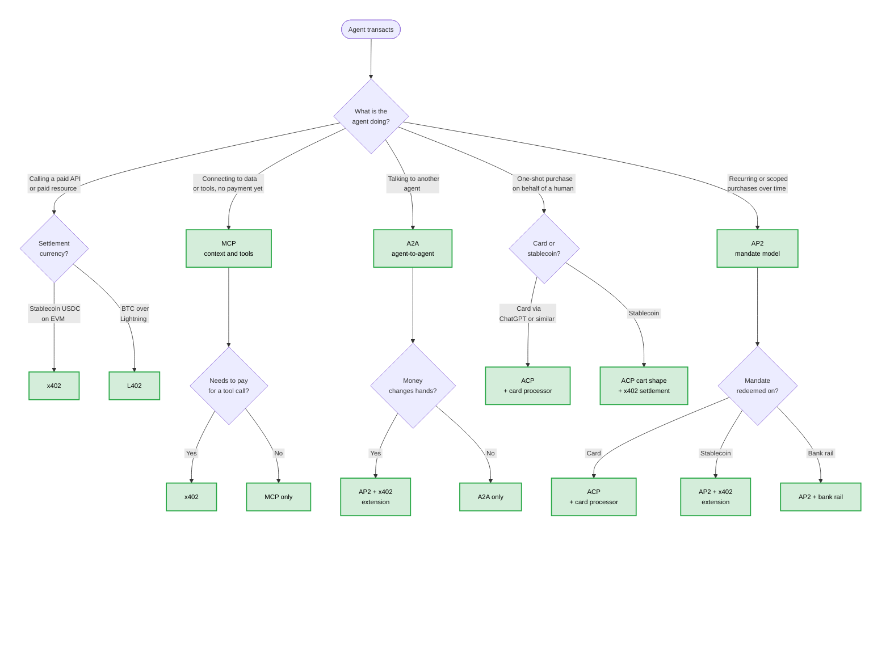

# Decision Tree — Pick the Right Protocol

You are building something where an AI agent transacts. There are nine or ten protocols in the air, and most of them solve different problems. This page narrows it down.

The short version: **what is the agent doing, and on whose behalf?** Five answers cover almost every real case.

## Flowchart

## Branch 1 — Pay-per-call API or paid resource

**Use case.** An agent calls an API that costs money. Examples: a search API priced per query, a model inference endpoint, a paid MCP tool, a metered data feed.

**Pick.** [x402](../protocols/x402.md) for stablecoin settlement (USDC on Base is the most common deployment in 2026). [L402](../protocols/l402.md) for BTC-over-Lightning, especially for sub-cent micropayments.

**Why x402 over L402 in most cases.** x402 rides on EVM stablecoins, which most merchants and agents already hold and reconcile. L402 wins when you genuinely need Lightning's micropayment economics or BTC settlement.

**Defender note.** Both protocols are per-request — set a per-task budget on the agent so a runaway loop cannot drain the wallet. Wallet-level allowance caps are not a substitute for application-level budgets.

## Branch 2 — One-shot purchase on behalf of a human

**Use case.** A human asks the agent to buy something specific. The agent quotes, the human approves explicitly or via a pre-set authorization, the agent transacts.

**Pick.**
- **Card path** — [ACP](../protocols/acp.md) paired with a card processor (Stripe and compatible). This is what ChatGPT Instant Checkout uses.
- **Stablecoin path** — ACP-shaped cart and quoting, settled with [x402](../protocols/x402.md) instead of a card. The cart and finalize semantics still help; the wire money is on-chain.

**Why ACP for the cart shape.** ACP standardizes line items, taxes, shipping, finalize, capture — the exchange every merchant has to support. Even if you settle in USDC, sharing ACP's cart shape makes you discoverable to ACP-aware agents.

**Defender note.** A Shared Payment Token is single-merchant, single-cart by design — that scope is a feature, not a limitation. Do not extend SPTs into multi-merchant or multi-cart use; that is what AP2 mandates exist for.

## Branch 3 — Mandated agent (recurring or scoped, multi-transaction)

**Use case.** "Buy me coffee every weekday morning under $7." "Subscribe to this service and renew up to $50/month." "Top up this number every time it goes below 5 GB." The agent acts under a delegated, scoped, possibly time-bound authorization.

**Pick.** [AP2](../protocols/ap2.md). Mandates are AP2's core primitive — a scoped, signed authorization that can be redeemed across rails.

**Sub-branch — what rail does the mandate redeem on?**
- Card → AP2 → card processor.
- Stablecoin → AP2 + x402 extension.
- Bank rail → AP2 + SEPA/ACH/FedNow integration (where supported).

**Defender note.** Mandate scope is the load-bearing primitive. Pin merchant, amount ceiling, time window, and product category as tightly as the use case allows. Audit-log every redemption. Rotate verifiable credentials on a schedule.

## Branch 4 — Agent context and tools (no payment yet)

**Use case.** You want an agent to read your data, call your APIs, or use your services. There may be money later, but right now the question is "how does the agent talk to my system?"

**Pick.** [MCP](../protocols/mcp.md). It is the standard for exposing tools, resources, and prompts to a model.

**If a tool call needs to be paid.** Layer x402 on top — the MCP tool can return an HTTP 402 with x402 headers, and the agent's wallet handles the payment. See the [`agent-payment-x402`](../protocols/x402.md) patterns.

**Defender note.** MCP is a connection layer, not a commerce protocol. Asking MCP about refunds, mandates, or jurisdictional rules is a category error. Use the right tool for the right layer.

## Branch 5 — Agent-to-agent (A2A)

**Use case.** Two autonomous agents negotiate or transact. A travel-agent agent talks to an airline-agent agent. A procurement agent talks to a supplier agent.

**Pick.** [A2A](../protocols/a2a.md) for the conversation. AP2 + x402 (or another AP2-supported rail) for the actual money movement, since A2A itself is not a payment protocol.

**Defender note.** Agent-to-agent flows compound the trust problem. Both agents need verifiable identities, both mandates need to be auditable end-to-end, and the transcript needs to be replayable for dispute resolution. Do not deploy A2A commerce without a clear post-incident investigation path.

## Common mistakes

- **Picking ACP when you mean AP2.** ACP is a cart-and-checkout protocol. AP2 is an authorization protocol. They compose; they do not substitute.
- **Picking MCP when you mean ACP.** An MCP server can sell things, but the commerce semantics live in ACP (or a merchant-defined equivalent). MCP is plumbing.
- **Picking x402 when you mean L402.** Both settle on-chain, but the rails are different. Choose by what your wallet and your reconciliation can already handle.
- **Treating "agent" as monolithic.** A pay-per-call agent, a personal-shopper agent, and a procurement agent need different protocols. Decompose.

## See also

- [protocol-matrix.md](./protocol-matrix.md) — capability × protocol grid.
- [rails-comparison.md](./rails-comparison.md) — settlement rails side-by-side.
- [merchant-readiness-scorecard.md](./merchant-readiness-scorecard.md) — what the protocol will not solve for you.
