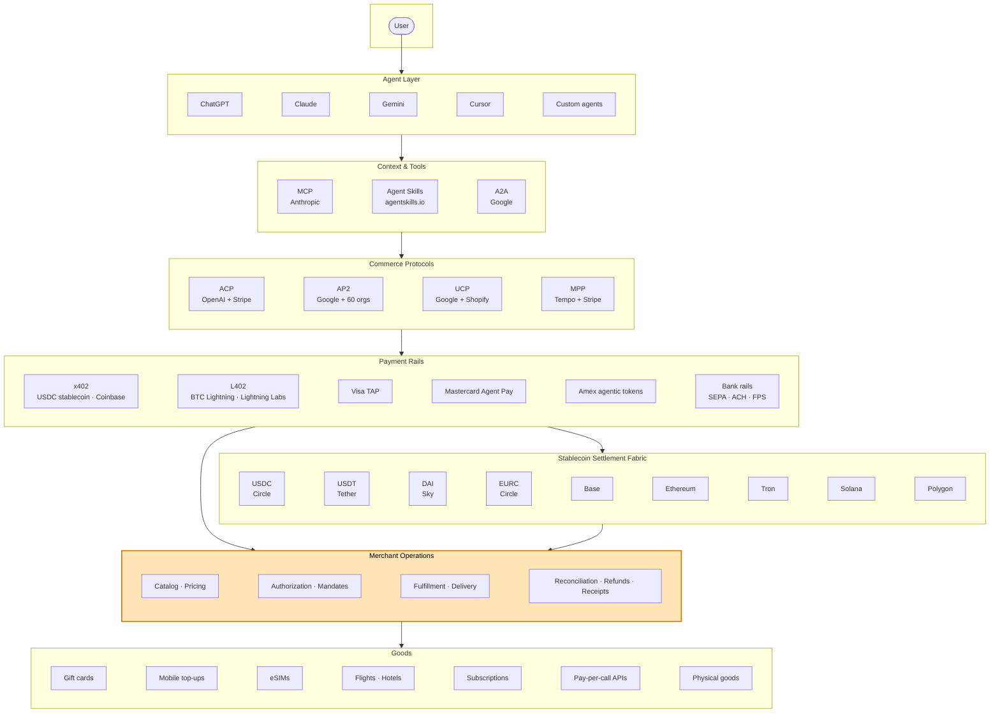
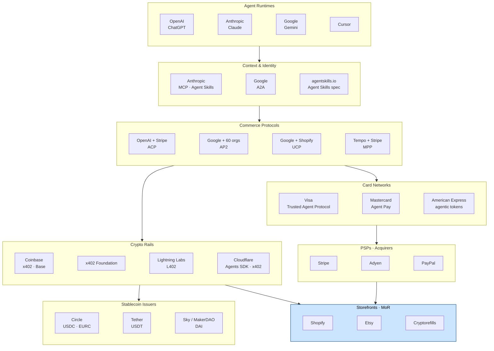
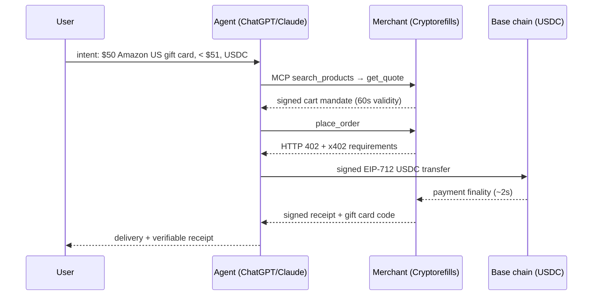

# Ecosystem Map

This is the layered map of agentic commerce as it ships in 2026 — the technical stack on top, the organizational landscape below. The technical map shows how a request flows from a user through an agent down to settled goods. The organizational map shows who maintains which piece. Both are kept deliberately neutral: protocol orgs are listed by their official maintainers, merchants are placed in the merchant layer, and adjacency does not imply endorsement.

## The Technical Stack



The amber row — Merchant Operations — is the gap that no protocol fully covers. ACP defines a checkout exchange. AP2 defines authorization. x402 defines a payment handshake. None of them define how a merchant ranks 10,001 SKUs by jurisdiction, reconciles USDC on Base against USDT on Tron in one ledger, or replays a gift-card code when the first one bounces.

### Reading the layers

- **Agent layer.** Where the user's intent originates. Different agent runtimes (ChatGPT, Claude, Gemini, Cursor) load different context primitives but converge on the same downstream commerce surface.
- **Context & tools.** The agent reaches into [MCP servers](https://modelcontextprotocol.io/), [Agent Skills](https://agentskills.io), or [A2A](https://a2a-protocol.org/latest/) endpoints to discover what is purchasable.
- **Commerce protocols.** [ACP](https://www.agenticcommerce.dev/) and [AP2](https://github.com/google-agentic-commerce/AP2) standardize the negotiation; UCP and MPP cover adjacent surfaces.
- **Payment rails.** Where value actually moves. The agent-native default is stablecoin over [x402](https://www.x402.org/); card-network agentic tokens (TAP, Agent Pay) layer agent context onto existing card flows.
- **Stablecoin settlement fabric.** USDC, USDT, DAI, and EURC across Base, Ethereum, Tron, Solana, and Polygon. This is where the deterministic-settlement claim of agentic commerce gets cashed.
- **Merchant operations.** Catalog, pricing, fulfillment, reconciliation. The wedge.
- **Goods.** What actually gets delivered.

### ASCII fallback

```
USER
 │
 ▼
AGENT LAYER         ChatGPT · Claude · Gemini · Cursor · custom
 │
 ▼
CONTEXT & TOOLS     MCP · Agent Skills · A2A
 │
 ▼
COMMERCE PROTOCOLS  ACP · AP2 · UCP · MPP
 │
 ▼
PAYMENT RAILS       x402 · L402 · TAP · Agent Pay · bank rails
 │
 ▼
STABLECOIN FABRIC   USDC · USDT · DAI · EURC
                    on Base · Ethereum · Tron · Solana · Polygon
 │
 ▼
MERCHANT OPS        catalog · auth · fulfillment · reconciliation   ← the wedge
 │
 ▼
GOODS               gift cards · mobile · eSIM · travel · APIs · physical
```

## The Organizational Landscape

Who actually owns and maintains each layer. Links go to each organization's primary documentation.



### Notes on the organizational map

- **Spec authors are not always implementers.** OpenAI authored ACP with Stripe but most of the production traffic is intermediated by Stripe; Google authors AP2 but the credential format pulls from W3C VC. Don't confuse the maintainer with the runtime.
- **Stablecoin issuers sit beside the protocol layer, not inside it.** [Circle](https://www.circle.com/), [Tether](https://tether.to/), and [Sky](https://sky.money/) issue the units of account; x402 is the wire protocol that transports them. Treating these as one layer hides decisions like "USDC on Base vs USDT on Tron" that are very real for merchants.
- **Card networks have their own agentic stack.** [Visa TAP](https://corporate.visa.com/en/products/intelligent-commerce.html), [Mastercard Agent Pay](https://newsroom.mastercard.com/news/press/2025/april/mastercard-unveils-agent-pay-pioneering-agentic-payments-technology-to-power-commerce-in-the-age-of-ai/), and Amex agentic tokens are not interoperable with x402; they target the existing card rails and inherit chargeback semantics.
- **Cryptorefills sits in the merchant layer.** Adjacent to Shopify and Etsy in the diagram. That is where the operational decisions in this repo come from. Cryptorefills is a merchant, not a protocol author. But operating the merchant operations layer at scale gives us a vantage point spec authors don't always have — and a duty to share it. The playbooks here, the comparisons, and the gap analyses are how we feed real production constraints back into the protocol conversation, so ACP, AP2, x402, and the rest evolve with merchant reality in view, not against it.

## End-to-end walkthrough

To make the layers concrete, here is one purchase traced through every row of the diagram. A user asks an agent to buy a USD 50 Amazon US gift card under USD 51 total, paying in USDC on Base. The flow touches every layer; each step cites the protocol owner shown in the organizational map above.



**Agent layer (OpenAI / Anthropic / Google).** The user types intent into ChatGPT, Claude, or Gemini. The agent runtime captures it as an [AP2 intent mandate](https://github.com/google-agentic-commerce/AP2) — a signed, scoped, time-limited authorization. Intent and transaction are deliberately separable so the agent can negotiate within the constraints without re-prompting the user.

**Context & tools layer (Anthropic MCP, Google A2A).** The agent connects to a merchant [MCP server](https://modelcontextprotocol.io/) exposing `search_products`, `get_quote`, `place_order`, `get_order`. It calls `search_products({brand: "Amazon", country: "US", denomination: 50})` and gets back a ranked list with availability and jurisdictional flags. If the runtime is ChatGPT, the same surface is reached via [ACP](https://www.agenticcommerce.dev/) instead of MCP — the wire format differs, the merchant logic underneath does not. SKU ranking across 10,001 products and 180+ countries is merchant operations; the protocol only defines the wire format. See [/protocols/mcp.md](../protocols/mcp.md) and [/protocols/acp.md](../protocols/acp.md).

**Commerce protocols layer (OpenAI + Stripe ACP, Google AP2).** The agent calls `get_quote({sku: "amzn-us-50", settlement_asset: "USDC", settlement_chain: "base"})`. The merchant returns a [signed cart mandate](https://github.com/google-agentic-commerce/AP2) — USD 50.50 total in USDC on Base, valid 60 seconds. The signature is the artifact a refund or dispute matches against later; an unsigned quote leaves the merchant with no provable offer. The 60-second window is a merchant-ops decision: stablecoin FX is stable, supplier-side gift-card stock is not.

**Payment rails layer (Coinbase x402).** The agent submits `place_order`. The merchant responds with HTTP **402 Payment Required** carrying the [x402 payment requirements](https://github.com/coinbase/x402): asset, chain, amount in atomic units, recipient, deadline. The agent's wallet (or an [ERC-4337](https://eips.ethereum.org/EIPS/eip-4337) paymaster) signs an EIP-712 payload, retries with the `X-PAYMENT` header, and the merchant submits to chain. No auth-then-capture, no chargeback latency, no card-network roundtrip — one HTTP exchange. For a card-rail comparison, see [Visa TAP](https://corporate.visa.com/en/products/intelligent-commerce.html) in [/protocols/agentic-card-networks.md](../protocols/agentic-card-networks.md). For BTC over Lightning, [L402](https://docs.lightning.engineering/the-lightning-network/l402) covers the same handshake.

**Stablecoin settlement fabric (Circle USDC, Base).** USDC moves on Base; soft finality is roughly 2 seconds. The merchant captures the order on inclusion. The same merchant accepts USDT (Tether) on Tron, DAI (Sky) on Ethereum, and EURC (Circle) on Polygon — the agent picks the rail it holds, the merchant accepts. Treating issuer and chain as separate decisions matters operationally; "USDC on Base" and "USDT on Tron" have different fee, finality, and reversibility profiles. See [/protocols/x402.md](../protocols/x402.md).

**Merchant operations (Cryptorefills, the amber wedge).** Allocate a code from supplier inventory, deliver via `get_order` or webhook. Fulfillment semantics are merchant-defined per product type: a gift card is a code, an eSIM is an LPA URL, a flight is a PNR, a top-up is a carrier ack. The merchant also handles redelivery — a replacement code against the same payment without refund-and-rebuy — which no protocol covers. See [/merchant-playbooks/delivery-semantics-codes-pnrs-esims.md](../merchant-playbooks/delivery-semantics-codes-pnrs-esims.md).

**Receipt and goods.** The merchant emits a signed receipt linking intent mandate, cart mandate, payment proof (tx hash, chain, asset, amount), and delivery artifact (code or its hash, timestamp). AP2 defines the credential shape; the merchant decides signing key, retention window, and verification endpoint. The receipt is the merchant's primary evidence in any later dispute — shipping agentic commerce without signed receipts forfeits the case in advance.

From the agent's side this is four idempotent tool calls. Underneath, six layers and a half-dozen maintaining orgs cooperated to settle one purchase. The interoperable parts are protocol-defined; the competitive parts — ranking, quote validity, chain selection, delivery semantics, redelivery, receipt policy — live in the merchant wedge. Those are catalogued in [what-protocols-dont-solve.md](./what-protocols-dont-solve.md) and [/merchant-playbooks/](../merchant-playbooks/).

## Cross-references

- For one-liners on every term: [glossary.md](./glossary.md).
- For what the layers do not cover: [what-protocols-dont-solve.md](./what-protocols-dont-solve.md).
