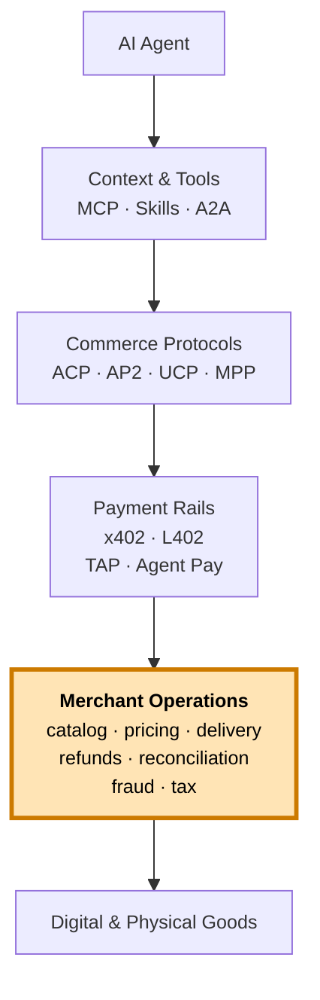

# Merchant Playbooks

> **What protocols leave to merchants. Catalog, quote, pay, deliver, refund, reconcile.**

ACP, AP2, UCP, MPP, x402, and L402 standardize the wire protocol — how an agent and a merchant agree to transact, sign mandates, settle a payment, and acknowledge a receipt. They stop at the merchant's edge. Catalog ranking, FX between quote and settle, multi-chain settlement reconciliation, refund semantics for irreversible rails, fraud signals specific to agent traffic, jurisdictional rules per SKU, delivery semantics for codes and PNRs, scoped authorization beyond a single mandate, and signed receipts that survive the agent's session — none of those are in any spec.

That gap is where merchants lose money. It's also where the actual product lives. Every playbook in this directory is one specific decision a Cryptorefills engineer has had to make in production — the kind of decision that gets re-litigated in a postmortem rather than a design doc, because the protocol said nothing about it.

---

## Where merchant ops sits in the stack

The amber row is this directory. Everything above it is standardized. Everything inside it is a merchant decision and a merchant liability.

---

## The nine playbooks

| Playbook | One-line summary |
|---|---|
| [Catalog discovery at scale](./catalog-discovery-at-scale.md) | Ranking, locale, currency, and jurisdiction filters across thousands of SKUs so an agent's "Amazon $50 US" lands on the right product, not the closest string match. |
| [Pricing drift and re-quote](./pricing-drift-and-requote.md) | Quote-vs-settle drift when stablecoin FX, supplier price, or chain confirmation latency moves under you. TTLs, drift thresholds, and re-quote semantics. |
| [Multi-chain settlement reconciliation](./multi-chain-settlement-reconciliation.md) | USDC on Base + USDT on Tron + DAI on Ethereum + USDC on Solana + USDC on Polygon, normalized into one ledger with finality, decimals, and fees handled per chain. |
| [Refunds and disputes for agents](./refunds-and-disputes-for-agents.md) | There is no chargeback in stablecoin. Build the refund flow yourself — partial, code-redelivery, supplier-failure, agent-initiated. |
| [Fraud signals on agent traffic](./fraud-signals-on-agent-traffic.md) | Velocity, fingerprinting, prompt-injection-driven purchases, agent-vs-human heuristics. What card-network fraud doesn't tell you about agents. |
| [Jurisdiction and tax metadata](./jurisdiction-and-tax-metadata.md) | Gift card vs monetary instrument vs e-money — the same SKU is classified differently across countries. Encode it at the SKU. |
| [Agent authorization scopes](./agent-authorization-scopes.md) | Per-merchant, per-amount, per-window, per-category. AP2 mandates are the wire format; this is the policy model. |
| [Delivery semantics — codes, PNRs, eSIMs](./delivery-semantics-codes-pnrs-esims.md) | "Delivered" means something different for a gift card code, an eSIM activation profile, an MSISDN top-up, a flight PNR. Sign each one. |
| [Receipts and proof-of-purchase](./receipts-and-proof-of-purchase.md) | Cryptographically signed, machine-parseable for the agent, human-readable for the user, durable past the agent's session. |

---

## How to read these

Each playbook follows the same structure:

1. **Problem** — the operational reality, in one paragraph.
2. **Why protocols don't cover this** — explicit naming of ACP, AP2, x402, etc., and what they leave out.
3. **Approach** — concrete decisions with tradeoffs. Schema sketches in JSON or TypeScript pseudo.
4. **Edge cases** — real failure modes, not hypotheticals.
5. **When to use this** / **When NOT to use this** — guardrails for adoption.
6. **References** — official docs from Circle, Tether, Coinbase, Stripe, Chainalysis, and protocol authors.

The framing throughout is **defender-side**. These are decisions a merchant makes to defend against ambiguity, drift, mis-settlement, fraud, and regulatory surprise. Optimizing for the agent's experience is the protocol's job. Surviving the long tail is the merchant's.

---

## Contributing a new playbook

Use [`_template.md`](./_template.md) as the skeleton. Rules:

- One operational decision per playbook. If you find yourself writing two, split them.
- The "Why protocols don't cover this" section is mandatory and must name the specific protocols and what they explicitly defer.
- Schema sketches must be runnable shape — JSON or TypeScript pseudo, 10-30 lines, no marketing diagrams.
- Edge cases must be real failure modes you can cite or describe from production. No hypotheticals.
- "When NOT to use this" is mandatory. Every approach has a domain where it's wrong.
- Reference at least one official source per major claim — Circle for USDC behavior, Tether for USDT, Coinbase for x402, Stripe for ACP, Google for AP2, Chainalysis for chain-analytics, etc.

See [CONTRIBUTING.md](../CONTRIBUTING.md) at the repo root for the full contribution policy.

---

## Why this section exists

Every other public reference for agentic commerce stops at the protocol layer. We started this repo because the same five questions kept coming up in conversations with other merchants, agent teams, and infra vendors:

1. How do we re-quote when USDC/EUR moves between the agent's quote and the chain's confirmation?
2. How do we tell USDC-on-Base from USDC-on-Solana in a single ledger when both arrive in the same minute?
3. How do we refund a gift-card purchase paid in USDT on Tron when the supplier code was already redeemed?
4. How do we tell an agent's stable-IP-but-rotating-card pattern from a customer-using-an-agent pattern?
5. How do we attach jurisdiction metadata to a SKU when the same product is a gift card in one country and a regulated e-money instrument in another?

None of those are in any protocol. All of them are in this directory.
