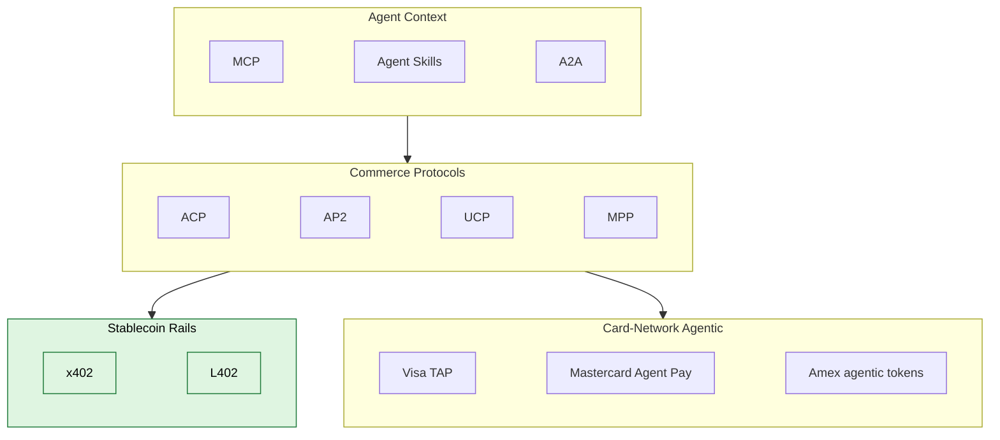

# Protocols

Index of agentic-commerce protocols. One file per protocol. Each page follows the same shape: maintainer, status, what it does, key concepts, how it fits, reference implementations, when to use, when **not** to use, references.

Content is CC0-1.0. Code samples in [`/examples`](../examples) are Apache-2.0.

---

## Layered view

The stablecoin row is highlighted on purpose. Cryptorefills is stablecoin-first: USDC, USDT, DAI, EURC across Base, Ethereum, Tron, Solana, and Polygon. The card-network row is documented for completeness; in production, agent-to-API and agent-to-agent flows route through x402.

---

## What each protocol solves

Skim this first. The grouped tables below add depth and link out to per-protocol pages.

- **ACP** (OpenAI + Stripe) — checkout exchange between agent and merchant
- **AP2** (Google + 60 partners) — verifiable agent mandates and authorization
- **UCP** (Google + Shopify) — storefront discovery and intent
- **MPP** (Tempo + Stripe) — machine-to-machine settlement
- **x402** (Coinbase) — HTTP-native stablecoin payments (USDC on Base)
- **L402** (Lightning Labs) — Bitcoin/Lightning micropayments for APIs
- **MCP** (Anthropic) — tools and resources for agents
- **Agent Skills** (agentskills.io) — packaged agent capabilities
- **A2A** (Google) — agent-to-agent communication
- **Visa TAP / Mastercard Agent Pay / Amex agentic** — card-network identity and authorization for agent purchases

---

## Commerce protocols

How an agent and a merchant agree to transact — cart, quote, checkout, capture.

| Protocol | Maintainer | One-liner |
|---|---|---|
| [ACP](./acp.md) | OpenAI + Stripe | Delegated checkout for agents — Shared Payment Token, merchant feed, live in ChatGPT Instant Checkout. |
| [AP2](./ap2.md) | Google + 60+ partners | Verifiable agent mandates (intent, cart) for payment-agnostic agent transactions. |
| [UCP](./ucp.md) | Google + Shopify | Storefront discovery and intent layer — co-developed on Shopify storefront MCP. |
| [MPP](./mpp.md) | Tempo + Stripe | Machine-to-machine settlement primitives. Spec stage. |

## Stablecoin rails

HTTP-native and Lightning-native crypto payments. The agent-native default for agent-to-API and agent-to-agent flows.

| Protocol | Maintainer | One-liner |
|---|---|---|
| [x402](./x402.md) | Coinbase + x402 Foundation | HTTP 402 stablecoin payments — USDC across Base, Ethereum, Polygon, Solana. V2 Dec 2025; Stripe-on-Base Feb 2026; Cloudflare Agents SDK supported. |
| [L402](./l402.md) | Lightning Labs | Lightning + macaroons (LSAT-derived). BTC-native instant micropayments. Used by Fewsats. |

## Card-network agentic

How card networks underwrite agent purchases and pass agent context to issuers.

| Protocol | Maintainer | One-liner |
|---|---|---|
| [Visa TAP](./agentic-card-networks.md#visa-trusted-agent-protocol-tap) | Visa | Trusted Agent Protocol — agent identity and intent passed to the issuer. |
| [Mastercard Agent Pay](./agentic-card-networks.md) | Mastercard | Agentic tokens with agent-specific authorization rules. |
| [Amex agentic tokens](./agentic-card-networks.md) | American Express | Agent-issued tokens for cardholder-delegated agent purchases. |

## Agent context

How agents acquire tools, capabilities, identity, and the ability to talk to other agents.

| Protocol | Maintainer | One-liner |
|---|---|---|
| [MCP](./mcp.md) | Anthropic + ecosystem | Model Context Protocol — tools and resources for agents. Storefront MCP servers becoming standard. |
| [Agent Skills](./agent-skills.md) | agentskills.io | Packaged, reusable agent capabilities. Adopted by Claude Code, Cursor. |
| [A2A](./a2a.md) | Google | Agent-to-agent communication and authorization. AP2 extends A2A. |

---

## Reading order

1. Start with [ACP](./acp.md) and [AP2](./ap2.md) — the two commerce protocols you will hit first.
2. Read [x402](./x402.md) next if your agents pay APIs or other agents.
3. Skim [MCP](./mcp.md) and [Agent Skills](./agent-skills.md) to understand the context layer.
4. Card-network pages are reference material; revisit when you need card-rail specifics.

For comparisons, see [`/comparison/protocol-matrix.md`](../comparison/protocol-matrix.md) and [`/comparison/decision-tree.md`](../comparison/decision-tree.md).

For production merchant ops the protocols don't cover, see [`/merchant-playbooks/`](../merchant-playbooks).

---

## Conventions

Every page on this index uses the same H2 outline:

- Maintainer
- Status (with date)
- What it does
- Key concepts
- How it fits
- Reference implementations
- When to use this
- When NOT to use this
- References

Sources are linked to the maintaining organization's spec, docs, blog, or repo. No third-party tutorials as the primary source.

## Adoption snapshot (April 2026)

| Protocol | Maturity | Production traffic | Cryptorefills usage |
|---|---|---|---|
| ACP | Live | High (ChatGPT, Stripe, Etsy, Shopify, PayPal) | Catalog-feed publication; SPT-shaped checkout for card buyers |
| AP2 | Spec public; A2A x402 ext live | Growing — crypto-rail today, card-rail rolling | Mandate verification on agent traffic |
| UCP | Live on Shopify; spec public | Shopify storefronts | Reference implementation under development |
| MPP | Spec stage | Limited | Monitoring; not yet in production |
| x402 | Live (V2 Dec 2025) | High and growing | **Primary stablecoin rail** for agent-to-API and agent-paid flows |
| L402 | Live | Moderate (BTC-native services, Fewsats) | Available but secondary to x402 |
| MCP | Mature | Very high (universal across major agent runtimes) | Storefront MCP server in development |
| Agent Skills | Mature | High (Claude Code, Cursor) | Skills published for x402 agent payments |
| A2A | Public spec | Growing | Watching; AP2 inherits A2A |
| Visa TAP / Mastercard Agent Pay / Amex agentic | Pilot to early production | Issuer-driven rollout | Reference docs only |

This is a snapshot, not a forecast. Update via PR as the field shifts.

## Cross-references

- [/comparison/protocol-matrix.md](../comparison/protocol-matrix.md) — capability × protocol matrix
- [/comparison/decision-tree.md](../comparison/decision-tree.md) — pick the right protocol
- [/docs/what-protocols-dont-solve.md](../docs/what-protocols-dont-solve.md) — opinionated gap analysis
- [/merchant-playbooks](../merchant-playbooks) — production merchant operations
- [/agent-playbooks](../agent-playbooks) — runnable agent patterns
- [/examples](../examples) — runnable code

## License

Content on this page and all linked protocol pages is [CC0-1.0](../LICENSE). Reuse, cite, remix freely.
