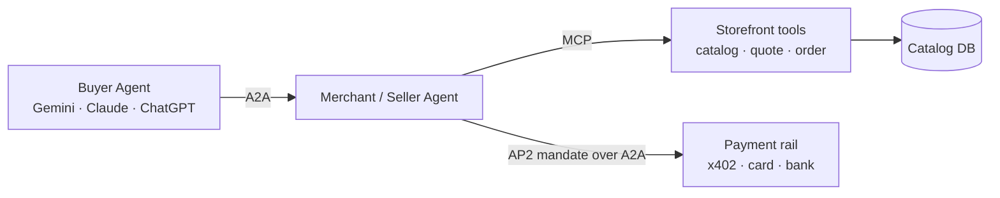

# A2A — Agent-to-Agent Protocol

An open protocol for one autonomous agent to discover, authenticate, and delegate work to another autonomous agent across organizational boundaries. Where MCP defines how an agent talks to a tool, A2A defines how an agent talks to another agent.

## Maintainer

[Google](https://developers.google.com/), originally announced at Google Cloud Next 2025 with 50+ launch partners. The specification is hosted at [google-a2a.github.io/A2A](https://a2a-protocol.org/latest/) with reference implementations in the [`google-a2a`](https://github.com/google-a2a) GitHub organization. Governance has been transitioned toward an open ecosystem foundation; see the official site for current governance status.

## Status

**Public spec, growing adoption.** The 1.0 specification is published. Launch and follow-on partners include Salesforce, SAP, ServiceNow, MongoDB, Atlassian, Box, Cohere, Deloitte, Accenture, and many others. Google's Agent Development Kit (ADK), Vertex AI Agent Builder, and Gemini Enterprise speak A2A natively.

The **AP2 (Agent Payments Protocol) extension** sits on top of A2A as the payments dialect — when one agent needs to pay another, it uses AP2 mandate semantics carried over A2A messages. The **x402 extension** to AP2 carries that payment over stablecoin rails.

## What it does

A2A standardizes:

- **Discovery** — every A2A agent publishes an `agent.json` (the *Agent Card*) at a well-known URL describing its capabilities, supported modalities, authentication, and skills.
- **Communication** — JSON-RPC 2.0 over HTTPS, with streaming via Server-Sent Events for long-running tasks.
- **Task lifecycle** — request, working, input-required, completed, failed, cancelled. Tasks are first-class, addressable, and resumable.
- **Authentication and authorization** — OpenID Connect, OAuth 2.0, mTLS, and bearer-token patterns are standardized as auth schemes in the Agent Card.
- **Multi-modal exchange** — text, structured data, files, and forms can be passed between agents.

It deliberately does **not** standardize the agent's internal reasoning, tool layout, or model. A2A is wire-level; it does not constrain implementation.

## Key concepts

| Concept | Definition |
|---|---|
| **Agent Card** | The published `/.well-known/agent.json` describing an agent's identity, capabilities, skills, supported auth schemes, and endpoints. The discovery anchor. |
| **Skill** | A named capability an agent advertises (`book-flight`, `quote-giftcard`, `refund-order`). Discoverable via the Agent Card. |
| **Task** | A first-class, server-side object representing a unit of delegated work. Addressable, resumable, observable. |
| **Message** | A turn within a task. Carries text, parts (structured data), files, or forms. |
| **Part** | A typed fragment of a message: `TextPart`, `FilePart`, `DataPart`. |
| **Push notifications** | Server-to-server callbacks for long-running tasks where SSE is unsuitable. |
| **Authentication scheme** | Standard OAuth 2.0, OIDC, API key, mTLS — declared in the Agent Card and negotiated per task. |
| **AP2 extension** | Payment-mandate semantics layered on A2A messages. Defines `IntentMandate`, `CartMandate`, `PaymentMandate`. |
| **x402 extension on AP2** | Stablecoin settlement over HTTP 402, carried as a payment method inside an AP2 mandate. |

## How it fits

A2A sits beside MCP, not above or below it. They solve different problems:

- **MCP** — agent → tool/server (an agent invokes a function on a server it trusts).
- **A2A** — agent → agent (one autonomous system delegates work to another autonomous system across an organizational trust boundary).

For agentic commerce, the two compose:



A user-facing buyer agent (Gemini, Claude, ChatGPT) discovers a merchant agent via its Agent Card, negotiates a cart through A2A messages, signs an AP2 cart mandate, and the merchant agent settles via x402 or a card rail. A2A is the transport for the inter-agent dialog; MCP is the transport for any tool the merchant agent calls internally.

### Lifecycle of a task

A typical commerce task on A2A:

1. **Discover.** Buyer agent fetches `https://merchant.example.com/.well-known/agent.json`. Reads the Agent Card, picks the `quote-and-buy` skill.
2. **Authenticate.** Buyer authenticates per the Agent Card's declared scheme (OAuth 2.0 client credentials, mTLS, or signed bearer).
3. **Open task.** Buyer sends `tasks/send` with an initial message — natural-language intent plus structured parts (country, budget, item type).
4. **Negotiate.** Seller may respond with `input-required` for clarifications, or stream progress via SSE.
5. **Mandate.** Seller returns a cart; buyer signs an AP2 `CartMandate` and sends it back.
6. **Settle.** Seller initiates settlement on the payment rail named in the mandate; status streams back as task progress.
7. **Complete.** Task transitions to `completed` with structured output (order ID, delivery resource).

Tasks are addressable. A buyer agent can resume, query, or cancel at any point — important for long-running or human-in-the-loop flows.

## Reference implementations

- **Google A2A reference** — TypeScript and Python SDKs, sample agents, and the Inspector tool at [github.com/google-a2a](https://github.com/google-a2a).
- **Google Agent Development Kit (ADK)** — Google's first-party agent framework with native A2A support.
- **Vertex AI Agent Builder** — managed A2A-native agent platform.
- **AP2 reference implementation** — Google + partners' payment-mandate implementation layered on A2A. See [github.com/google-agentic-commerce](https://github.com/google-agentic-commerce) and the [AP2 page in this repo](./ap2.md).
- Partner implementations: Salesforce Agentforce, SAP Joule, ServiceNow AI Agents, and others publish A2A-compatible endpoints per Google's launch announcements.

### Minimal Agent Card

```json
{
  "name": "cryptorefills-merchant-agent",
  "description": "Quote and purchase digital goods (gift cards, mobile, eSIMs) across 180+ countries.",
  "url": "https://agent.cryptorefills.com",
  "version": "1.0.0",
  "skills": [
    {
      "id": "quote-and-buy",
      "name": "Quote and buy a digital good",
      "description": "Quote a SKU in the buyer's currency and complete purchase via AP2 mandate.",
      "tags": ["commerce", "digital-goods", "stablecoin"]
    }
  ],
  "capabilities": { "streaming": true, "pushNotifications": true },
  "authentication": { "schemes": ["bearer", "oauth2"] }
}
```

## A2A vs MCP at a glance

| Dimension | MCP | A2A |
|---|---|---|
| Counterparty | Tool / server inside a trust boundary | Agent across an organizational trust boundary |
| Discovery | Static client config or marketplace | `/.well-known/agent.json` Agent Card |
| Primitive | Tools, resources, prompts | Tasks, messages, parts, skills |
| Lifecycle | Single request/response or stream | First-class long-running tasks, resumable |
| Auth | Per-server (OAuth 2.0, bearer, mTLS) | Per-agent (OAuth 2.0, OIDC, mTLS) declared in Agent Card |
| Payments | Out of scope | Out of scope on its own; AP2 extension provides mandates |
| Typical use | Merchant exposes catalog tools | Buyer agent talks to seller agent across orgs |

The two protocols compose; they are not alternatives.

## When to use this

- Two agents from different organizations need to coordinate, and you want a standard wire format instead of bespoke webhooks.
- You are publishing an agent as a service that other agents (not just humans, not just tools) will consume.
- You need first-class long-running task semantics — not every interaction completes in one turn.
- You want OAuth 2.0 / OIDC / mTLS auth negotiated declaratively from a published Agent Card.
- You are building a marketplace where buyer agents discover seller agents at runtime.

## When NOT to use this

- **You are exposing tools to a single agent inside one platform.** MCP is simpler and more direct.
- **Your "agents" are really just RPC services.** A plain OpenAPI + OAuth 2.0 service may be all you need; A2A's task-and-mandate machinery is overhead if there is no real delegation.
- **You are doing payments, full stop.** A2A is transport; the payment semantics live in AP2 (and x402 / card rails underneath). Don't roll your own payment dialog over raw A2A — use AP2.
- **Your trust boundary is not actually agent-to-agent.** If a human is in every loop, a webhook + signed callback is often simpler than a full A2A integration.
- **Defender concern: cross-agent prompt injection.** A buyer agent that trusts a remote seller agent's free-form text inherits the seller's content as instructions. Treat A2A messages from external agents as untrusted input — do not blindly let returned text drive client-side tool calls. Pair A2A with content quarantine and explicit user confirmation for any state change.

## The AP2 extension

The most relevant A2A extension for commerce is [AP2 (Agent Payments Protocol)](./ap2.md). AP2 defines payment-mandate semantics — `IntentMandate`, `CartMandate`, `PaymentMandate` — as verifiable digital credentials carried inside A2A messages. Where A2A says "an agent can talk to another agent," AP2 says "and here is the cryptographic envelope when the conversation results in money moving."

The AP2 x402 sub-extension specifies how to carry a stablecoin settlement (USDC, USDT, DAI, EURC) inside an AP2 mandate. That stack — A2A + AP2 + x402 — is the production-ready path for agent-to-agent stablecoin commerce as of early 2026.

For the card-rail equivalent, AP2 mandates can wrap a card-network flow, with the actual authorization carrying [Visa TAP](./agentic-card-networks.md#visa-trusted-agent-protocol-tap) attestation, a [Mastercard Agentic Token](./agentic-card-networks.md), or an [Amex agentic token](./agentic-card-networks.md) at the network layer.

## Defender posture

A2A opens an organizational trust boundary. Treat it accordingly:

- **Verify the Agent Card.** Pin known publishers; do not auto-trust newly seen Agent Cards in production flows. The card lives at a public URL and can change.
- **Scope tokens narrowly.** OAuth 2.0 client credentials per relationship; rotate; log per-token activity.
- **Quarantine inbound message content.** Free-form text from a remote agent is untrusted input. Do not let it drive client-side tool calls without explicit user confirmation, especially for state changes or payments.
- **Rate-limit aggressively.** Agent traffic bursts; accidental loops between two A2A agents are a real failure mode. Cap requests per minute per counterparty.
- **Log task lifecycles.** Structured logs of `tasks/send`, status transitions, and final outputs make post-incident investigation possible.
- **Plan for revocation.** When a counterparty's behavior is wrong, you need to be able to terminate the relationship cleanly — token revocation, Agent Card unpin, allowlist removal.

## Merchant implications

Merchants surfacing capabilities to other agents decide attestation policy, identity verification, and authorization boundaries. The spec defines discovery and call shape; the merchant defines what other agents can see, which skills they can invoke, and under which scoped tokens. Agent Card pinning, inbound-message quarantine, per-counterparty rate limits, and the revocation path when a counterparty misbehaves are all operator-side. See [/merchant-playbooks/](../merchant-playbooks/) for production decisions.

## References

- [google-a2a.github.io/A2A](https://a2a-protocol.org/latest/) — official specification.
- [github.com/google-a2a](https://github.com/google-a2a) — reference SDKs and samples.
- [Google Cloud Next 2025 — A2A announcement](https://cloud.google.com/blog/products/ai-machine-learning/a2a-a-new-era-of-agent-interoperability) — original announcement.
- [Google Agentic Commerce / AP2](https://github.com/google-agentic-commerce) — AP2 reference (payments over A2A).
- [AP2 protocol page](./ap2.md) — payment-mandate extension that runs on A2A.
- [Vertex AI Agent Builder](https://cloud.google.com/vertex-ai) — managed A2A-native platform.
