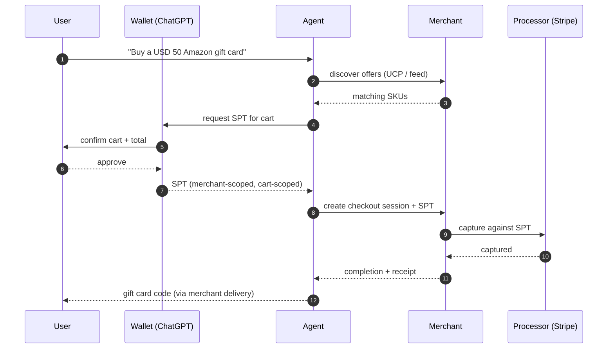

# ACP — Agentic Commerce Protocol

## Maintainer

[OpenAI](https://openai.com) and [Stripe](https://stripe.com), with co-development from a partner ecosystem (Shopify, Etsy, PayPal, others). Spec hosted at [agenticcommerce.dev](https://www.agenticcommerce.dev/).

## Status

**Live** · production traffic since 2025; broad partner availability through Q1 2026.

- Live in **ChatGPT Instant Checkout** (US, expanding) — agents complete purchases without leaving the conversation.
- Live for **Stripe-hosted merchants** via the ACP server-side primitives.
- Adopted by **Etsy**, **Shopify** (storefront integration), and **PayPal "Agent Ready"**.
- OpenAI's app-platform pivot in early 2026 keeps ACP as the checkout layer beneath the new app surface.

ACP is the highest-volume agentic checkout protocol in production today by transaction count. It earned that position by delivering distribution (ChatGPT) and reusing existing card-rail infrastructure (Stripe), rather than by inventing a new settlement mechanism.

## What it does

ACP is a delegated-checkout protocol for AI agents. The agent does not handle the buyer's raw card. Instead, the buyer's wallet (e.g. ChatGPT) issues a **Shared Payment Token** scoped to a single merchant and a single cart, the agent forwards that token to the merchant, and the merchant completes the purchase using its existing payment processor (Stripe or compatible). The merchant publishes a **product feed** so agents can discover and quote items. ACP standardizes the request/response shape — checkout creation, line items, totals, taxes, shipping, finalization, and capture — so any compliant agent can transact with any compliant merchant.

The protocol is **wallet-mediated**, not agent-mediated: the wallet retains card custody, the agent acts as a messenger, the merchant captures with its existing rails. This is the design choice that makes consumer ChatGPT checkout safe enough to ship at scale.

## Key concepts

- **Shared Payment Token (SPT)** — a single-use, merchant-scoped, cart-scoped credential issued by the buyer's wallet (e.g. ChatGPT). Replaces the need to expose the raw card to the agent or merchant. The token is bound to a specific merchant identifier and a specific cart total range; it cannot be replayed against another merchant or for a different cart.
- **Delegated checkout** — the agent acts on behalf of the buyer; the wallet retains card custody; the merchant captures with its own processor. The agent is a *messenger*, not a *holder of value*.
- **Merchant feed** — a product catalog feed (offers, prices, availability, jurisdiction, taxes) published by the merchant for agent consumption. Specified format; aligned with existing merchant-feed conventions. Agents query the feed during the discovery phase that precedes checkout.
- **Checkout session** — the server-side ACP object representing an agent's cart with the merchant. State machine: `created → updated → finalized → completed | cancelled`. Idempotency keys travel with every state transition.
- **Capture** — the merchant captures payment via its processor against the SPT after `finalized`. ACP standardizes the wire shape; the actual capture is processor-specific.
- **Refund / void** — performed by the merchant in its processor; ACP standardizes the post-completion notification but **not** the chargeback model. Refund semantics for digital goods (gift card codes, eSIM activation, mobile top-ups) remain a merchant decision.
- **Webhook events** — ACP defines server-to-agent webhooks for state changes so the agent can keep the user informed without polling.

## How it fits

ACP sits at the **commerce-protocol layer** of the stack: it is the standard the agent and merchant use to agree on a cart and capture payment. It is payment-rail-agnostic at the wire level, but in production it is paired with **card networks** (via Stripe). For stablecoin-native flows, agents typically pair ACP-shaped checkout with **[x402](./x402.md)** as the payment rail rather than ACP's card path — the cart shape is reusable; the settlement rail is not.

Stack neighbors:

- **Above ACP**: [UCP](./ucp.md) for storefront discovery, [MCP](./mcp.md) for tool exposure, [Agent Skills](./agent-skills.md) for packaged agent capabilities. An agent typically discovers via UCP/MCP, then enters an ACP checkout session.
- **Beside ACP**: [AP2](./ap2.md) for verifiable agent mandates. ACP's SPT covers a single cart; AP2 covers broader delegated authority. The two combine cleanly when the buyer wants to authorize an agent to make a category of purchases rather than approve each cart.
- **Below ACP**: card networks (Stripe primary), [x402](./x402.md) (stablecoin path), bank rails. ACP doesn't care which.

ACP does **not** cover catalog ranking, refund semantics for digital goods, multi-chain reconciliation, jurisdictional metadata, or fraud signals — those stay with the merchant. See [`/merchant-playbooks/`](../merchant-playbooks).

## Reference implementations

| Name | Link | Language |
|---|---|---|
| `agenticcommerce/agentic-commerce-protocol` | [github.com/agenticcommerce/agentic-commerce-protocol](https://github.com/agenticcommerce/agentic-commerce-protocol) | Spec (OpenAPI / JSON Schema) |
| Stripe ACP server primitives | [docs.stripe.com](https://docs.stripe.com) (search "Agentic Commerce") | Multi-language SDKs |
| OpenAI ChatGPT Instant Checkout | [developers.openai.com/commerce](https://developers.openai.com/commerce) | Buyer / wallet side |
| Shopify ACP integration | Shopify dev docs | Server-side |
| PayPal "Agent Ready" | PayPal developer docs | Server-side |

## When to use this

- You sell to consumers and want **ChatGPT users** to check out without leaving ChatGPT.
- You already process cards through **Stripe** (or a Stripe-compatible processor) and want the lowest-friction path to agent checkout.
- Your inventory is consumer-grade SKUs with predictable pricing, taxes, and shipping.
- You want to be **discoverable** to agents through merchant feeds.
- You want delegated card custody — the agent never sees the buyer's card.
- Your buyer base overlaps with **ChatGPT, Etsy, Shopify, or PayPal** — distribution is where ACP earns its keep.
- Your refund volume on the SKUs in question is low and your existing chargeback model is acceptable for agent-originated traffic.

## When NOT to use this

- You need **stablecoin settlement at the protocol layer** — use [x402](./x402.md) for the payment rail; ACP's card path doesn't help.
- You're building **agent-to-API or agent-to-agent** flows (no human buyer in the loop) — x402 or [MPP](./mpp.md) fit better; ACP is buyer-to-merchant.
- You need **mandate-based delegated authorization** with verifiable credentials beyond a single cart — see [AP2](./ap2.md).
- You operate primarily in **markets where ChatGPT Instant Checkout is not yet available**; the SPT model still applies, but distribution is the value.
- Your products are **monetary instruments or KYC-gated** (some gift-card categories, mobile top-ups in certain countries, regulated travel). ACP doesn't model the metadata; you have to add it merchant-side.
- You need **chargeback-equivalent dispute handling for crypto** — ACP's dispute model is whatever your processor's is. Crypto rails have their own model; see [refunds-and-disputes-for-agents](../merchant-playbooks/refunds-and-disputes-for-agents.md).

## Defender notes

ACP delegates card custody but **does not eliminate fraud surface**. Concrete risks and mitigations:

- **Prompt-injection-driven carts.** A user asks the agent to buy A; a malicious page or tool nudges the agent to also add B. ACP's SPT is cart-scoped, so B has to fit into the same cart total — but the cart still contains B. Mitigation: hard category and amount caps in the agent's authorization (AP2 mandates), and a cart-confirmation step the agent cannot suppress.
- **SPT misuse within scope.** The token is single-use and cart-scoped, but if the cart total has wide bounds, the merchant can still be played. Mitigation: tight cart-total ranges; explicit line-item enumeration in the cart payload; reject mid-flight cart mutations.
- **Feed poisoning.** A compromised upstream catalog publishes mispriced or misclassified items. Mitigation: signed feed entries where the protocol supports it; price-drift alarms; jurisdiction-tagged SKUs validated independently.
- **Replay across processors.** Don't rely on the processor alone for replay protection — track session idempotency keys at the ACP layer too.

Treat agent traffic like any high-velocity surface: rate limits per agent identity, anomaly detection on quote-to-capture intervals, and content provenance on the feed itself. For agent-traffic fraud signals, see [`fraud-signals-on-agent-traffic.md`](../merchant-playbooks/fraud-signals-on-agent-traffic.md).

## Example flow

The user is in the loop exactly once: cart confirmation. Everything else is automatic.

## Operational notes for merchants

- **Feed freshness.** Agents quote against the feed; if the feed lags inventory, you'll over-sell. Treat feed publication latency as a first-class SLO.
- **Tax / shipping calculation.** ACP carries totals; the merchant computes them. Edge cases — digital goods with variable jurisdictional VAT, shipping that depends on the agent's stated delivery address — must be deterministic at quote time.
- **Multi-currency display.** Agents quote in the buyer's locale; merchants typically capture in a single processing currency. Document the FX path explicitly.
- **Receipt format.** ACP's completion payload is the canonical receipt for the agent. For human-readable receipts, keep your existing email or in-app path.
- **Idempotency.** Every state transition needs an idempotency key. Carts that fail to finalize on the first attempt will be retried; don't double-charge.
- **Cart-mutation policy.** Decide whether the agent can modify line items mid-session. Many production deployments lock the cart at `finalized` and force a new session for any change.

## FAQ

**Q: Is the Shared Payment Token a card token?**
No. The SPT is a wallet-issued credential that authorizes a specific cart capture against the wallet-held card. The merchant's processor sees a normal card capture; the agent never sees card details.

**Q: Can the agent modify the cart after the SPT is issued?**
Within the SPT's stated bounds, yes — typically a small total range. Outside those bounds, the agent must request a new SPT. Production deployments often lock at `finalized` for safety.

**Q: How are taxes computed?**
The merchant computes tax at quote time and includes it in the cart total presented to the wallet. The wallet shows the taxed total to the user before SPT issuance.

**Q: What about refunds?**
The merchant initiates refunds in its processor as it would for any card sale. ACP standardizes the post-completion notification; the actual reversal is processor-native.

**Q: Does ACP work for digital goods that deliver instantly (gift cards, eSIMs)?**
Yes. Delivery is a merchant operation; ACP doesn't constrain delivery semantics. See [`use-cases/gift-cards.md`](../use-cases/gift-cards.md).

**Q: Does ACP support stablecoin settlement?**
Not on the standard card path. Stablecoin-native flows pair an ACP-shaped cart with [x402](./x402.md) for the payment rail.

## Merchant implications

Merchants implementing ACP own catalog metadata, quote semantics, refund pathways, and delivery confirmation. The spec defines the wire exchange; the merchant defines what's sellable, where, at what price, under which authorization, and how returns work. Tax computation, jurisdictional eligibility, cart-mutation policy, and the digital-goods delivery path are all merchant-side. Idempotency at the session boundary is yours to enforce, not the protocol's. See [/merchant-playbooks/](../merchant-playbooks/) for the production decisions.

## References

- Spec hub: <https://www.agenticcommerce.dev/>
- OpenAI commerce docs: <https://developers.openai.com/commerce>
- Stripe documentation: <https://docs.stripe.com>
- Spec repository: <https://github.com/agenticcommerce/agentic-commerce-protocol>
- ChatGPT Instant Checkout announcement (OpenAI blog, 2025)
- Shopify storefront ACP integration (Shopify developer docs)
- PayPal "Agent Ready" announcement (PayPal newsroom, 2025)
- Etsy agentic-commerce integration (Etsy developer docs)
- Cryptorefills' merchant playbooks for what ACP doesn't cover: [`/merchant-playbooks`](../merchant-playbooks)
