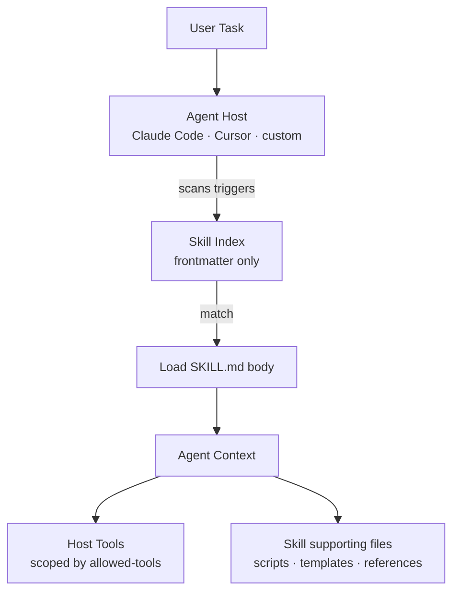

# Agent Skills

A portable, file-based packaging format for capabilities an AI agent can load on demand. A *skill* is a directory containing a `SKILL.md` file with YAML frontmatter and natural-language instructions, plus optional supporting files (scripts, references, templates). Skills are the unit of reusable, distributable agent know-how.

## Maintainer

The specification is hosted at [agentskills.io/specification](https://agentskills.io/specification) as an open, vendor-neutral format. Anthropic incubated the format and ships native loaders in [Claude Code](https://docs.claude.com/en/docs/claude-code) and the Claude apps. Cursor, the [`anthropics/skills`](https://github.com/anthropics/skills) repository, and an emerging ecosystem of community skill libraries adopt the same shape.

## Status

**Adopted and growing.** As of early 2026:

- Native skill loading in Claude Code, Claude.ai, the Anthropic API (via the `anthropic-beta: agent-skills-*` header pattern), and Cursor.
- Public skill libraries: [`anthropics/skills`](https://github.com/anthropics/skills), the Everything Claude Code (ECC) library, and [`cryptorefills/agents`](https://github.com/cryptorefills/agents) — commerce skills for gift cards, mobile top-ups, eSIMs, and travel over MCP and x402.
- Skill discovery surfaces (`agentskills.io`, GitHub topics `claude-skills` / `agent-skills`) are populating quickly.
- The format is small enough that any agent harness can adopt it — there is no SDK lock-in.

## What it does

A skill is a directory; the agent reads its `SKILL.md` when triggered. The skill provides:

- **A trigger description** — when the agent should activate the skill (declared in YAML `description`).
- **Instructions** — natural-language guidance the agent reads at activation time, written for the model.
- **Optional supporting files** — reference docs, templates, scripts, fixtures the skill instructions point the agent toward.
- **Optional `allowed-tools`** — a scoped subset of host tools the skill is permitted to invoke.

Skills are **lazy-loaded by the agent**: the harness reads only the YAML frontmatter at startup to know what skills exist, then pulls the full body into context only when the trigger matches the user's task. This keeps the system prompt small while allowing arbitrary depth in the skill body.

## Key concepts

| Concept | Definition |
|---|---|
| **Skill** | A directory containing a `SKILL.md` plus optional supporting files. The atomic unit of distribution. |
| **`SKILL.md`** | The skill's entry point. YAML frontmatter (`name`, `description`, optional `allowed-tools`, optional `version`) followed by markdown instructions for the agent. |
| **Trigger** | A natural-language description of when the skill should activate. The host scans triggers against the user's task to decide which skills to surface. |
| **Lazy loading** | Only the frontmatter is loaded at startup; the body is loaded on activation. |
| **Allowed tools** | Optional scoped permission list — the skill can only call these host tools. Defender control. |
| **Skill library** | A repository or directory of many skills, often organized by domain (`web/`, `python/`, `commerce/`). |
| **Skill creator** | A meta-skill that creates new skills from session history or from specifications. |
| **Plugin / namespace** | Skills bundled inside a plugin appear under `plugin:skill-name`. |

## How it fits



Skills are **complementary to MCP**. MCP exposes *tools* — invocable functions backed by code. Skills package *know-how* — when to use which tools, in what order, with what conventions. A commerce agent typically uses both: an MCP server for catalog/quote/order, and a skill that tells the agent how to negotiate refunds, choose between rails, or format a receipt.

For agentic commerce, skills are how a merchant ships an opinionated agent playbook. A `cryptorefills-checkout` skill teaches a buyer agent the right sequence of `searchProducts` → `quote` → `placeOrder` calls and the right error handling — without modifying the model.

## Reference implementations

- **[anthropics/skills](https://github.com/anthropics/skills)** — Anthropic's official public skill library. Canonical examples for the format.
- **Claude Code skills directory** — `~/.claude/skills/` (user) and `.claude/skills/` (project) are loaded automatically by the Claude Code harness.
- **[cryptorefills/agents](https://github.com/cryptorefills/agents)** — commerce skills for gift cards, mobile top-ups, and travel eSIMs across 180+ countries. Three skills: `cryptorefills-catalog` (product discovery), `cryptorefills-buy` (purchase workflow over MCP), and `cryptorefills-x402` (autonomous agent commerce via x402 + USDC on Base). See `/agent-playbooks/agent-runtimes.md` in this repo for usage patterns.
- **Everything Claude Code (ECC)** — large open-source skill library covering engineering domains (Rust, Python, Swift, web).

## Code sketch

A minimal skill directory:

```
cryptorefills-giftcard-checkout/
├── SKILL.md
├── reference/
│   ├── error-codes.md
│   └── supported-countries.md
└── scripts/
    └── verify-delivery.sh
```

A minimal `SKILL.md`:

```markdown
---
name: cryptorefills-giftcard-checkout
description: Buy a gift card via the Cryptorefills MCP storefront and verify delivery. Use when the user asks to purchase a gift card, top-up, or eSIM and a Cryptorefills MCP server is available.
allowed-tools:
  - mcp__cryptorefills__searchProducts
  - mcp__cryptorefills__quote
  - mcp__cryptorefills__placeOrder
  - Bash
version: 0.2.0
---

# Cryptorefills gift-card checkout

When activated:

1. Call `searchProducts` with the user's country and the brand they want.
2. Surface the top 3 SKUs with face value, FX, and any KYC flags.
3. After user confirmation, call `quote` and show the user the all-in price including network fees.
4. On accept, call `placeOrder` with the quote ID and the user's pay currency.
5. Run `scripts/verify-delivery.sh` against the order ID. Display the redemption code only after verification passes.

If `placeOrder` returns `PRICING_DRIFT`, re-quote once. If it drifts a second time, surface the
delta to the user and stop. Never auto-retry beyond once. See `reference/error-codes.md` for the
full error matrix.
```

The frontmatter is the only thing scanned at startup. The body and the `reference/` files are pulled into context only when the skill activates.

## Skills vs MCP vs prompts

| Dimension | Skill | MCP server | Prompt template |
|---|---|---|---|
| What ships | A directory: `SKILL.md` + supporting files | A running server exposing tools | A reusable prompt string |
| What it provides | Know-how (when and how) | Tools (executable functions) | Wording (what to ask the model) |
| Loaded into context | Lazily, on activation | Tools listed; output streamed in | Inserted at the call site |
| Distribution | Git-checkout-able directory | Endpoint URL or local binary | String in code or config |
| Best for | Domain workflows, standards, conventions | Catalog, quote, order, refund operations | Single repeated phrasing |

Skills, MCP, and prompts compose. A merchant typically ships an MCP server (capability), one or more skills that teach an agent how to use that server well (know-how), and prompt templates for fixed phrasings (wording).

## When to use this

- You want to ship reusable, auditable agent know-how that survives model upgrades.
- You want capabilities that appear automatically in any compatible host (Claude Code, Cursor) by dropping a directory into a skills folder.
- You want lazy loading — many skills can coexist without bloating the system prompt.
- You want to scope tool access per skill via `allowed-tools` (defender control).
- You are publishing a domain library (commerce, security review, deployment) for an ecosystem of agents to adopt.

## When NOT to use this

- **You need executable tools, not instructions.** Use MCP. Skills are *prompt-shaped*; they do not run code unless they invoke a host tool.
- **Your host doesn't support skills.** Plain prompts or OpenAI Custom GPTs / ChatGPT Apps are the right format there.
- **You need cross-agent delegation.** Skills run inside one agent; A2A handles the cross-agent case.
- **You are tempted to put secrets in `SKILL.md`.** Don't. Skills ship in repos and end up in user shells. Use environment variables, secret managers, or host-side config.
- **Defender concern: skill triggering as a prompt-injection vector.** A malicious skill description can attempt to attract activation when it shouldn't. Pin skill libraries to known publishers, code-review skill descriptions like you would code, and scope `allowed-tools` tightly. Treat third-party skill installation with the same caution as installing an npm package.

## Skill quality checklist

A skill that ships well:

- **Has a sharp trigger.** The `description` should describe *exactly* the situation that should activate it — not a topic area. "Use when the user asks to purchase a gift card via Cryptorefills MCP" beats "Cryptorefills helper."
- **Names its tools.** If `allowed-tools` is set, the skill is bounded; the host enforces it. Skills without tool scoping inherit the agent's full permission set.
- **Stays small in the body.** Long skills get partially loaded into context and lose details. Push depth into supporting files (`reference/`, `scripts/`) the skill body links to.
- **Versions and tracks.** Real skills change. Version in frontmatter, log changes in a `CHANGELOG.md` next to `SKILL.md`.
- **Tests.** Have a fixture or transcript that exercises the skill. Skills regress silently when models or hosts update; explicit tests catch it.
- **Cites.** When a skill encodes domain knowledge (refund rules, jurisdictional metadata, network limits), link to the canonical source in the body so a maintainer can verify it later.

## Merchant implications

Skill authors decide what a skill exposes, what it asserts about credentials, and what it leaves to the host. Merchants publishing skills also publish operational expectations: rate limits, supported regions, refund SLAs, and the error matrix the skill expects. Trigger sharpness, `allowed-tools` scoping, and versioning discipline determine whether a skill ages well across model and host updates. See [/merchant-playbooks/](../merchant-playbooks/) for production decisions.

## References

- [agentskills.io/specification](https://agentskills.io/specification) — the specification.
- [anthropics/skills](https://github.com/anthropics/skills) — Anthropic's reference skill library.
- [Anthropic — Agent Skills documentation](https://docs.claude.com/en/docs/agents-and-tools/agent-skills) — official docs.
- [Claude Code — Skills](https://docs.claude.com/en/docs/claude-code/skills) — host-side integration.
- [Cursor — Rules and Skills](https://docs.cursor.com/) — Cursor's skills support.
