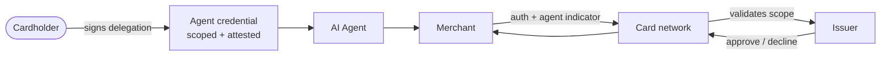

# Agentic card networks — Visa TAP · Mastercard Agent Pay · Amex

Visa, Mastercard, and American Express have each published a program for authenticating, authorizing, and settling card transactions initiated by AI agents. The category shares a design: a tokenized or attested credential bound to a specific agent platform, a cardholder-authored delegation scope (merchants, MCCs, amount caps, time window), an indicator on the ISO 8583 authorization message marking the transaction as agent-initiated, and network-level enforcement of scope. What differs is the wire format, the credential primitive, the network model (open- vs closed-loop), and the maturity of public technical material. Settlement and chargeback rails are otherwise unchanged.

## At a glance

| Dimension | Visa TAP | Mastercard Agent Pay | Amex agentic tokens |
|---|---|---|---|
| Network model | Open-loop | Open-loop | Closed-loop (issuer + network) |
| Credential primitive | Network-managed attestation referenced at auth | Agentic Token (tokenized credential on MDES) | Agentic token on Amex tokenization |
| Scope encoding | Per-merchant, per-MCC, per-amount, per-window, per-count | Per-merchant, per-MCC, per-amount, per-window, per-count | Per-merchant, per-amount, per-window |
| Auth-message indicator | Yes — Visa-defined fields | Yes — Mastercard-defined fields | Yes — Amex-defined fields |
| Scope enforcement | Network and issuer verify | Network and issuer verify | Network and issuer verify |
| Dispute model | Standard Visa rules; agent indicator is evidence | Standard Mastercard rules; token reference is evidence | Standard Amex rules; token reference is evidence |
| Settlement timing | Standard Visa: T+1 to T+3 | Standard Mastercard: T+1 to T+3 | Standard Amex: T+2 to T+5 |
| Status (early 2026) | Rolling, public technical depth | Rolling, public technical depth | Rolling, technical material thinner |
| Acceptance footprint | Largest globally | Second-largest globally | Smaller; concentrated US + premium |
| Reference | [Visa newsroom](https://usa.visa.com/about-visa/newsroom.html) | [Mastercard Agent Pay (Apr 2025)](https://www.mastercard.com/news/press/2025/april/mastercard-unveils-agent-pay-pioneering-agentic-payments-technology-to-power-commerce-in-the-age-of-ai/) | [Amex newsroom](https://about.americanexpress.com/newsroom/) |

The three programs are aligned on design — agent attestation, scoped delegation, network signaling — but they are independent implementations on independent rails. A merchant accepting all three runs three integrations.

## Visa Trusted Agent Protocol (TAP)

A Visa specification for cryptographically attesting that a card transaction was initiated by an authorized AI agent acting on a cardholder's behalf. TAP gives the issuing bank, the network, and the merchant a shared, verifiable signal that the buyer is an agent and that the agent is operating within bounds the cardholder has agreed to.

### Maintainer

[Visa](https://www.visa.com/), through Visa Intelligent Commerce. The TAP specification is published and licensed by Visa; reference SDKs and partner integrations are listed on the [Visa developer site](https://developer.visa.com/).

### Status

Rolling availability. TAP was announced in 2025 as part of Visa Intelligent Commerce. As of early 2026, TAP attestation is in pilot or production with a growing list of issuer banks, agent platforms, and merchant acquirers; rollout is by region and partner. Visa coordinates with EMVCo and the broader card-network agentic-payments effort. Refer to the [Visa newsroom](https://usa.visa.com/about-visa/newsroom.html) for the current adopter list.

### What it does

- **Agent identity attestation.** A cryptographically signed credential issued to an agent platform, presented at authorization time.
- **Scoped delegation.** Cardholder consent encoded with constraints — merchants permitted, amount caps, time window, transaction count, MCC restrictions.
- **Issuer verifiability.** The issuing bank can verify the attestation chain at authorization, allowing fewer step-up challenges for in-bounds transactions and clearer denials for out-of-bounds ones.
- **Network-side signaling.** Visa receives a structured agent indicator on the authorization message so risk models, dispute handling, and reporting treat agent-initiated transactions correctly.

TAP is complementary to AP2: AP2's mandate model and TAP's attestation can co-exist on the same transaction. AP2 carries the cart and intent semantics; TAP carries the network-level identity and delegation signal that the issuer evaluates.

### Key concepts

| Concept | Definition |
|---|---|
| Agent attestation | A signed credential identifying the agent platform and instance. Verifiable by issuer and network. |
| Scoped delegation | The cardholder's consent envelope: merchants, amounts, duration, MCC restrictions. |
| Trusted agent registry | The list of agent platforms onboarded with Visa whose attestations the network accepts. |
| Authorization signaling | Fields injected into the standard ISO 8583 authorization message marking the transaction as agent-initiated. |
| Step-up exemption | Issuer policy that may waive 3DS challenges when attestation and delegation are valid and in-scope. |
| Out-of-scope decline | Authorization decision when an agent transacts outside the cardholder's authorized scope. The network is the enforcement point. |

### Where TAP composes with other protocols

| Layer | Standard | What it carries |
|---|---|---|
| Discovery / negotiation | UCP, MCP storefront | Agent finds the merchant and the cart. |
| Cart and authorization intent | ACP, AP2 | Cart structure, intent, mandates the cardholder signed. |
| Card-network rail | **TAP (Visa)** | Network-level agent indicator + scope verification at auth time. |
| Settlement | Standard Visa rails | Capture, clearing, settlement; differentiated dispute handling. |

### Lifecycle of a TAP-attested authorization

1. Cardholder grants delegation in the issuer or partner app: which agent platform, which merchants or MCCs, what amount caps, what time window.
2. Agent platform receives the delegation and registers it with its TAP credential store.
3. Agent initiates a transaction. The merchant's checkout receives an authorization request carrying the TAP attestation and the agent indicator.
4. Acquirer forwards the auth message to Visa with the agent fields preserved.
5. Visa validates the attestation against the trusted-agent registry and the scope envelope.
6. Issuer evaluates: in-scope and standard risk passes → step-up exemption may apply; otherwise standard rules.
7. Decision returns with the agent indicator preserved; capture, clearing, settlement proceed on standard Visa rails.
8. Cardholder revokes delegation at any time via the issuer app; the agent platform's next attempt fails.

### References

- [Visa newsroom](https://usa.visa.com/about-visa/newsroom.html)
- [Visa Intelligent Commerce program](https://corporate.visa.com/en/products/intelligent-commerce.html)
- [Visa developer site](https://developer.visa.com/)

## Mastercard Agent Pay

Mastercard's program for authenticating, authorizing, and settling card transactions initiated by AI agents. Agent Pay defines the consumer- and merchant-experience layer; **Mastercard Agentic Tokens** are the underlying credential — a tokenized card permission scoped to a specific agent, merchant set, and spending envelope.

### Maintainer

[Mastercard](https://www.mastercard.com/), through the Mastercard Agent Pay program. The program announcement and rolling partner list are published on the [Mastercard newsroom](https://www.mastercard.com/news/), and integration material is available through Mastercard Developers.

### Status

Rolling availability. Mastercard announced Agent Pay in April 2025 as the umbrella program for agent-initiated card payments. As of early 2026, public partner integrations include Microsoft, IBM, OpenAI, Mistral, and major issuing banks. Agentic Tokens are in active deployment as the credential primitive — they extend Mastercard's existing tokenization rails (MDES) into the agent context. Mastercard is aligned with Visa TAP and Amex agentic tokens on conceptual primitives even where the wire formats differ.

### What it does

- **Agent-scoped tokens.** A Mastercard Agentic Token is a tokenized card credential usable only by a specific agent platform within scope rules the cardholder set.
- **Cardholder consent capture.** A standardized consent UX issuers can deploy so cardholders can grant, view, and revoke agent permissions per agent and per merchant set.
- **Network-level enforcement.** Authorization requests carrying an Agentic Token are evaluated against scope at the network. Out-of-scope transactions can be declined by Mastercard before they reach the issuer.
- **Agent indicator on authorization.** Structured fields on the ISO 8583 message identifying the authorization as agent-initiated, with verifiable attestation references.
- **Dispute and chargeback hooks.** Adjusted reason codes and evidence requirements for agent-initiated transactions, so cardholders and merchants both have clear recourse when an agent transacts out of bounds.

### Key concepts

| Concept | Definition |
|---|---|
| Agentic Token | A tokenized Mastercard credential bound to a specific agent platform and delegation scope. Built on MDES tokenization. |
| Delegation scope | Cardholder-authored constraints: merchants/MCCs, amount caps per transaction and per period, expiration, transaction-count caps. |
| Agent attestation | A signed credential identifying the agent platform; verifiable by the network at authorization. |
| Authorization indicator | Standard fields marking the transaction as agent-initiated for differentiated risk treatment. |
| Issuer consent UX | Standardized consumer flow for granting, viewing, and revoking agent delegations; deployed in issuer apps. |
| Out-of-scope decline | Network or issuer declines an authorization when the agent attempts a transaction outside the Agentic Token's scope. |
| Revocation | Cardholder-initiated, immediate cancellation of an Agentic Token from the issuer app. |

### Lifecycle of an Agent Pay authorization

1. Cardholder grants delegation in the issuer app: agent platform, permitted merchants/MCCs, amount caps, expiration, transaction count.
2. Issuer provisions an Agentic Token scoped to that envelope; the token is delivered to the agent platform via standard MDES tokenization rails.
3. Agent presents the Agentic Token at checkout in place of the underlying card credential.
4. Acquirer forwards the authorization to Mastercard with the agentic-token fields and agent indicator.
5. Mastercard validates the token, checks the transaction against the encoded scope envelope, and emits the agent indicator on the auth message.
6. Issuer evaluates with the agent context; out-of-scope declines are distinct from generic risk declines.
7. Capture, clearing, settlement proceed on standard Mastercard rails with agent context preserved end-to-end.
8. Cardholder revokes the Agentic Token from the issuer app; subsequent agent attempts fail.

### References

- [Mastercard newsroom](https://www.mastercard.com/news/)
- [Mastercard — Agent Pay program announcement (April 2025)](https://www.mastercard.com/news/press/2025/april/mastercard-unveils-agent-pay-pioneering-agentic-payments-technology-to-power-commerce-in-the-age-of-ai/)
- [Mastercard Developers](https://developer.mastercard.com/)

## American Express agentic tokens

American Express's program for authenticating and authorizing card transactions initiated by AI agents. The program extends Amex's existing tokenization platform with agent-scoped credentials, Card Member-authored delegation, and network-level signaling that an authorization is agent-initiated. Amex's closed-loop model — Amex is both issuer and network for most of its cards — gives the program structurally tighter end-to-end visibility than open-loop equivalents.

### Maintainer

[American Express](https://www.americanexpress.com/), with program details published through the [American Express newsroom](https://about.americanexpress.com/newsroom/) and integration material exposed via the [American Express developer site](https://developer.americanexpress.com/). As of early 2026, public technical material on Amex's agentic-token program is sparser than the Visa and Mastercard equivalents.

### Status

Rolling availability. Amex has publicly announced participation in the broader card-network agentic-payments effort and its own agent-token initiative, aligned with the same design direction as Visa TAP and Mastercard Agent Pay. Pilot integrations with agent platforms and issuing relationships are progressing; treat specific implementation details as subject to update from official Amex channels.

### What it does

- **Agent-scoped credentials.** A tokenized Amex permission bound to a specific agent platform and the Card Member's delegation scope.
- **Card Member consent capture.** A standardized way for the Card Member to grant, view, and revoke agent permissions for their card.
- **Authorization signaling.** Authorization messages carry an indicator that the transaction is agent-initiated, with attestation-chain references.
- **Network-level enforcement.** Out-of-scope authorizations can be declined upstream of the merchant.
- **Risk and dispute differentiation.** Agent-initiated transactions are treated with rules suitable to that context.

### Key concepts

| Concept | Definition |
|---|---|
| Agentic token | An Amex tokenized credential scoped to a specific agent platform and delegation envelope. |
| Delegation scope | The Card Member's constraints: permitted merchants/industries, amount caps, time window, transaction count. |
| Agent attestation | A signed credential identifying the agent platform; verifiable by Amex at authorization. |
| Card Member consent UX | The Amex-side flow where the Card Member grants, reviews, and revokes agent permissions. |
| Out-of-scope decline | Authorization decision when an agent transacts outside the granted scope. |
| Revocation | Card Member-initiated, immediate cancellation of an agentic token. |

### Lifecycle of an Amex agent-token authorization

1. Card Member grants delegation in the Amex or partner-issuer app: agent platform, permitted merchants, amount caps, expiration.
2. Amex provisions an agentic token scoped to that delegation; the token is delivered to the agent platform.
3. Agent presents the agentic token at checkout instead of the raw card credential.
4. Acquirer forwards the authorization to Amex with the agent fields and indicator preserved.
5. Amex validates the token, evaluates the transaction against the scope envelope, and emits the agent indicator.
6. Issuer evaluates: in-scope transactions get differentiated risk treatment; out-of-scope transactions are declined upstream of the merchant.
7. Capture, clearing, settlement proceed on standard Amex rails with agent context persisted on the record.
8. Card Member revokes the token from the Amex app; subsequent agent attempts fail.

### References

- [American Express newsroom](https://about.americanexpress.com/newsroom/)
- [American Express developer site](https://developer.americanexpress.com/)

## When to use a card-network agentic rail

Card-network agentic rails are the right choice when the transaction must ride existing card infrastructure and the merchant or buyer wants the properties that infrastructure provides.

- **The buyer cohort prefers cards.** Consumer markets in the US and EU still default to card payment; agentic card rails preserve that affordance while giving the network agent context.
- **Chargeback protection is a feature for the buyer that the merchant explicitly wants to offer.** Cardholder dispute rights are unchanged for agent-initiated transactions.
- **Fiat accounting is the merchant's preferred path.** Existing card-rail accounting, tax, and reconciliation flows continue to work — the agent indicator is a new column on the order record, not a new pipeline.
- **Higher AOV.** At $30+ AOV the interchange and scheme fees are tolerable for the value the rail provides.
- **Issuer-side risk differentiation matters.** A correctly attested agent transaction can clear with fewer step-up challenges and richer fraud context than a vanilla CNP transaction would.
- **PCI scope reduction matters.** Agent credentials are tokenized; the merchant integration should never see, store, or process the underlying PAN. This is a real PCI scope reduction win — but only if the integration honors it.

Production considerations to validate before quoting "agentic card support" to a partner:

- **Acquirer support is the bottleneck.** TAP, Agent Pay, and Amex agentic require the merchant's processor to support the new authorization fields. As of early 2026, major processors are rolling this out; smaller acquirers lag. Confirm with your processor before promising the rail.
- **Step-up authentication happens at mandate setup, not per transaction.** SCA/3DS fires once when the user enrolls the agent. Make sure your enrollment flow surfaces this; users expect "log in once, agent goes" UX.
- **Velocity rules differ.** Issuers tune velocity for human cardholders. An agent making 50 small purchases an hour will trip rules unless the issuer has the agent-attestation flag and has tuned for it. Expect early-period false declines and have a fallback rail (usually stablecoin) ready.
- **Cross-border MCC and category rules still apply.** An agent buying through an OTA still hits MCC 4722 with all its category-specific rules. Agentic does not change those.
- **Refunds.** Standard card-network refunds. Refund through the same auth/transaction reference. Do not let the agent provide a different refund destination — that path is for crypto rails only and conflating them is a fraud surface.

Defender framing on the dispute model:

- The agent indicator and the delegation reference are **evidence**, not insulation. Persist both on the order record so a representment carries the full delegation context.
- Out-of-scope claims will become a distinct dispute type as reason codes evolve. Track network bulletins; route agent-initiated disputes to a separate support queue with the delegation reference attached.
- Chargeback liability is **unchanged**. None of the three programs (yet) shifts liability to the network or issuer the way 3DS sometimes does. Agent attestation reduces *false declines* and *fraud probability*; it does not absolve merchants under standard rules.
- Build per-cohort risk baselines. Velocity, geo-risk, and 3DS rules tuned on cardholder-present traffic over- or under-trigger on agent flows.
- Do not strip the agent indicator. A custom payments orchestrator that re-creates the auth message can drop the indicator, losing dispute defense and risk differentiation. Audit the auth path end-to-end.
- Do not conflate token authentication with cardholder authentication. Tokenization and attestation authenticate the *agent* and enforce *delegation*. Some flows still warrant cardholder step-up.

Mandate evidence to capture on every agent-initiated card transaction:

- **Mandate or token reference** issued by the network or the cardholder's issuer.
- **Scope** — merchant, amount cap, time window, MCC/category, recurring flag, expiration.
- **Agent identity** — the network's agent identifier, plus the agent platform name.
- **Step-up evidence** — timestamp and method of the SCA/3DS event at mandate enrollment.
- **Transaction reference** — the network's authorization code and ARN.
- **Order context** — order ID, SKU, fulfillment status, delivery proof.

Storage retention should match the acquirer's chargeback window — typically 540 days minimum; some merchants keep mandate evidence for 7 years to align with general financial-record retention.

## When NOT to use

- **You are settling in stablecoin (USDC, USDT, DAI, EURC) or BTC.** Card-network agentic programs apply to card rails. For stablecoin-settled agent transactions see [x402](./x402.md) and the [crypto-stablecoin rail page](../rails/crypto-stablecoin.md). The two are alternatives, not layers.
- **The transaction is human-initiated.** Marking a human-initiated authorization with the agent indicator is misrepresentation. Reserve the indicator for actual agent-initiated traffic.
- **Unit economics make 1.5–3% interchange untenable.** Pay-per-call APIs, micropayments, and sub-$5 retail are stablecoin-native; card rails do not fit.
- **The merchant wants deterministic, non-reversible settlement.** Card rails carry chargeback risk by design; if the merchant needs finality, use stablecoin.
- **The agent is an autonomous M2M actor without a human cardholder principal.** Card delegation requires a cardholder; pure agent-to-agent flows belong on stablecoin rails.
- **Cross-border friction (FX, multi-currency settlement) is a real cost.** Stablecoin settlement avoids the layered FX of card rails.
- **You think network tokenization replaces application-level scopes.** It does not. Encode scopes in your AP2 mandate or bespoke consent capture as well — defense in depth, not single-point trust.

In practice, agent-friendly merchants accept both: stablecoin as the agent-native default, card-network agentic rails as the consumer-comfort default. Capture the rail used on every order and tag agent-initiated card transactions with the delegation reference end-to-end.

## Merchant implications

Merchants accepting agentic card payments inherit chargeback exposure, scope verification, mandate-evidence retention, and the issuer-acquirer-network coordination that cards bring. Stablecoin rails offload some of this; cards complement, not replace. Acquirer support for the new authorization fields is the gating dependency, and persisting the agent indicator end-to-end through the auth path is the merchant's responsibility — strip it and you lose dispute defense. See [/merchant-playbooks/](../merchant-playbooks/) for production decisions.

## References

Visa:

- [Visa newsroom](https://usa.visa.com/about-visa/newsroom.html)
- [Visa Intelligent Commerce program](https://corporate.visa.com/en/products/intelligent-commerce.html)
- [Visa developer site](https://developer.visa.com/)

Mastercard:

- [Mastercard newsroom](https://www.mastercard.com/news/)
- [Mastercard — Agent Pay program announcement (April 2025)](https://www.mastercard.com/news/press/2025/april/mastercard-unveils-agent-pay-pioneering-agentic-payments-technology-to-power-commerce-in-the-age-of-ai/)
- [Mastercard Developers](https://developer.mastercard.com/)

American Express:

- [American Express newsroom](https://about.americanexpress.com/newsroom/)
- [American Express developer site](https://developer.americanexpress.com/)

Standards:

- [EMVCo — Tokenization specifications](https://www.emvco.com/specifications/)
