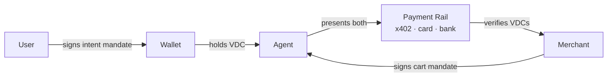

# AP2 — Agent Payments Protocol

## Maintainer

[Google](https://google.com), with a 60+ partner consortium that includes Mastercard, American Express, Coinbase, Adyen, Salesforce, PayPal, Worldpay, and others. Spec hosted at [ap2-protocol.org](https://ap2-protocol.org/). Reference implementations and conformance assets at [github.com/google-agentic-commerce/AP2](https://github.com/google-agentic-commerce/AP2).

## Status

**Spec public; production paths shipping.**

- Specification public and versioned.
- The **A2A x402 extension** of AP2 is **production-ready for crypto** — agents settling in stablecoins via [x402](./x402.md) can carry AP2 mandates today.
- **Card-based** AP2 paths are maturing through 2026 with the consortium issuers; pilots and rolling availability rather than universal merchant support.
- Multiple SDKs and reference samples in the AP2 repo.

## What it does

AP2 standardizes how an agent **proves it has authority to pay**. Instead of binding authority to a single processor or card, AP2 uses **verifiable digital credentials** — cryptographically signed mandates issued by the buyer (or buyer's wallet) — that the agent presents to merchants and payment networks. The protocol is **payment-rail-agnostic**: the same mandate format can authorize a card capture, a stablecoin transfer over x402, or a bank rail. AP2 separates *intent* (what the user wants done) from *cart* (what the merchant offers in response) so each can be signed and verified independently. The spec is co-developed with card networks so issuers can underwrite agent transactions with explicit user delegation rather than implicit card-on-file consent.

The crucial separation in AP2 is **authority** (who can pay, for what, up to how much, until when) from **mechanism** (which rail moves the money). Card networks and crypto rails can both consume the same mandate; what differs is how they settle.

## Key concepts

- **Verifiable Digital Credential (VDC)** — a cryptographically signed token following W3C VC conventions, used to express user-to-agent and user-to-merchant authorizations. Verifiable offline; revocable via standard VC revocation lists.
- **Intent mandate** — a signed credential expressing what the user authorizes the agent to do. Fields typically include: category, amount ceiling (per transaction and aggregate), time window, allowed merchant set, recurrence policy, cancellation policy.
- **Cart mandate** — a signed credential expressing the specific cart the merchant is offering at quote time. Counterpart to the intent mandate. The merchant signs the cart mandate; the agent submits both to the rail for verification.
- **Mandate refresh** — semantics for renewing recurring authorizations without forcing the user back into the loop on every cycle. Critical for subscriptions, top-ups, and recurring agent purchases.
- **A2A x402 extension** — the AP2 binding for [x402](./x402.md): the AP2 mandate is carried alongside an x402 payment header so the merchant can verify both authorization and settlement in one HTTP exchange.
- **Issuer / wallet / agent / merchant** — four-party model. Issuer signs the credential; wallet holds it; agent presents it; merchant verifies it. Issuer and wallet can be the same entity in simple deployments.
- **Revocation** — VDCs follow standard revocation list patterns. Merchants must check revocation before honoring mandates above a configurable risk threshold.
- **Scope language** — structured claim language describing what the mandate authorizes. Avoid free text; prefer enumerated categories and amounts.

## How it fits

AP2 sits at the **trust-and-authorization layer** between the agent and the payment rail. Where [ACP](./acp.md) standardizes the buyer-to-merchant checkout exchange, AP2 standardizes the **proof** that the agent is allowed to checkout in the first place.

The two layers are complementary:

- An agent carries an **AP2 intent mandate** into an **[ACP](./acp.md)** checkout session for card-rail flows.
- The same intent mandate is carried into an **[x402](./x402.md)** paid request via the A2A x402 extension for stablecoin-rail flows.
- For agent-to-agent (A2A) flows, AP2 inherits Google's [A2A](./a2a.md) communication primitives.

AP2 does not specify the payment rail, the catalog format, or the refund model — it specifies *how delegated authority is expressed and verified*. The card-network agentic protocols ([Visa TAP](./agentic-card-networks.md#visa-trusted-agent-protocol-tap), [Mastercard Agent Pay](./agentic-card-networks.md), [Amex agentic tokens](./agentic-card-networks.md)) are increasingly designed to consume AP2-shaped mandates at the issuer.

## Glossary

- **VDC** — Verifiable Digital Credential. The credential format used for AP2 mandates. Aligned with W3C Verifiable Credentials.
- **Mandate** — a signed VDC expressing user-to-agent authorization (intent mandate) or merchant-to-agent offer commitment (cart mandate).
- **Issuer** — the party that signs the mandate. For consumer flows, typically the wallet provider or issuing bank.
- **Wallet** — holds VDCs on behalf of the user.
- **Holder / agent** — presents VDCs to merchants and rails.
- **Verifier** — the merchant or rail that checks the mandate.
- **Revocation list** — published list of revoked credentials; checked by verifiers.
- **A2A x402 extension** — the AP2 binding to [x402](./x402.md) for stablecoin-rail flows.

## Reference implementations

| Name | Link | Language |
|---|---|---|
| `google-agentic-commerce/AP2` | [github.com/google-agentic-commerce/AP2](https://github.com/google-agentic-commerce/AP2) | Spec + reference SDKs |
| AP2 protocol site | [ap2-protocol.org](https://ap2-protocol.org/) | Docs, spec, partner list |
| A2A x402 extension samples | inside the AP2 repo, `examples/x402` | TypeScript / Python |
| Coinbase x402 + AP2 integration | [github.com/coinbase/x402](https://github.com/coinbase/x402) (related repos) | TypeScript / Go |
| Mastercard agentic pilots | Mastercard developer portal | Card-rail SDKs |

## When to use this

- You need **payment-rail-agnostic** agent authorization — one mandate format covering card, stablecoin, and bank rails.
- You're shipping **recurring agent purchases** (subscriptions, top-ups, repeat orders) and need a clean refresh model.
- You need **explicit, signed user delegation** the issuer or merchant can verify offline.
- You are running **agent-to-agent** flows where one agent must prove authority to another.
- Your stack already includes **stablecoin settlement** via x402 — the A2A x402 extension is the production path today.
- You operate in jurisdictions where issuer/regulator scrutiny on agent transactions is high; signed mandates give you an evidentiary trail.

## When NOT to use this

- You only need **single-cart consumer checkout from ChatGPT** — [ACP](./acp.md) plus a Shared Payment Token is simpler and live today.
- You're building a **machine-to-machine settlement** primitive with no user in the loop — see [MPP](./mpp.md) and [x402](./x402.md).
- Your card-network partner has not yet shipped AP2 issuer support — pilot first; don't bet a roadmap on a credential format the issuer can't verify yet.
- You need **discovery and intent** at the storefront layer, not authorization — see [UCP](./ucp.md).
- Your team has no capacity to manage **VC issuance and key rotation** — the operational overhead is real, especially for the wallet role.

## Defender notes

VDC-based authorization shifts trust from card-network rails into your **mandate verification path**. That path becomes the new attack surface: clock skew on credential expiry, replay across mandate lifetimes, key compromise in the wallet, ambiguous scope language ("this category" → which category?), and cart-mandate / intent-mandate mismatch attacks where a cart subtly exceeds what the intent authorized. Validate explicitly. Log mandate verifications with full credential digests. Keep a public revocation list path. Mandate scopes should be **narrow by default**: per-merchant, per-amount, per-window, per-category. See [`agent-authorization-scopes.md`](../merchant-playbooks/agent-authorization-scopes.md).

## Example flow

A user authorizes an agent to buy mobile top-ups for their family up to USD 50/month across approved operators:

1. **Issuer signs intent mandate** — scope: `category=mobile_topup`, `merchant_set=[approved_carriers]`, `amount_per_tx≤50`, `aggregate_per_30d≤200`, `expiry=2026-12-31`.
2. **Wallet stores the mandate**, makes it available to the agent.
3. **Agent observes a need** — recipient phone is low on balance.
4. **Agent picks a merchant**, builds a candidate cart, asks merchant to sign a **cart mandate**.
5. **Agent presents both mandates** to the payment rail — for stablecoin settlement, an x402 paid request with both mandates in the AP2 extension; for card settlement, the merchant-side ACP capture with mandate proof.
6. **Rail / merchant verifies**: signatures valid, scopes match, totals within bounds, not revoked.
7. **Settlement** in USDC over Base (or card capture, depending on the rail).
8. **Reconciliation hook** fires; wallet decrements aggregate; merchant captures.

If the merchant is outside the approved set or the amount exceeds the bound, the rail rejects before settlement.

## Operational notes for merchants

- **Verification path is your new attack surface.** Treat it as security-critical. Audit every code path that grants service based on a mandate.
- **Clock skew.** VDC expiry is wall-clock; agent and merchant must agree on time. NTP discipline on both sides; reject mandates with skew beyond a tight threshold.
- **Revocation latency.** A revoked mandate may not propagate instantly. Decide your latency tolerance per amount tier; high-value transactions warrant a fresh revocation check, low-value can use cached lists.
- **Mandate logging.** Archive presented mandates with their full cryptographic proof for audit and dispute. Don't strip the signature on the way to your DB.
- **Scope ambiguity is a bug.** "This category" must be enumerated, not free text. If your category taxonomy isn't stable, fix that before relying on AP2 scopes.
- **Refresh policy.** Recurring mandates need explicit refresh semantics. A subscription mandate that silently auto-extends is a regulatory risk; one that requires fresh user consent every cycle is a UX failure. Pick the middle and document it.

## FAQ

**Q: Is AP2 a payment protocol or an authorization protocol?**
Authorization. AP2 specifies how delegated authority is expressed and verified. Settlement happens on a separate rail (card, x402, bank).

**Q: How does AP2 differ from a card-on-file token?**
A card-on-file token authorizes any merchant the token is presented to, up to the card's credit limit. An AP2 mandate authorizes a specific scope (category, amounts, time, merchants), is cryptographically verifiable offline, and can be revoked independently of the underlying payment instrument.

**Q: Do I need AP2 if I'm using ACP?**
For single-cart, user-confirmed checkouts, no — ACP's SPT is sufficient. For recurring purchases, agent-to-agent flows, or anywhere you need a verifiable delegated-authority trail, yes.

**Q: Which rails support AP2 today?**
The A2A x402 extension is production-ready for stablecoin settlement. Card-network support is rolling out through the consortium issuers. Bank-rail support varies by partner.

**Q: How do mandate refreshes work for subscriptions?**
The intent mandate carries a recurrence policy. On each cycle, the agent re-presents the mandate; on the policy's renewal boundary, the wallet either auto-extends (if the user pre-authorized) or prompts the user for fresh consent.

## Merchant implications

Merchants accepting AP2 mandates encode scope, refresh cadence, and revocation locally. The spec defines the credential shape; the policy is the merchant's. Mandate verification, audit-trail retention, clock-skew tolerance, and cross-mandate disambiguation are all merchant-side decisions. Scope vocabulary must be enumerated, not free text — your category taxonomy becomes a load-bearing part of the verification path. See [/merchant-playbooks/](../merchant-playbooks/) for production decisions.

## References

- Spec hub: <https://ap2-protocol.org/>
- Repository: <https://github.com/google-agentic-commerce/AP2>
- Google announcement: Google Cloud blog, "Agent Payments Protocol", 2025
- A2A spec (sibling): <https://github.com/google/A2A>
- W3C Verifiable Credentials Data Model: <https://www.w3.org/TR/vc-data-model/>
- Coinbase x402 + AP2 integration notes: <https://www.x402.org/>
- Mastercard, American Express, Adyen, Salesforce, Coinbase consortium statements (vendor newsrooms, 2025)
- Cryptorefills agent-authorization-scopes playbook: [`/merchant-playbooks/agent-authorization-scopes.md`](../merchant-playbooks/agent-authorization-scopes.md)
