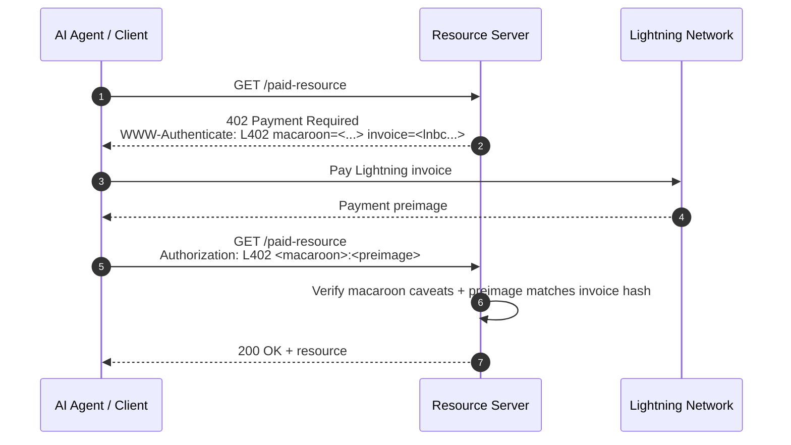

# L402 — Lightning + Macaroons

## Maintainer

[Lightning Labs](https://lightning.engineering). L402 is the open evolution of LSAT (Lightning Service Authentication Token), originally specified by Lightning Labs and now adopted across the Bitcoin/Lightning agent ecosystem. [Fewsats](https://fewsats.com) maintains a widely used L402 toolkit and proxy.

## Status

**Live · production traffic on Lightning.**

- Specification stable; multiple production deployments.
- **Fewsats** ships a production L402 proxy and SDK used by API providers and AI-agent integrations.
- Lightning-native; settles in BTC over the Lightning Network with sub-second finality and sub-cent fees.
- Specification family is sometimes referred to as **LSAT** in older docs; L402 is the current name.

## What it does

L402 is a Lightning-native HTTP payment protocol for **per-request micropayments**. A server protecting a paid resource responds with HTTP `402 Payment Required` plus a Lightning **invoice** and a **macaroon** (a bearer credential with attached caveats). The client pays the invoice over Lightning, then attaches the macaroon plus the payment preimage as the credential on subsequent requests. The macaroon is the access token; the preimage is the proof-of-payment. L402 is purpose-built for **micropayments** — fractions of a cent are economically viable on Lightning, which makes per-API-call or per-token billing practical in a way card rails cannot match.

## How macaroons + Lightning invoice work

The macaroon carries **caveats** — scoping rules baked into the credential (expiry, allowed paths, request count, etc.). The server verifies them locally without contacting an issuer service. The preimage is a 32-byte secret revealed only when the Lightning payment settles; possession proves the invoice was paid.

## Key concepts

- **Macaroon** — a bearer credential with attached caveats, originally specified by Google Research (2014). Cryptographically chained; caveats are append-only and verifiable offline.
- **Caveat** — a scoping rule attached to a macaroon (e.g. `expires_at = T+3600`, `allowed_path = /api/v1/*`, `max_requests = 100`).
- **Lightning invoice** — a `lnbc...` BOLT-11 invoice; payable on the Lightning Network; identified by a payment hash.
- **Preimage** — the 32-byte secret revealed when the invoice is paid. Hashed, it equals the payment hash. Functions as proof-of-payment.
- **L402 challenge** — the `WWW-Authenticate: L402 macaroon=... invoice=...` header on the 402 response.
- **L402 credential** — the `Authorization: L402 <macaroon>:<preimage>` header on the retry.
- **LSAT** — older name for the same family; LSAT and L402 are interchangeable in most older docs.

## How it fits

L402 sits in the **stablecoin rails / crypto payment** layer, alongside [x402](./x402.md), but with different economics. Where x402 settles in stablecoins on EVM-style chains and Solana, L402 settles in BTC on Lightning. The two cover **complementary use cases**: x402 for stablecoin-amount payments (cents to dollars), L402 for micropayments where Lightning's fee profile dominates. L402 is independent of [ACP](./acp.md), [AP2](./ap2.md), [UCP](./ucp.md), and [MPP](./mpp.md); a paid resource can be wrapped with L402 regardless of the calling protocol stack. For BTC-native checkout flows and Lightning-first agents (Fewsats and similar), L402 is the canonical primitive.

## Reference implementations

| Name | Link | Language |
|---|---|---|
| Lightning Labs LSAT specification | [github.com/lightninglabs/LSAT](https://github.com/lightninglabs/LSAT) | Spec |
| `aperture` (LSAT/L402 proxy by Lightning Labs) | [github.com/lightninglabs/aperture](https://github.com/lightninglabs/aperture) | Go |
| Fewsats L402 toolkit | [github.com/fewsats](https://github.com/fewsats) | TypeScript / Python |
| Lightning Address ecosystem (LNURL family) | [lightningaddress.com](https://lightningaddress.com) | n/a |
| `macaroon` libraries | various ports across Go, Python, Rust, JS | multi-language |

## When to use this

- **True micropayments** — sub-cent per-API-call billing, per-token billing, per-second metering. Lightning's fee floor makes this practical.
- **Bitcoin-native** flows where the user, agent, or service operates in BTC by default and stablecoin exposure is a non-starter.
- **Latency-sensitive** payments — Lightning settles in well under a second; preimage release is the credential.
- You want **caveat-scoped credentials** that the server can verify offline (no callback to an issuer).
- You're integrating with **Fewsats**, AI agent toolchains that target Lightning, or LNURL-style ecosystems.
- The receiver is comfortable holding BTC and either keeping it or off-ramping out-of-band.

## When NOT to use this

- Your settlement currency must be a **stablecoin** — use [x402](./x402.md) on Base / Ethereum / Polygon / Solana for USDC, USDT, DAI, EURC. Cryptorefills' default is x402 for stablecoin reasons.
- The paying party doesn't have a Lightning wallet and you can't put one in their hands. Lightning UX is excellent now but still narrower than card or stablecoin wallets.
- You need **chargeback / dispute** machinery — Lightning offers neither; refunds are a merchant operation, same as x402.
- Your **per-payment amounts are large** — Lightning channel capacity and routing reliability favor smaller amounts. Larger amounts are fine on x402 stablecoin rails.
- You operate in **jurisdictions where BTC handling adds compliance overhead** beyond what stablecoins require (varies by country and entity).
- Your team has **no operational experience** with Lightning channels, liquidity, or watchtowers. Operate via a managed provider (Fewsats, Voltage, or similar) until that comfort is built.

## Defender notes

L402 inherits Lightning's operational realities: channel liquidity affects whether a payment routes, watchtowers protect against channel-state attacks if you self-host nodes, and macaroons are **bearer tokens** — leak one and the holder gets the same access until the caveats expire. Mitigations: short-lived macaroons by default, IP- or agent-identity caveats where the trust model permits, fast revocation paths (a server-side denylist of macaroon root keys), and channel-balance monitoring to avoid silent payment failures. For high-value or high-volume Lightning operations, prefer a **managed Lightning provider** over self-hosting at first; the failure modes of self-hosted nodes (force-closes, justice transactions, fee-bumping) require dedicated operational attention. Keep stablecoin paths via x402 available as a fallback for cases where Lightning routing is unhealthy.

## L402 vs x402 — quick comparison

| Dimension | L402 | x402 |
|---|---|---|
| Settlement asset | BTC | USDC (primarily); USDT, DAI, EURC supported |
| Settlement chain | Lightning Network | Base, Ethereum, Polygon, Solana |
| Finality | Sub-second | Seconds to a minute, chain-dependent |
| Fee floor | Sub-cent | Cents (low-fee chains) to dollars (Ethereum L1) |
| Best for | True micropayments, BTC-native | Stablecoin amounts, mainstream agent flows |
| Credential model | Macaroon (caveats, offline-verifiable) | Signed payment header per request |
| Operational complexity | Lightning channels, liquidity, watchtowers | EVM RPC + facilitator |
| Production deployments | Lightning Labs, Fewsats, BTC-native services | Coinbase, Stripe-on-Base, Cloudflare, broad ecosystem |

For Cryptorefills' stablecoin-first model, [x402](./x402.md) is the default. L402 is the right tool for BTC-native or true-micropayment cases.

## Operational notes

- **Channel liquidity** governs whether your payments route. Monitor inbound and outbound capacity. A merchant receiving payments needs **inbound** liquidity; a buyer needs **outbound**.
- **Watchtowers** protect self-hosted nodes against published-but-stale channel states. If you self-host, run or rent watchtower service.
- **Macaroon expiry** must be aggressive by default. Bearer tokens leaked to logs become production incidents.
- **Routing failures** are normal. Your client retry logic should distinguish "no route" from "rejected" from "node offline" and surface different UX.
- **BTC custody.** Receiving BTC means deciding whether to hold it or off-ramp. Off-ramp adds latency, FX risk, and counterparty exposure; holding adds price-volatility exposure to your balance sheet.
- **Lightning Address / LNURL** integrations layer cleanly on top of L402 for human-tipping and identity-shaped payment flows.

## FAQ

**Q: Is L402 the same as LSAT?**
Effectively yes. LSAT is the original Lightning Labs name; L402 is the open evolution. The cryptographic primitives and wire format are the same family.

**Q: Can I use L402 without running a Lightning node?**
Yes — use a managed Lightning provider (Fewsats, Voltage, etc.). Self-hosting is a deeper operational commitment.

**Q: How small can payments go?**
Sub-cent comfortably; sub-millicent is possible but routing reliability degrades. Lightning's fee floor is the practical minimum.

**Q: Does L402 work for stablecoins?**
Stablecoin support on Lightning exists (Taproot Assets and similar) but is early. For stablecoins, [x402](./x402.md) is the production answer today.

**Q: Can I revoke a macaroon?**
Macaroons are bearer tokens; revocation is a server-side denylist on the macaroon's root key. Plan for short expiries by default.

**Q: How does L402 interact with MCP, ACP, AP2?**
L402 is a payment rail; it doesn't replace discovery, checkout, or authorization protocols. An MCP tool can return 402 with an L402 challenge; an AP2 mandate can be presented alongside the L402 credential if the merchant verifies both.

## Glossary

- **Macaroon** — bearer credential with cryptographically chained caveats; verifiable offline.
- **Caveat** — a scoping rule attached to a macaroon (expiry, path, count, etc.).
- **Preimage** — 32-byte secret revealed when a Lightning invoice is paid; proof-of-payment.
- **BOLT-11 invoice** — the standardized Lightning invoice format.
- **LSAT** — older name for L402; same protocol family.

## Merchant implications

Merchants accepting L402 inherit Lightning custody, channel liquidity management, and macaroon revocation policy. Refunds over Lightning require either pre-arranged refund channels or off-rail mechanisms — there is no in-protocol reversal. Caveat design (expiry, path scope, request count) is merchant-authored, and bearer-token leakage is an operational risk worth the defaults you pick. BTC custody decisions — hold versus off-ramp — sit on the merchant's balance sheet. See [/merchant-playbooks/](../merchant-playbooks/) for production decisions.

## References

- LSAT specification (origin): <https://github.com/lightninglabs/LSAT>
- Aperture proxy: <https://github.com/lightninglabs/aperture>
- Lightning Labs documentation: <https://docs.lightning.engineering>
- Fewsats: <https://fewsats.com> and <https://github.com/fewsats>
- Macaroons paper (Google, 2014): <https://research.google/pubs/pub41892/>
- BOLT-11 invoice format: <https://github.com/lightning/bolts/blob/master/11-payment-encoding.md>
- HTTP 402 reference: [RFC 9110, §15.5.2](https://www.rfc-editor.org/rfc/rfc9110#section-15.5.2)
- BTC + Lightning rails playbook: [`/rails/crypto-bitcoin-lightning.md`](../rails/crypto-bitcoin-lightning.md)
- Fewsats documentation and SDK examples (production agent integrations)
