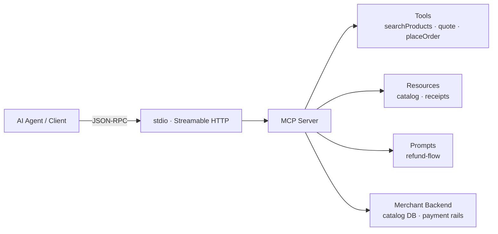

# MCP — Model Context Protocol

The open standard that lets an LLM client (Claude, ChatGPT, Cursor, custom agents) discover and call tools, read resources, and invoke prompt templates exposed by an external server. MCP is the connective tissue underneath most production agentic-commerce surfaces: the storefront, the catalog, the quote tool, and the order tool are usually MCP servers.

## Maintainer

[Anthropic](https://www.anthropic.com), with an open specification governed at [modelcontextprotocol.io](https://modelcontextprotocol.io/) and reference implementations in the [`modelcontextprotocol`](https://github.com/modelcontextprotocol) GitHub organization.

The spec is open and ecosystem-driven. Anthropic authors the canonical SDKs (TypeScript, Python, Java, Kotlin, C#, Go, Rust, Swift). Servers are written by anyone — Shopify, Cryptorefills, Stripe, Cloudflare, GitHub and thousands of independent maintainers all ship MCP servers.

## Status

**Mature.** MCP launched in late 2024 and has become the de facto integration surface for AI agents. By early 2026:

- All major LLM clients (Claude, ChatGPT, Cursor, Cline, Continue, Zed) speak MCP.
- **Storefront MCP servers are becoming the default agent-facing surface for commerce.** Shopify ships an official storefront MCP server. Stripe exposes its API as MCP. Cloudflare Agents SDK includes first-class MCP support.
- The [Streamable HTTP transport](https://modelcontextprotocol.io/specification/basic/transports) supersedes the older SSE-only transport; stdio remains canonical for local servers.
- Microsoft, GitHub, Linear, Notion, Figma, and most developer-tooling vendors ship first-party MCP servers.

## What it does

MCP defines three primitives a server can expose to a client:

- **Tools** — invocable functions the agent calls with structured arguments (`searchProducts`, `quote`, `placeOrder`, `getOrderStatus`). The agent decides when to call; the server defines the schema and runs the code.
- **Resources** — read-only addressable data (a product page, an order receipt, a catalog file). The agent can attach these into context.
- **Prompts** — reusable, parameterized prompt templates the user or agent can invoke (`refund-flow`, `compare-skus`).

It also standardizes:

- A JSON-RPC 2.0 message format.
- Capability negotiation during the initialize handshake.
- Two transports: **stdio** (subprocess) and **Streamable HTTP** (single endpoint, optional SSE for server-initiated events).
- Sampling (server can request the client run an LLM completion) and roots (client tells server which filesystem locations are in scope).

## Key concepts

| Concept | Definition |
|---|---|
| **Server** | The process exposing tools, resources, and prompts. Owned by the merchant or vendor. |
| **Client** | The LLM host (Claude Desktop, ChatGPT, Cursor, custom). Connects to one or more servers. |
| **Host** | The application embedding the client. Claude Desktop is the host; the MCP client is a component inside it. |
| **Transport — stdio** | Local, for trusted local servers spawned as subprocesses. Default for desktop integrations. |
| **Transport — Streamable HTTP** | Remote, for hosted servers. One HTTP endpoint, JSON request/response or SSE for streaming. Replaces the older SSE-only transport. |
| **Tool** | A function with a JSON-Schema input contract. Returns structured content the agent can reason about. |
| **Resource** | An addressable read-only object identified by a URI. Cacheable. |
| **Prompt** | A named, parameterized template surfaced to the user (slash commands) or agent. |
| **Sampling** | Server requests the client perform an LLM completion. Lets servers offload reasoning to the client's model. |
| **Roots** | Client-declared filesystem boundaries. Defender control: the client tells the server what it is permitted to see. |

## How it fits



In agentic commerce, MCP usually sits **above the commerce protocol layer**. ACP, AP2, and x402 govern the *transaction*; MCP governs how the agent *discovers and invokes* the tools that initiate that transaction. A typical Cryptorefills-style flow:

1. Agent connects to a storefront MCP server.
2. Agent calls `searchProducts({ category, country, currency })`.
3. Agent calls `quote({ sku, quantity, payCurrency })` — the server returns a quote that may embed an x402 challenge or an ACP `checkout_session` object.
4. Agent calls `placeOrder({ quoteId, paymentProof })` — the server settles via the appropriate rail and returns a delivery resource.

## Reference implementations

- **Anthropic SDKs** — official MCP SDKs in [TypeScript](https://github.com/modelcontextprotocol/typescript-sdk), [Python](https://github.com/modelcontextprotocol/python-sdk), and others under [github.com/modelcontextprotocol](https://github.com/modelcontextprotocol).
- **Shopify storefront MCP** — official storefront MCP server for Shopify-hosted merchants. See the [Shopify Dev MCP documentation](https://shopify.dev/).
- **Stripe MCP** — official Stripe API surface as an MCP server. See the [Stripe Agent Toolkit](https://github.com/stripe/agent-toolkit).
- **Cloudflare Agents SDK** — Streamable HTTP MCP servers running on Workers. See [developers.cloudflare.com/agents](https://developers.cloudflare.com/agents/).
- **GitHub MCP** — official server exposing repository, issue, and PR tooling.
- **Cryptorefills MCP server** — exposes the digital-goods catalog (gift cards, mobile, eSIMs) to agents. See `/examples/mcp-storefront-minimal` in this repo for a minimal port.

## Code sketch

A minimal MCP server in TypeScript exposing one tool. This is the smallest viable surface a merchant can ship to expose a single capability to an agent.

```ts
import { Server } from "@modelcontextprotocol/sdk/server/index.js";
import { StdioServerTransport } from "@modelcontextprotocol/sdk/server/stdio.js";
import { z } from "zod";

const server = new Server(
  { name: "cryptorefills-storefront", version: "0.1.0" },
  { capabilities: { tools: {} } }
);

server.tool(
  "searchProducts",
  "Search the digital-goods catalog by country and category.",
  { country: z.string().length(2), category: z.string() },
  async ({ country, category }) => {
    const products = await catalog.search({ country, category });
    return { content: [{ type: "text", text: JSON.stringify(products) }] };
  }
);

await server.connect(new StdioServerTransport());
```

For a Streamable HTTP variant, swap `StdioServerTransport` for the HTTP transport and host on Workers, Lambda, or any HTTP server. Use Zod (or any JSON-Schema source) to define and validate inputs at the boundary.

## Transports in practice

| Transport | When to pick it | Trust posture |
|---|---|---|
| **stdio** | Local desktop integrations spawned by the host. Trusted environment; the user installed the binary. | Server runs with the user's privileges. Treat as local code. |
| **Streamable HTTP** | Hosted servers, multi-tenant SaaS, anything not on the user's machine. | Server is third-party. Always authenticate; scope tokens; never grant blanket data access. |

The older HTTP+SSE transport from MCP's first months is deprecated — Streamable HTTP collapses both response patterns onto a single endpoint and is the canonical remote transport. New servers should ship Streamable HTTP.

## Authentication and scoping

For remote MCP servers, OAuth 2.0 is the canonical authentication flow. The spec defines a discovery and authorization handshake so an agent client can dynamically register, request scoped tokens, and refresh them. Defender posture for any merchant exposing an MCP server publicly:

- Issue per-agent and per-user tokens; never share a master credential across clients.
- Scope tokens to specific tools (`searchProducts` and `quote` for unauthenticated discovery; `placeOrder` only after user-bound auth).
- Rate-limit per token. Agent traffic patterns burst.
- Log tool invocations with the token identity so out-of-band investigation is possible.
- Treat any free-form text returned by the server as untrusted input on the client side. Sanitize before it reaches the model when the threat model warrants it.

## When to use this

- You want to expose a capability (catalog, quote, order, refund, status) to *any* MCP-speaking agent without writing a per-client integration.
- You want a stable, schema-driven surface that survives model and client churn.
- You want capability negotiation, structured errors, and streaming responses out of the box.
- You are building a developer-tool or merchant integration that multiple agent platforms will consume.

## When NOT to use this

- **You only need to expose an HTTP API.** A plain REST or GraphQL API plus an OpenAPI spec is simpler and works fine if you control the client.
- **You need protocol-level payment semantics.** MCP carries data; it does not define how payments settle. Pair it with x402, ACP, AP2, or a card rail.
- **You need agent-to-agent coordination.** That is A2A's domain.
- **You are inside a single LLM provider's surface and they offer a richer first-party tool format.** ChatGPT Apps, Claude tool use, and Gemini function-calling each have native shapes; MCP is the cross-vendor lingua franca, not always the deepest one.
- **Untrusted servers.** Agent clients should treat MCP servers like any third-party API: scoped permissions, principle-of-least-privilege, no blanket filesystem or network grants. Prompt-injection from server-returned content is a real attack surface — strip or quarantine untrusted server output before it reaches the model when the threat model warrants it.

## Resources and prompts in commerce

Most attention goes to MCP tools. Resources and prompts are underused but useful in commerce contexts:

- **Resources** are ideal for product detail pages, catalog feeds, and signed receipts. The agent can attach a resource by URI; the server controls cacheability and freshness. A merchant can expose `cryptorefills://product/{sku}` and `cryptorefills://order/{id}/receipt` as canonical, machine-readable, agent-fetchable resources.
- **Prompts** are ideal for fixed flows the agent can offer the user as slash commands or named actions: `/refund`, `/compare-skus`, `/quote-in-currency`. The merchant authors the prompt server-side; the agent surfaces it to the user with parameter slots.

Treating resources and prompts as first-class — not afterthoughts — produces a richer agent-facing surface than tools alone.

## Merchant implications

Merchants exposing an MCP storefront decide tool surface area, rate limits, idempotency keys, and the read-versus-write split. The spec defines the transport; the merchant defines catalog ranking, quote semantics, and order lifecycle. OAuth scopes per tool, per-token rate limits, and the policy for treating server-returned text as untrusted on the client side are all operator decisions. See [/merchant-playbooks/](../merchant-playbooks/) for production decisions.

## References

- [modelcontextprotocol.io](https://modelcontextprotocol.io/) — specification, transport docs, authentication, lifecycle.
- [github.com/modelcontextprotocol](https://github.com/modelcontextprotocol) — reference servers, SDKs, inspector tooling.
- [Anthropic — Introducing MCP](https://www.anthropic.com/news/model-context-protocol) — original announcement and rationale.
- [Shopify Dev — MCP](https://shopify.dev/) — storefront MCP for Shopify merchants.
- [Stripe Agent Toolkit](https://github.com/stripe/agent-toolkit) — Stripe API as MCP.
- [Cloudflare Agents SDK](https://developers.cloudflare.com/agents/) — Streamable HTTP MCP on Workers.
