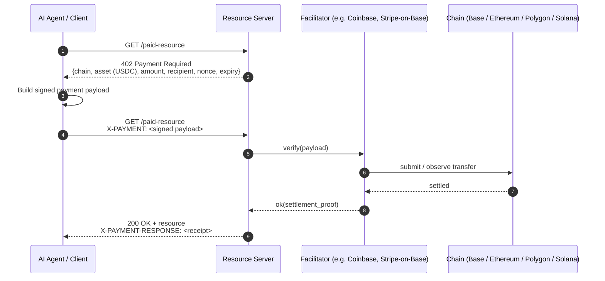

# x402 — HTTP 402 Stablecoin Payments

## Maintainer

[Coinbase](https://coinbase.com) and the [x402 Foundation](https://www.x402.org/). Reference implementation at [github.com/coinbase/x402](https://github.com/coinbase/x402). The spec name comes from the long-reserved HTTP `402 Payment Required` status code.

## Status

**Live · production traffic.**

- **V2 launched December 2025** — facilitator model, multi-chain settlement, hardened spec.
- **Stripe integrated on Base, February 2026** — Stripe acts as a facilitator for x402 payments settling in USDC on Base.
- **Cloudflare Agents SDK** ships first-class x402 support; merchant-side x402 servers can run on Cloudflare Workers.
- USDC is the dominant settlement asset; USDT, DAI, and EURC are supported across chain implementations.
- Production chains today: **Base**, **Ethereum**, **Polygon**, **Solana**. Tron support is implemented in some facilitator deployments.

x402 is the **stablecoin-native default** for agent-to-API and agent-to-agent payments in 2026. Cryptorefills routes a meaningful share of agent traffic through x402.

## What it does

x402 turns the HTTP `402 Payment Required` status code into a usable payment primitive. A server protecting a paid resource responds with a `402` plus structured payment requirements (chain, asset, amount, recipient, nonce, expiry). The client (an agent or its wallet) constructs a signed payment payload, retries the original request with an `X-PAYMENT` header, and the server (or a facilitator) verifies and settles on-chain before returning the resource. The protocol standardizes the negotiation, the header format, the signed payload shape, and the facilitator role so any compliant client can pay any compliant server with **zero pre-arranged account relationship**. Settlement is a stablecoin transfer on a public chain — deterministic, auditable, and final on the chain's normal terms.

## How HTTP 402 → resource link → settle works



The signed payload is **chain-agnostic in shape** — the server's 402 response selects the chain and asset; the client signs accordingly. Facilitators abstract the on-chain submission so the resource server doesn't need to run a node.

## Key concepts

- **Resource ID** — the URL of the paid resource. The unit of pricing.
- **Payment requirements** — the structured 402 body: chain, asset (USDC by default; USDT, DAI, EURC supported), amount, recipient, nonce, expiry, and optional metadata.
- **`X-PAYMENT` header** — the signed payment payload the client attaches on retry. Format defined by the spec; opaque to intermediaries.
- **`X-PAYMENT-RESPONSE` header** — the server's settlement receipt returned with the 200 response. Signed; reusable as proof of payment.
- **Facilitator** — a service (Coinbase, Stripe-on-Base, others) that verifies signed payloads and settles on-chain so the resource server doesn't have to. Optional but common.
- **Settlement chain selection** — the server states the chain in the 402; the client signs for that chain. A merchant accepting USDC on Base advertises Base; a merchant accepting USDC on Solana advertises Solana. Multi-chain merchants typically run multiple endpoints or a content-negotiated chain selection.
- **Idempotency** — the nonce in the requirements doubles as the idempotency anchor; replays are rejected.
- **Stablecoin emphasis** — x402 in production is overwhelmingly **USDC on Base, Ethereum, Polygon, and Solana**, with USDT, DAI, and EURC available where the facilitator and chain support them.

## Code sketch (TypeScript, ~20 lines)

```ts
import { createPaymentClient } from "x402-client"; // illustrative
import { parseEther } from "viem";

const client = createPaymentClient({
  wallet: agentWallet,                 // signs payments
  chains: ["base", "ethereum", "polygon", "solana"],
  defaultAsset: "USDC",
});

const res = await client.fetch("https://api.example.com/paid-resource", {
  method: "GET",
  maxPrice: { asset: "USDC", amount: "0.10" }, // hard ceiling
});

if (res.status === 200) {
  const receipt = res.headers.get("X-PAYMENT-RESPONSE");
  console.log("paid; receipt:", receipt);
  console.log("body:", await res.text());
}
```

The library handles the 402 retry, signs the `X-PAYMENT` header, enforces the `maxPrice` ceiling, and parses the settlement receipt. Real client libraries vary; see the [coinbase/x402](https://github.com/coinbase/x402) repo for the canonical TypeScript and Go SDKs.

## How it fits

x402 is the **payment rail** for agent-to-API and agent-to-agent flows. It pairs cleanly with [AP2](./ap2.md) (the A2A x402 extension carries AP2 mandates over the same HTTP exchange) and with [MCP](./mcp.md) (an MCP tool can return 402 from a paid endpoint). For human-shopper checkout, x402 is the *settlement* layer beneath the [ACP](./acp.md) cart shape when the merchant accepts stablecoins. x402 does **not** cover catalog discovery, refunds, jurisdictional metadata, or human delegation — those stay with merchant ops and protocols above. See [`/merchant-playbooks/multi-chain-settlement-reconciliation.md`](../merchant-playbooks/multi-chain-settlement-reconciliation.md) for the production reconciliation pattern across Base, Ethereum, Polygon, Solana, and Tron.

## Reference implementations

| Name | Link | Language |
|---|---|---|
| `coinbase/x402` | [github.com/coinbase/x402](https://github.com/coinbase/x402) | TypeScript, Go |
| x402 Foundation site | [www.x402.org](https://www.x402.org/) | Spec, examples, partners |
| Stripe-on-Base x402 facilitator | Stripe documentation | Multi-language |
| Cloudflare Agents SDK x402 support | [developers.cloudflare.com/agents](https://developers.cloudflare.com/agents/) | TypeScript |
| AP2 A2A x402 extension | [github.com/google-agentic-commerce/AP2](https://github.com/google-agentic-commerce/AP2) | TypeScript, Python |
| Cryptorefills x402 example | [`/examples/x402-pay-an-api`](../examples/x402-pay-an-api) | TypeScript |

## When to use this

- **Agent pays an API** per call, with no pre-arranged account.
- **Agent-to-agent payments** with stablecoin settlement.
- **Stablecoin-native checkout** for digital goods where instant final settlement is preferable to card capture.
- You want **deterministic settlement** with on-chain proof rather than processor-dependent capture.
- You operate across **multiple chains** (USDC on Base, USDC on Solana, USDT on Tron) and want one protocol shape across all of them.
- You need **chargeback-free settlement** for low-fraud, low-dispute digital products (gift cards, mobile top-ups, eSIMs, API access).
- You want **Cloudflare Workers**, edge, or other serverless deployment — x402 servers run cleanly on edge runtimes.

## When NOT to use this

- You need **chargeback / dispute machinery** native to the rail. Crypto rails do not provide chargebacks; refunds are a merchant operation. See [`refunds-and-disputes-for-agents.md`](../merchant-playbooks/refunds-and-disputes-for-agents.md).
- Your buyer **doesn't have a wallet** and you can't put one in their hands quickly. Card-rail [ACP](./acp.md) is the pragmatic answer for ChatGPT consumer flows.
- Your products require **KYC at point of sale** that an anonymous on-chain payment can't satisfy. You must collect KYC out-of-band; x402 alone doesn't carry it.
- Settlement amounts are **far below network fees** on your selected chain. Pick a low-fee chain (Base, Solana, Polygon) or use [L402](./l402.md) on Lightning for true micropayments.
- You need **fiat on the merchant side** with no off-ramp tolerance. Off-ramp adds latency and FX exposure — model it explicitly. See `multi-chain-settlement-reconciliation.md`.

## Defender notes

x402 makes settlement final and fast, which is the point. That removes the card-network "we can claw it back" safety net. Defensible x402 deployments require: per-resource and per-agent **hard maximum price ceilings** enforced client-side **and** server-side, signed `X-PAYMENT-RESPONSE` receipts archived for audit, watch-only addresses for the receiving wallet so anomaly detection runs out-of-band, **decimals validation** on every chain (USDC has 6 decimals on Base/Ethereum/Polygon/Solana but bridged variants and adjacent assets have caused real outages elsewhere — see [evm-token-decimals](../resources.md#articles) hazards), strict nonce/expiry enforcement at the facilitator, and a wallet-per-purpose model (revenue-receipt wallet ≠ payout wallet ≠ ops wallet). Treat the facilitator as **trusted but verified**: cross-check on-chain settlement against facilitator receipts in your reconciliation job. For non-custodial agent wallets and per-task budgets, see the patterns in the [agent-payment-x402](../agent-playbooks/x402-buyer-loop.md) playbook.

## FAQ

**Q: Why HTTP 402 specifically?**
Because the status code was reserved decades ago for exactly this purpose and never used. x402 reclaims it. Practically, 402 is unambiguous to HTTP intermediaries — caches, proxies, gateways — and survives the modern web stack cleanly.

**Q: Which stablecoin should I default to?**
USDC. It has the broadest issuer trust profile, is native on every chain x402 ships on, and is the asset Stripe-on-Base settles. USDT is widely supported, especially on Tron. DAI and EURC fit specific currency-exposure cases.

**Q: Which chain should I accept on?**
Base for cost + speed + USDC nativity. Solana for ultra-low fees. Polygon for EVM compatibility. Ethereum L1 only when you need that finality / liquidity. Avoid receiving on chains your back office can't reconcile.

**Q: Do I need to run a facilitator?**
No. Coinbase, Stripe-on-Base, and others run public facilitators. Self-host only if your settlement model demands it.

**Q: What about agent-side wallet management?**
Use non-custodial agent wallets with per-task budgets. The [agent-payment-x402](../agent-playbooks/x402-buyer-loop.md) playbook covers concrete patterns.

**Q: How do I handle refunds?**
Out-of-band, merchant-initiated. There's no on-rail refund primitive. Document your refund policy per product type. See [refunds-and-disputes-for-agents](../merchant-playbooks/refunds-and-disputes-for-agents.md).

**Q: What about decimals — USDC has 6 decimals on every chain, right?**
On the chains x402 cares about (Base, Ethereum, Polygon, Solana for native USDC) — yes, 6. **But bridged variants and adjacent assets do not always agree.** Validate at runtime; never hardcode. A decimals-mismatch bug silently mis-prices everything.

## Glossary

- **Facilitator** — third-party service that verifies x402 payments and submits or observes the on-chain transfer.
- **Resource server** — the HTTP server protecting a paid resource and emitting 402.
- **`X-PAYMENT`** — request header carrying a signed payment payload.
- **`X-PAYMENT-RESPONSE`** — response header carrying a signed settlement receipt.
- **Settlement chain** — the blockchain on which the stablecoin transfer finalizes.

## Merchant implications

Merchants accepting x402 settle in stablecoin and inherit chain selection, finality gating, and decimal-correct accounting. The spec defines the HTTP exchange; the merchant defines reconciliation across chains, refund pathways (off-rail by definition), per-chain fee policy, and the wallet-per-purpose split that keeps revenue, payout, and ops funds separate. Treat the facilitator as trusted-but-verified: cross-check on-chain settlement against facilitator receipts. See [/merchant-playbooks/](../merchant-playbooks/) for production decisions.

## References

- Spec hub: <https://www.x402.org/>
- Repository: <https://github.com/coinbase/x402>
- Coinbase blog: <https://www.coinbase.com/blog> (search "x402")
- Cloudflare Agents SDK: <https://developers.cloudflare.com/agents/>
- Stripe-on-Base launch (Stripe newsroom, Feb 2026)
- HTTP 402 historical context: [RFC 9110, §15.5.2](https://www.rfc-editor.org/rfc/rfc9110#section-15.5.2)
- AP2 A2A x402 extension: <https://github.com/google-agentic-commerce/AP2>
- Cryptorefills production playbook: [`/merchant-playbooks/multi-chain-settlement-reconciliation.md`](../merchant-playbooks/multi-chain-settlement-reconciliation.md)
