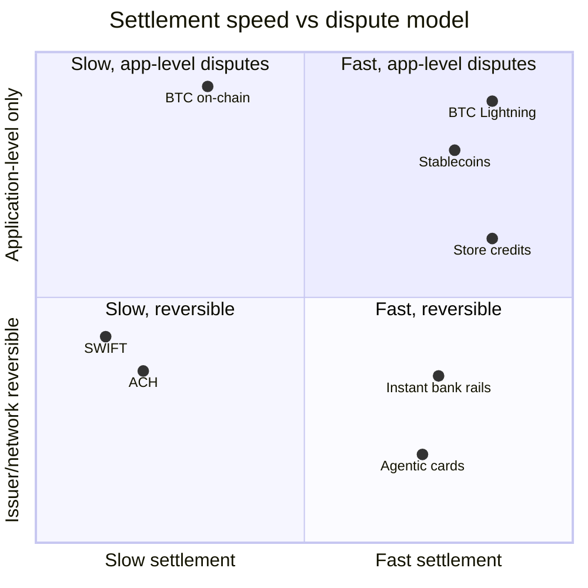
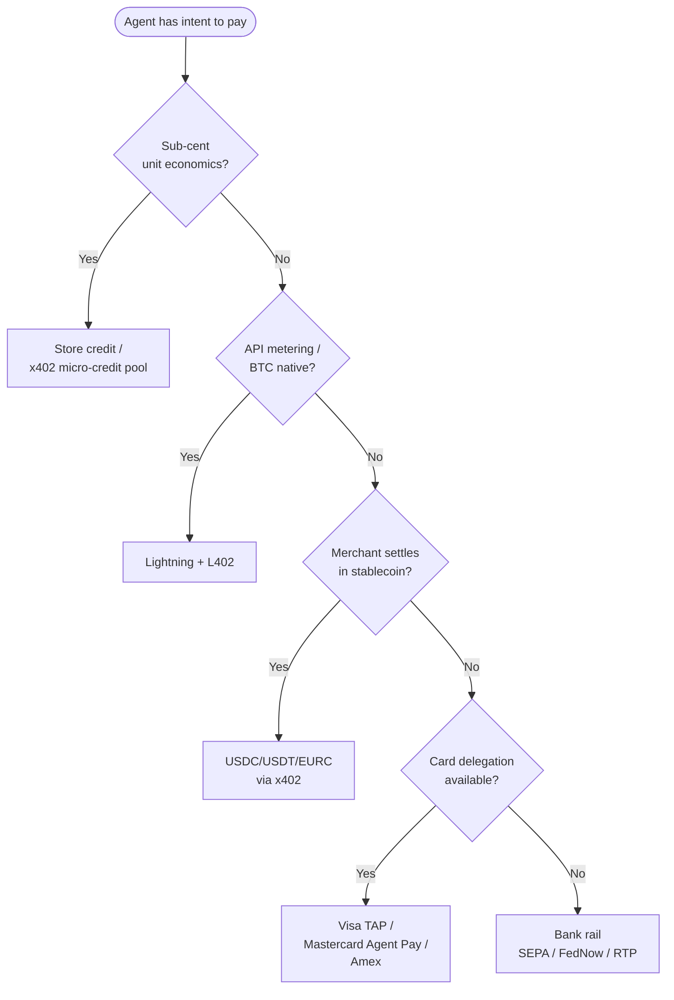

# Payment Rails — Index

> Index of payment rails for agentic commerce. Each rail page documents the rail's mechanics, its dispute model, the production considerations a merchant actually deals with, and the agent-side patterns that ride on top.

## What this is

A payment rail is the system that moves value between a buyer and a seller. In agentic commerce there is no single rail — agents settle in stablecoins, in BTC over Lightning, on agent-aware card-network tokens, on bank rails, and against pre-funded balances. Choosing the right rail is the highest-leverage decision a merchant makes when bringing AI-agent traffic into checkout. This index orients you across the rails Cryptorefills ships in production and links to a deeper page per rail.

## Rails covered

| Rail | Page | One-line summary |
|---|---|---|
| Stablecoins | [crypto-stablecoin.md](./crypto-stablecoin.md) | USDC, USDT, DAI, EURC across Base, Ethereum, Tron, Solana, Polygon — the agentic-commerce production default. |
| BTC + Lightning | [crypto-bitcoin-lightning.md](./crypto-bitcoin-lightning.md) | Native bitcoin on-chain plus Lightning for instant micropayments and L402-gated APIs. |
| Card networks (agentic) | [card-networks-agentic.md](../protocols/agentic-card-networks.md) | Visa TAP, Mastercard Agent Pay, Amex agentic tokens — card rails adapted for agent delegation. |
| Bank rails | [Off-ramp to bank rails](./crypto-stablecoin.md#off-ramp-to-bank-rails) | SEPA, ACH, FedNow, RTP, SWIFT — used for fiat off-ramp from crypto receipts and B2B settlement. |
| Store credits and loyalty | [store-credits-loyalty.md](./store-credits-loyalty.md) | Pre-funded balances and gift-card credit as a rail; the right answer for sub-cent unit economics. |

## Quadrant — settlement speed × dispute model

The two axes that matter operationally:

- **Settlement speed** — when does the merchant actually have spendable funds? Lightning and store credits are sub-second. Stablecoins on Base/Solana/Tron are seconds. Card auths post in seconds but settlement is days. ACH and SWIFT are days.
- **Dispute model** — can the issuer or network reverse the payment after settlement? Card networks can (chargebacks). Bank rails can (returns, recalls — limited windows). Crypto cannot at the protocol layer; disputes are application-level only and the merchant has to decide refund semantics.

These two axes together drive how a merchant has to think about reserves, fraud loss, refund SLAs, and reconciliation. Rails in the upper-right (fast + app-level) are the agentic-commerce default. Rails in the lower-left (slow + reversible) are where merchants take the most working-capital and dispute exposure.

## Rail summaries

### Stablecoins (USDC, USDT, DAI, EURC)

The production default for agent-to-merchant and agent-to-agent payments. Settlement is on-chain, finality is per-chain (Base ~2s soft / ~12 min hard via Ethereum reorg window, Solana ~400ms / ~13s, Tron ~3s, Polygon ~2s soft / ~256 blocks finalization, Ethereum ~12s / ~12 min). No chargebacks. Refunds are merchant-initiated outbound transfers. Decimals vary per token (USDC = 6, USDT = 6, DAI = 18, EURC = 6) — the most common production bug.

→ [crypto-stablecoin.md](./crypto-stablecoin.md)

### BTC + Lightning

On-chain BTC for high-value, low-frequency settlement. Lightning for micropayments and L402-style API metering. Custodial Lightning (Voltage, Lightspark, Strike) is what most merchants actually use; non-custodial requires liquidity management. L402 (Lightning Labs, derived from LSAT) is the HTTP 402 + macaroon dialect that matters for agent API access where stablecoin rails don't fit.

→ [crypto-bitcoin-lightning.md](./crypto-bitcoin-lightning.md)

### Card networks adapted for agents

Visa Trusted Agent Protocol (TAP), Mastercard Agent Pay, and American Express's agentic tokens add agent delegation, scope encoding, and agent-aware fraud signals to existing card rails. Settlement and chargeback semantics are unchanged from card transactions; what changes is the cryptographic proof that an agent (not a phishing bot) is the one presenting the credential.

→ [card-networks-agentic.md](../protocols/agentic-card-networks.md)

### Bank rails

Where agents touch bank rails: merchant settlement of crypto receipts to fiat (off-ramp), B2B invoice payments, and recurring debits where card rails are too expensive. SEPA Instant and FedNow / RTP are the agentic-relevant subset because they settle in seconds and are 24/7. SWIFT and ACH still matter for cross-border B2B but are not in the agent's hot path.

→ [Off-ramp to bank rails →](./crypto-stablecoin.md#off-ramp-to-bank-rails)

### Store credits and loyalty as a rail

Pre-funded balances are a real rail. The agent (or its principal) tops up once, then debits per use. This collapses per-transaction cost to near-zero, eliminates network fees, and gives the merchant deterministic refunds. Gift-card balances, prepaid stablecoin allowances on x402, and micro-credit pools are the same pattern in different clothes. For sub-cent unit economics this is the right choice.

→ [store-credits-loyalty.md](./store-credits-loyalty.md)

## Production considerations (cross-rail)

Things every merchant has to plan for regardless of rail choice:

- **Reserves and float.** Card rails sit on a 1–3 day settlement curve and require a chargeback reserve. Stablecoin rails settle in seconds but the merchant carries the FX/treasury risk if they price in fiat. Bank rails sit on 0–2 day curves depending on instant vs batch.
- **Reconciliation surface.** Each rail produces a different settlement artifact: card processor batch reports, on-chain transactions per chain, Lightning invoices, SEPA pacs.008/pacs.002. A merchant running multiple rails needs one ledger that ingests all of them with idempotent keys.
- **Refund semantics.** Card networks: refund through the same auth. Stablecoins: outbound transfer to the buyer's address (which the agent must have provided at quote time). Lightning: outbound invoice paid to a buyer-provided invoice. Bank: credit transfer.
- **Dispute window and evidence.** Card networks: 60–540 days depending on reason code. Crypto: no protocol window — the merchant publishes their own. Bank rails: short, network-defined recall windows.
- **Tax classification per rail.** Stablecoin receipts are usually treated as commodity sales for tax purposes in many jurisdictions; card receipts are cash-equivalent. Different reporting forms apply.
- **Fraud surface.** Card rails: stolen-card fraud. Crypto rails: address-poisoning, replay across chains, decimals confusion. Bank rails: APP fraud and recall abuse.

→ Cross-rail comparison: [/comparison/rails-comparison.md](../comparison/rails-comparison.md)
→ Multi-rail reconciliation: [/merchant-playbooks/multi-chain-settlement-reconciliation.md](../merchant-playbooks/multi-chain-settlement-reconciliation.md)
→ Refund decisions per rail: [/merchant-playbooks/refunds-and-disputes-for-agents.md](../merchant-playbooks/refunds-and-disputes-for-agents.md)

## How agents pick a rail

This is the rough decision an agent (or the agent's wallet/orchestrator) walks every checkout. It is not a single global default — it is a per-merchant, per-product, per-amount decision.

## Picking a rail by use-case

A merchant doesn't pick "a rail" — they pick a default rail per use case. The shape Cryptorefills runs in production:

| Use case | Default rail | Secondary | Notes |
|---|---|---|---|
| Agent buys gift card $10–$500 | USDC over x402 on Base | USDT/Tron, Visa TAP | Stablecoin is dominant for agent traffic; cards still common where the user pays directly. Per Cryptorefills production: 10,500+ gift-card brands across 180+ countries. |
| Agent buys mobile top-up $1–$50 | USDC/USDT | Lightning | Low AOV; stablecoin or LN beat card interchange. At Cryptorefills, agent-driven top-ups default to USDC. |
| Agent buys eSIM $5–$100 | USDC over x402 | Card (TAP/Agent Pay) | Stablecoin is cleanest; consumer cohort still cards. In [Cryptorefills' public agent catalog](https://github.com/cryptorefills/agents), eSIM appears under `kind: mobile_recharge`. |
| Agent books flight or hotel $100–$2,000 | Card (TAP/Agent Pay) | USDC over x402 | Chargeback protection matters; consumer reflex is card. |
| Agent pays per API call $0.0001–$0.01 | Store credit / x402 micro-credit | Lightning + L402 | External rails too expensive per call. |
| Agent recurring subscription | Card mandate or SEPA SDD | Store credit auto-refill | Mandate reliability and dispute coverage matter. |
| Agent-to-agent (M2M) | USDC over x402 | Lightning | No human cardholder; card rails don't apply cleanly. |
| Merchant settles to fiat | Bank rail (SEPA-Inst, FedNow, RTP) | SWIFT for cross-border | Off-ramp from crypto receipts to operating cash. |

These defaults are not universal. They reflect the AOV bands, geographies, and merchant risk posture Cryptorefills operates against. Pick your own per your data — but pick deliberately.

## What this index does not cover

Each rail has its own page; this index does not duplicate them. What you'll find on the rail pages but not here:

- Decimals hazards on stablecoin rails (the production bug class).
- Custodial-vs-non-custodial Lightning tradeoffs.
- Mandate-evidence retention for card-network agentic disputes.
- Bank-rail return windows and reserve sizing.
- Reserve and reconciliation policy for store credits.

The bigger cross-rail topics — multi-chain settlement reconciliation, refund decisions per rail, fraud signals on agent traffic — live in `/merchant-playbooks/`. Start with the rail pages, then jump to the playbooks for the operational depth.

## References

- Coinbase, *x402 specification* — <https://www.x402.org/>
- Circle, *USDC* — <https://www.circle.com/usdc>
- Tether, *USDT* — <https://tether.to/>
- Sky (formerly MakerDAO), *DAI* — <https://sky.money/>
- Lightning Labs, *Lightning Network* — <https://lightning.network/>
- Visa, *Trusted Agent Protocol* — <https://corporate.visa.com/en/products/agentic-commerce.html>
- Mastercard, *Agent Pay* — <https://www.mastercard.com/news/press/2025/april/mastercard-unveils-agent-pay/>
- American Express, *Agentic commerce* — <https://www.americanexpress.com/>
- ECB, *SEPA Instant Credit Transfer* — <https://www.ecb.europa.eu/paym/integration/retail/instant_payments/html/index.en.html>
- Federal Reserve, *FedNow* — <https://www.frbservices.org/financial-services/fednow>
- The Clearing House, *RTP* — <https://www.theclearinghouse.org/payment-systems/rtp>
