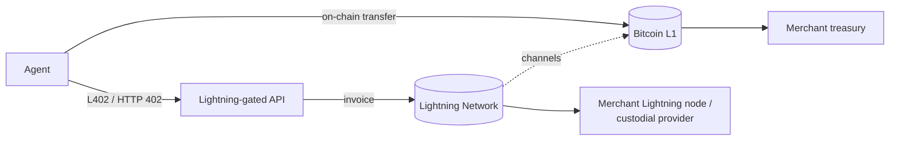
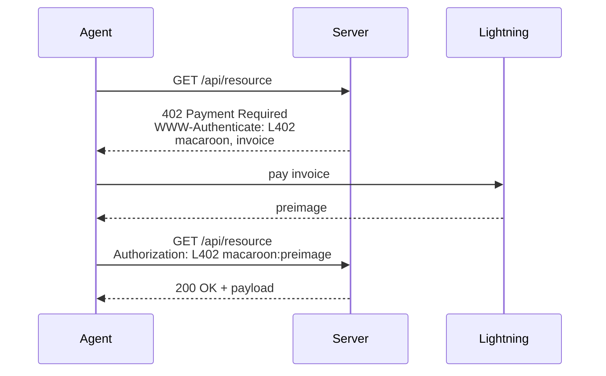

# BTC + Lightning Rails

> Bitcoin on-chain and Lightning as a payment rail for agentic commerce. On-chain BTC for high-value, low-frequency settlement. Lightning for instant micropayments, API metering, and L402-gated agent access. This page covers what each is for, what they are not, and the production considerations a merchant deals with when accepting them.

## What this is

Bitcoin is a settlement-layer asset — fixed supply, the longest-running public chain, and the highest-liquidity non-stablecoin crypto. The base layer (on-chain BTC) settles in roughly 10-minute blocks with probabilistic finality after several confirmations; that makes it good for treasury and high-value flows but poor for retail checkout. The Lightning Network is a payment-channel protocol on top of Bitcoin that enables instant, near-free, off-chain transfers. Together they cover two distinct rails for agentic commerce: Bitcoin as a value-settlement asset and Lightning as a sub-second metered-payment rail. L402 is the HTTP authentication scheme that lets agents pay for API calls over Lightning.

## Overview

Two rails, one asset:

- **On-chain BTC** — value transfer recorded directly on the Bitcoin blockchain. Slow, censorship-resistant, fee market. Good for merchants who want to hold BTC as treasury or accept high-value settlement.
- **Lightning** — payment channels that net out to on-chain BTC at open and close. Instant, sub-cent fees, ideal for sub-dollar transactions and API metering.

## On-chain BTC characteristics

| Property | Value |
|---|---|
| Block time | ~10 minutes (target) |
| Confirmations for "safe" | 1 conf for low-value retail; 6 conf for high-value (industry custom) |
| Practical finality | Probabilistic. ~6 confirmations is the convention for treating a transaction as final. Reorgs of more than 1–2 blocks are rare in 2026. |
| Native fee unit | sat/vB (satoshis per virtual byte) |
| Typical fee | $0.50–10 depending on mempool congestion |
| Decimals | BTC has 8 decimals (1 BTC = 100,000,000 sats). The "decimal" is fixed by protocol, not per-token. |
| Scripts in use | P2PKH, P2SH, P2WPKH, P2WSH, P2TR (Taproot) |

Practical guidance:

- On-chain BTC is rarely the agent's hot path for retail purchases. It is too slow and too expensive per-transaction for sub-$10 commerce.
- Where it shows up: high-value settlement (gift cards >$500, B2B invoices, treasury moves), opt-in customer preference ("I want to pay in BTC, not stablecoin"), and as the close-out asset for Lightning channels.
- A merchant accepting on-chain BTC must hold either a self-custody node or a relationship with a custody provider (Coinbase Custody, BitGo, Anchorage, Fireblocks).
- Address re-use is a privacy and reconciliation hazard. Generate one address per quote (HD-derived) and treat the address as the order key.

## Lightning Network primer

Lightning is a network of bilateral payment channels. Two parties open a channel by funding a 2-of-2 multi-sig on-chain output. They then exchange signed off-chain balance updates between themselves, and close the channel by broadcasting the final state on-chain. Routed payments hop across multiple channels using HTLCs (hashed time-locked contracts) so any pair of nodes can transact even without a direct channel.

What this means operationally:

- **Settlement is sub-second** for routed payments under typical conditions.
- **Fees are tiny** — typically a few sats plus a per-hop fee. Sub-cent for most payments.
- **Capacity is bounded by channel liquidity.** A node can only send as much as its outbound capacity in the right direction. This is the operational headache.
- **Invoices are single-use.** A standard BOLT-11 invoice has an amount, a description, an expiry, and a payment hash. Once paid (or expired) it cannot be reused.
- **AMP and BOLT-12 offers** allow reusable, amount-flexible invoices. BOLT-12 in particular is the future of Lightning UX but support is uneven across implementations as of 2026.

Reference implementations: LND (Lightning Labs), Core Lightning (Blockstream), Eclair (ACINQ), LDK (Spiral). All BOLT-spec compatible.

## L402 use

L402 is an HTTP authentication scheme by Lightning Labs (originally LSAT) that issues a macaroon-based access token paid for via a Lightning invoice. It implements HTTP 402 with a Lightning-flavoured semantic.

Flow (agent perspective):

Why agents care about L402:

- It is HTTP-native. An agent that already speaks HTTP can pay an L402 endpoint with no protocol-level surgery.
- It is per-request economically — fits API metering, content paywalls, search, inference calls, scraping access.
- It is good for use cases where stablecoin rails don't fit: where the merchant prefers BTC, where the user is in a Lightning-heavy region, or where the unit economics are sub-cent and Lightning is the cheapest rail.

Where L402 is *not* the right answer: standard agentic-commerce checkout for goods (gift cards, eSIMs, mobile top-ups). For those, x402 over stablecoin is the better default — the merchant accounting and refund flow is simpler.

→ See [/protocols/l402.md](../protocols/l402.md) for the spec walk and toolchain (Lightning Labs Aperture, Fewsats).

## Custodial vs non-custodial Lightning

This is the single biggest operational decision for a merchant on Lightning.

| Dimension | Custodial | Non-custodial |
|---|---|---|
| Liquidity management | Provider handles channels, rebalancing, force-closures | Merchant operates a node, monitors channels, manages inbound liquidity |
| Time to integrate | Hours (REST API) | Days–weeks (run a node, open channels, learn the failure modes) |
| Counterparty risk | Provider holds funds in hot wallets or pooled channels | Merchant holds funds; channel-state risk is the main exposure |
| Fees | Provider markup on top of network fees (typically 0.5–1%) | Network fees only |
| Invoice issuance | API call | Local node call (lncli, c-lightning RPC) |
| Cold-storage flow | Provider sweeps to merchant's bank/BTC address | Merchant moves on-chain themselves |
| Examples | Voltage, Lightspark, Strike, OpenNode, Breez SDK with LSP, ZBD | LND, CLN, Eclair self-hosted; Blink for SMB self-hosted-flavoured |

Defender framing:

- **Custodial** is the right starting point for a merchant whose Lightning volume is <1 BTC/day or whose primary rail is something else (stablecoin) with Lightning as a secondary accept-only path. The simplification is worth the markup.
- **Non-custodial** is correct for high-volume Lightning-native merchants and for merchants who refuse to hold funds at a third party. The operational cost is real — channel monitoring, liquidity rebalancing, force-close handling, watchtowers.
- **Hybrid** — many merchants run a self-hosted node behind a custodial LSP (Lightning Service Provider) for liquidity. This gives you self-custody at rest plus the LSP's inbound liquidity and routing.

Hot-wallet exposure on Lightning is unavoidable: channel funds are in 2-of-2 multi-sig that requires the merchant's online key to spend. Every Lightning merchant has some hot exposure. Sweep regularly to cold storage on-chain.

## Production considerations

What merchants actually deal with on BTC + Lightning in production:

- **On-chain fee volatility.** A $20 BTC purchase with $8 of network fees is not viable. Set a minimum on-chain order size and route smaller orders to Lightning or a different rail.
- **Confirmation policy.** For sub-$100 orders, 1 confirmation is usually fine. Higher value: 3–6 confirmations. State the policy publicly so agents can plan.
- **Lightning invoice expiry.** Default expiry is often 1 hour. For agent flows where the agent quotes-then-pays, shorter expiry (60–120 seconds) is fine and reduces stale-state surface. Never accept a payment for an expired invoice.
- **Lightning routing failures.** A payment can fail mid-route due to insufficient channel liquidity. The agent must retry with a different route or fall back. Custodial providers hide this; non-custodial merchants must handle it.
- **Force-closures.** When a channel closes uncooperatively, on-chain settlement can take 24+ hours and fees are higher. Watch for stuck channels.
- **Refund channel.** Lightning refunds are not automatic — the merchant pays an invoice the buyer (or agent) provides. Force `refundInvoice` collection at order time, just as you do `refundTo` for stablecoins.
- **MPP and AMP.** Multi-Part Payments split a payment across several routes. Most modern wallets handle this; older custodial APIs may not. Test it.
- **L402 macaroon scope.** Macaroons can carry caveats restricting what the resulting access token can do. Use this — restrict to one endpoint, one TTL, one principal. An over-scoped macaroon is the same fraud surface as an over-scoped OAuth token.
- **BTC accounting.** BTC is a commodity in most jurisdictions. Receipt at fair value is a taxable event. A merchant pricing in fiat but settling in BTC must record the fiat-equivalent at moment of receipt.
- **Sanctions screening on Lightning is hard.** Lightning is privacy-preserving by design. Custodial providers screen at the provider level; non-custodial merchants must accept that they have less visibility than on-chain.
- **Compliance posture.** Many jurisdictions (EU MiCA, FinCEN guidance, FATF travel rule) treat above-threshold BTC receipts as obligations on the merchant. Confirm with counsel per jurisdiction.

Defender framing on risk:

- Treat hot-wallet exposure as a sized risk, not an avoidable one. Limit balance, sweep frequently, monitor.
- Treat custodial Lightning providers as counterparty risk, not infrastructure. Diversify if volume justifies.
- Treat on-chain confirmation policy as a UX promise. Publishing "1 conf for under $100, 3 confs above" is better than ad-hoc.

## When to choose this rail vs stablecoin

Pick BTC + Lightning when:

- The buyer prefers BTC (a real preference in some regions and demographics).
- The merchant wants BTC as treasury (some bitcoin-native businesses).
- The use case is API metering / paywalls and L402's HTTP-native flow is a fit.
- Sub-cent unit economics where Lightning fees beat any stablecoin chain.

Pick stablecoin instead when:

- The merchant prices and accounts in fiat (most retail and SaaS commerce).
- Refunds and reconciliation must be deterministic and auditable.
- The agent ecosystem the merchant targets has standardized on x402 over USDC.

Most production agentic-commerce merchants run stablecoin as the default and Lightning as a secondary accept rail for the buyer cohort that wants it, plus L402 for any API-metered surface. Cryptorefills runs both.

## References

- Bitcoin Core docs — <https://bitcoincore.org/en/doc/>
- Lightning Network spec (BOLTs) — <https://github.com/lightning/bolts>
- Lightning Labs (LND) — <https://lightning.engineering/>
- Lightning Labs, *L402 protocol* — <https://docs.lightning.engineering/the-lightning-network/l402>
- Blockstream, *Core Lightning (CLN)* — <https://github.com/ElementsProject/lightning>
- ACINQ, *Eclair* — <https://github.com/ACINQ/eclair>
- Spiral, *Lightning Development Kit (LDK)* — <https://lightningdevkit.org/>
- BOLT-11 invoice spec — <https://github.com/lightning/bolts/blob/master/11-payment-encoding.md>
- BOLT-12 offers — <https://github.com/lightning/bolts/blob/master/12-offer-encoding.md>
- Voltage (custodial Lightning infra) — <https://voltage.cloud/>
- Lightspark — <https://www.lightspark.com/>
- Strike — <https://strike.me/>
- Fewsats (L402 toolkit for agents) — <https://fewsats.com/>
