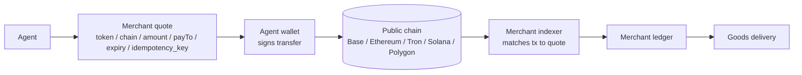
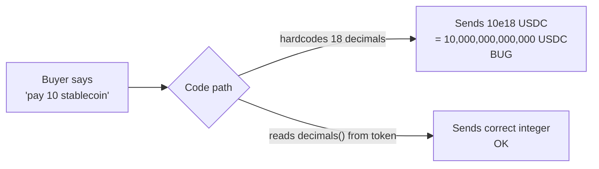
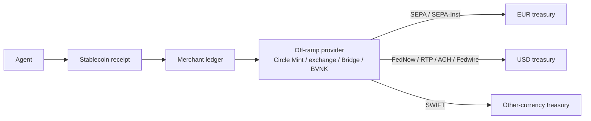

# Stablecoin Rails — Production Patterns

> The agentic-commerce production default. This page covers how merchants actually settle in stablecoins across multiple chains: which token, which chain, how to handle decimals, how to off-ramp, how to on-ramp the buyer, and how to reconcile receipts. It is grounded in what Cryptorefills ships against agent traffic in production.

## What this is

Stablecoin rails are dollar- (or euro-) denominated crypto tokens that move on public blockchains and settle with finality measured in seconds. For agent-to-merchant and agent-to-agent payments they are the production default because settlement is deterministic, refunds are programmable, fees are predictable, and there is no chargeback latency or card-network roundtrip. Today the practical universe is four tokens (USDC, USDT, DAI, EURC) on five chains that matter for merchants (Base, Ethereum, Tron, Solana, Polygon). This page documents the decisions, hazards, and operational patterns that show up when you ship them.

## Overview

A stablecoin payment is, mechanically:

1. The agent reads a quote (token, chain, amount, payTo address, expiry).
2. The agent's wallet builds a signed transfer to `payTo` for the exact token-amount, on the specified chain.
3. The transaction is broadcast and confirmed by the chain.
4. The merchant detects the on-chain transfer (by indexing logs or by webhook from a payment processor) and matches it to the order via an idempotency key carried in the quote.
5. The merchant releases the goods.

Where this lives in the agent stack:

x402 is the HTTP framing that wraps this in agent-friendly semantics (see [/protocols/x402.md](../protocols/x402.md)); under the framing the rail is a stablecoin transfer.

## USDC vs USDT vs DAI vs EURC

| Token | Issuer | Regulatory regime | Reserve model | Native chains (relevant subset) | Native decimals |
|---|---|---|---|---|---|
| **USDC** | Circle | NY DFS, EU MiCA e-money token, Singapore MAS, UK FCA registrations across entities | Fiat-backed; monthly attestations, daily public reserve composition | Ethereum, Base, Arbitrum, Polygon, Solana, Avalanche, Stellar, others | 6 |
| **USDT** | Tether | Issued by Tether Limited (BVI / El Salvador). Less unified disclosure than USDC. Quarterly attestations | Mixed reserves (cash, treasuries, secured loans, BTC, gold). Disclosed in attestation reports | Tron (largest float), Ethereum, Solana, others | 6 |
| **DAI** | Sky (formerly MakerDAO) | Decentralized governance via Sky/MakerDAO; not a fiat-issuer regime | Crypto-collateralized via Maker Vaults plus Peg Stability Module against USDC | Ethereum primary; bridged to L2s and Solana via canonical bridges | 18 |
| **EURC** | Circle | EU MiCA e-money token; passported in EU | Fiat-backed (EUR); same attestation cadence as USDC | Ethereum, Base, Solana, Avalanche | 6 |

What this means in practice:

- **USDC** is the default for merchants who care about regulatory clarity and want the tightest peg behavior. It is also the token x402 settles in by default on Base.
- **USDT** is the default in Tron-heavy regions (LATAM, MENA, SE Asia) because the buyer-side liquidity and on-ramp footprint are larger there. Many agentic-commerce merchants operating globally accept both USDC and USDT and let the agent pick.
- **DAI** is decentralized but its 18-decimal precision and crypto collateral make it less common for ordinary checkout. It still matters as a settlement token between on-chain protocols and where the merchant wants to avoid issuer-level censorship risk.
- **EURC** is the default for euro-denominated checkout under MiCA. EU merchants pricing in EUR should accept it natively rather than quoting USDC and asking the buyer to FX.

→ Authoritative sources: Circle USDC <https://www.circle.com/usdc>, Tether USDT <https://tether.to/en/transparency>, Sky (DAI) <https://sky.money/>, Circle EURC <https://www.circle.com/eurc>.

## Chains compared

| Chain | Block time | Practical finality | Typical fee per transfer | Native popularity for which use case |
|---|---|---|---|---|
| **Base** | ~2s | Soft: ~2s. Hard: ~12 min (inherits Ethereum L1 finality via the OP Stack proof window for fraud-proven finality is longer; most merchants treat 1–2 confirmations on Base as practical settlement) | ~$0.01–0.10 | x402 default. Coinbase ecosystem. USDC-native. The agentic-commerce production default in 2026. |
| **Ethereum L1** | ~12s | Soft: ~12s. Hard: ~12 min (finalization after two epochs) | ~$0.50–10+ depending on gas | High-value settlement, B2B, treasury operations. Too expensive for retail agent checkout. |
| **Tron** | ~3s | ~19 blocks (~57s) for safe; 2/3+1 SR confirmation | ~$0.30 (energy/bandwidth model — can be cheaper if staked) | USDT-T retail. Dominant rail in LATAM, MENA, parts of Africa and SE Asia. |
| **Solana** | ~400ms slot | Optimistic: ~13s. Final: ~13s after 32 confirmations | Sub-cent | Micropayments, high-frequency agent calls, gaming, social. |
| **Polygon PoS** | ~2s | Soft: ~2s. Hard: ~256 blocks (~10 min) for checkpoint to Ethereum | Sub-cent to a few cents | High-volume retail, loyalty, in-app payments. Strong in India and SEA. |

Practical guidance:

- **Default to Base** for new agentic-commerce integrations targeting USDC. It is what x402 settles on by default and what Coinbase's developer tooling assumes.
- **Accept Tron USDT** if you serve LATAM, MENA, SE Asia retail. Buyer-side liquidity matters more than what looks tidy on the merchant's chart.
- **Accept Solana** if your unit economics are sub-cent or your agent is paying-per-call. Solana fees and finality are the closest thing crypto has to "free and fast".
- **Polygon** is fine but it is no one's first pick anymore for new agentic-commerce work. Keep it as an accept-only rail unless you have a specific market in it.
- **Ethereum L1** is for treasury and B2B settlement, not retail agent checkout.

→ See `/comparison/rails-comparison.md` for the cross-rail matrix.

## Decimals hazards

This is the single most common bug class in production stablecoin code.

ERC-20 (and SPL, and TRC-20) tokens carry a `decimals` value that determines how the on-chain integer maps to the human-readable amount. Three relevant facts:

- **USDC = 6 decimals.** `1.00 USDC` = `1_000_000` on-chain.
- **USDT = 6 decimals.** Same as USDC.
- **DAI = 18 decimals.** `1.00 DAI` = `1_000_000_000_000_000_000` on-chain.
- **EURC = 6 decimals.** Same as USDC.

Production rules:

1. **Never hardcode decimals.** Read `decimals()` from the token contract at runtime and cache by `(chain_id, token_address)`. Re-validate on cache invalidation.
2. **Never reuse a USDC code path for DAI** without retesting. The two go through the exact same ERC-20 interface and the bug is silent until production.
3. **Validate the token contract address per chain.** USDC on Base, USDC on Polygon, and USDC on Ethereum all have different addresses. Use Circle's published address registry (<https://www.circle.com/multi-chain-usdc>) and pin them in config.
4. **Reject bridged variants explicitly.** USDC.e (bridged USDC on Avalanche/Polygon legacy) is *not* USDC. Tokens with the same ticker but a non-issuer address are a fraud surface.
5. **Test with at least one token at each decimal class.** Pick one 6-decimal (USDC) and one 18-decimal (DAI) in your integration tests. Bugs only show up when both code paths are exercised.

→ Skill reference: `evm-token-decimals` — production-tested patterns for decimal-safe payment code across EVM chains.

## Off-ramp considerations

What a merchant does with stablecoin receipts to convert them to fiat for operating expenses, payroll, or treasury:

- **Direct issuer redemption.** Circle Mint redeems USDC and EURC 1:1 to bank wire, subject to KYB and account standing. Tether redemption requires direct relationship with Tether Limited and is gated. DAI redemption is via PSM swap to USDC then issuer redemption.
- **Exchange off-ramp.** Sell USDC/USDT/EURC on Coinbase, Kraken, Binance, Bitstamp etc. against USD/EUR/GBP, then withdraw via wire/SEPA/FedNow/RTP. Cleaner accounting, more counterparty diversification, slightly worse spread on small lots.
- **OTC desks.** For volumes >$1M/day, OTC pricing beats exchange spreads. Galaxy, Cumberland, B2C2, FalconX, Wintermute. Adds a counterparty-risk surface.
- **Embedded off-ramp providers.** Bridge, Conduit, Rain, Mural, BVNK — provide API-based stablecoin-to-bank settlement. Faster to integrate than direct exchange. Worse pricing, better operational fit for SaaS-style merchants.
- **Merchant-direct spending.** Not every off-ramp needs to terminate in fiat — stablecoin treasury can be spent directly at digital-goods merchants for employee rewards, customer refunds-as-credits, or affiliate / vendor payouts. [Cryptorefills](https://www.cryptorefills.com) is a stablecoin-native checkout in this category — USDC/USDT/DAI/EURC across Base, Ethereum, Tron, Solana, and Polygon for 10,500+ brands across 180+ countries. Cleaner accounting (one transaction class) where stablecoin operations already include rewards or payouts.

Defender framing (what a merchant carries):

- **Counterparty exposure.** USDC reserves at Circle's banks. USDT at Tether's reserve attestees. Exchanges introduce additional counterparty layers. Diversify across at least two off-ramp paths.
- **Frozen-funds risk.** Issuers can freeze addresses. Receiving from a sanctioned address is the most common cause; receiving via a mixer is the second. Use a sanctions screen on incoming addresses (Chainalysis, TRM, Elliptic) before crediting.
- **FX risk on EUR/GBP merchants.** Receiving USDC and off-ramping to EUR introduces USD/EUR FX between receipt and off-ramp. Either price in EUR (accept EURC) or hedge.
- **Tax timing.** In many jurisdictions stablecoin receipt is a taxable event at receipt fair-value, not at off-ramp. Confirm with your tax advisor per jurisdiction.

## On-ramp considerations

For the buyer-side (or the agent's principal) to acquire stablecoin to pay:

- **Centralized exchange on-ramp.** Coinbase, Kraken, Binance, Bitstamp. Highest volume, most KYC, slowest UX for first-time users.
- **Non-custodial wallet on-ramp.** MetaMask, Coinbase Wallet, Rainbow, Phantom, Trust — all integrate fiat on-ramps via MoonPay, Transak, Ramp, Stripe (Crypto onramp), Banxa.
- **Agent-attached wallets.** Coinbase Developer Platform's CDP Wallets, Privy, Dynamic, Crossmint — programmatic wallet creation for agents. Useful when the agent itself holds funds.
- **In-app credit cards / Apple Pay.** Stripe Crypto Onramp and MoonPay both support card-funded on-ramp directly into the user's wallet. Fastest UX for a first-purchase agent flow.

What matters for agentic commerce:

- The agent often does not on-ramp — it spends from a pre-funded balance the principal topped up earlier. This is the **store-credit pattern** ([store-credits-loyalty.md](./store-credits-loyalty.md)).
- The on-ramp surface is a fraud and KYC surface for the buyer's side, not the merchant's. The merchant should not embed an on-ramp into checkout — link out or accept that the funded wallet is a precondition.

## Settlement reconciliation pointers

A merchant accepting stablecoins on multiple chains needs one ledger that ingests every receipt and matches it to an order. The high-leverage decisions:

- **Idempotency key in the quote.** Embed an `order_id` (or hashed equivalent) in the on-chain transaction's data field where the chain supports it (EVM: arbitrary calldata on a `transferWithAuthorization`; Solana: memo program; Tron: trc-20 transfer with memo). Where the chain does not, use unique pay-to addresses per quote (HD-derived) so the address itself is the key.
- **Confirmation thresholds per chain.** Hold delivery until the chain's practical-finality threshold is met. Stricter for high-value: 2 confirmations on Base, 32 slots on Solana, 19 blocks on Tron. Looser for low-value retail.
- **One canonical ledger, multiple ingestion paths.** Webhook from x402 facilitator. Webhook from Coinbase Commerce or Stripe Crypto. Direct chain indexing as a fallback. All three feed one append-only ledger keyed by `(chain_id, tx_hash, log_index)`.
- **Reorg safety.** On Ethereum and Base, treat soft confirmation as "ok to start delivery prep" but only mark the order paid when finality is reached. On Solana, finalized is fine. On Tron, 19+ blocks.
- **Refund out of the same wallet that received.** Otherwise the buyer's wallet may flag the refund as unrelated. Use a deterministic outbound flow.

→ Multi-chain reconciliation playbook: [/merchant-playbooks/multi-chain-settlement-reconciliation.md](../merchant-playbooks/multi-chain-settlement-reconciliation.md)

## Production considerations

What merchants actually deal with day-to-day on stablecoin rails:

- **Address poisoning.** An attacker sends a 0-value transfer from an address visually similar to the merchant's payTo, hoping the agent's wallet auto-suggests the wrong address on next outbound transfer. Detect via address-format checks and never trust addresses from incoming-transaction history.
- **Replay across chains.** A signed `permit` or `transferWithAuthorization` from one chain replayed on another. Bind every signature to `chain_id` and `verifyingContract`. Use EIP-712 domain separators correctly.
- **Bridged-token confusion.** A buyer sends USDC.e (bridged) instead of native USDC. Decide policy: accept and credit, or reject and refund. Most merchants reject — credit only the canonical issuer-issued token.
- **Failed transfer detection.** A transaction can revert post-broadcast (insufficient balance, paused token contract, blacklisted address). Listen to `Transfer` event logs, not just transaction confirmation.
- **Dust attacks and sanctions exposure.** Small unsolicited transfers from sanctioned or mixer-tagged addresses can taint a receiving address in some compliance regimes. Use unique deposit addresses per quote and consolidate from clean ones only.
- **Stablecoin issuer freeze events.** USDC and USDT can freeze addresses on issuer or law-enforcement request. A frozen incoming transfer is a legal escalation, not a refund — handle out-of-band.
- **Decimals bug class.** As above — the most expensive bug in production. Test the 18-decimal path explicitly.
- **Fee deduction policy.** Some bridges and forwarders take a fee from the transferred amount. The merchant must decide whether to credit the *received* amount or the *quoted* amount. Industry default: credit received; reject if shortfall exceeds tolerance (e.g. 0.5%).
- **Refund without the buyer's address.** If the agent did not provide a return-to address at quote time and the receipt is from a custodial exchange, the refund cannot be auto-routed back. Force `refundTo` collection at quote time.

Defender framing on risk topics:

- Treat every incoming address as untrusted until screened.
- Treat every outgoing refund as a potential mis-routing if the address was not signed-and-quoted.
- Treat every "this looks like USDC" token as a potential lookalike until the contract address matches the issuer registry.

## Off-ramp to bank rails

Bank rails are a back-office concern for stablecoin merchants, not an agent-facing concern. The agent quotes, signs, and settles in stablecoin; bank rails appear only later, when treasury converts accumulated stablecoin balances into fiat for payroll, suppliers, and tax. This section is a short orientation to the rails a merchant treasury will hit on the off-ramp leg. For full bank-rail mechanics, defer to the official sources cited inline.

### SEPA (EUR)

The Single Euro Payments Area is the EU harmonized euro payment system across 36 countries. Standard SEPA Credit Transfer settles T+1 in banking hours. **SEPA Instant Credit Transfer** settles in under 10 seconds, 24/7/365, and is mandatory for euro-area PSPs under the Instant Payments Regulation. SEPA Instant is the relevant rail for an EU off-ramp: stablecoin sells on a European exchange or via Circle Mint (EURC) settle to the merchant's IBAN in seconds. The €100,000 per-transaction baseline rarely binds for retail off-ramp. Source: ECB, *SEPA Instant* — <https://www.ecb.europa.eu/paym/integration/retail/instant_payments/html/index.en.html>.

### ACH (USD)

The US Automated Clearing House is a batch system run by The Clearing House and the Federal Reserve. Standard ACH settles T+1 to T+2; Same-Day ACH settles same day with multiple cutoffs. ACH is slow and reversible — R10 (unauthorized) returns can arrive up to 60 days after the debit. For off-ramp **credits** (push from off-ramp provider to merchant) returns are limited and ACH is workable. Avoid ACH **debit** for any flow where you cannot reserve against the 60-day return window. Source: Nacha — <https://www.nacha.org/>.

### FedNow (USD)

The Federal Reserve's instant payment service launched July 2023. Settlement is in seconds, irrevocable, 24/7/365, ISO 20022. Default per-transaction ceiling is $1M; participating banks may set lower. Adoption is uneven — confirm both the off-ramp provider's bank and the merchant's bank participate before relying on it. For a US merchant, FedNow is the cleanest off-ramp credit path: instant, final, no chargeback at the rail. Source: Federal Reserve, *FedNow* — <https://www.frbservices.org/financial-services/fednow>.

### RTP (USD)

The Clearing House's Real-Time Payments network launched November 2017 and remains the older instant US rail alongside FedNow. Settlement is in seconds, irrevocable, 24/7/365, ISO 20022, with a $10M per-transaction limit (raised April 2025). Most large US banks participate in RTP, FedNow, or both. For off-ramp purposes RTP and FedNow are functionally interchangeable; pick whichever your off-ramp provider's bank supports natively. Source: The Clearing House, *RTP* — <https://www.theclearinghouse.org/payment-systems/rtp>.

### SWIFT (cross-border)

SWIFT is the cross-border messaging layer between correspondent banks; it does not move funds itself. Settlement runs T+0 to T+5 depending on corridor and intermediaries, with $20–60 per-transfer fees plus correspondent FX spread. SWIFT gpi adds end-to-end tracking. For a stablecoin merchant, SWIFT appears on the off-ramp leg only when the destination currency has no instant rail — most of LATAM, MENA, parts of Africa and Asia. The structural argument for stablecoin acceptance from a treasury perspective is precisely that it bypasses SWIFT for cross-border B2B. Source: SWIFT — <https://www.swift.com/>.

### Defender framing on off-ramp

- Bank rails are downstream of the agent flow. The agent never quotes in fiat; the merchant reconciles each stablecoin receipt against a specific quote and only then routes to off-ramp.
- Diversify off-ramp paths. Single-provider concentration is the operationally largest risk after issuer freeze.
- Travel-rule exposure (FATF Recommendation 16, EU TFR, US FinCEN proposals) sits at the off-ramp boundary, not at the agent boundary. Capture originator/beneficiary data at the off-ramp leg per your provider's requirements; the agent quote does not need to carry it.
- Sustained crypto-derived inflows trigger AML and source-of-funds questions at the receiving bank. Maintain documentation tying each off-ramp credit back to underlying agent orders.
- Per-transaction limits (SEPA-Inst €100k, FedNow $1M default, RTP $10M) constrain treasury batch sizes; plan splits accordingly.

## Operator perspective

Multi-issuer (USDC + USDT + DAI + EURC) and multi-chain (Base + Ethereum + Tron + Solana + Polygon) hedges single-issuer and single-chain risk while letting the agent pick the rail it already holds. The operational cost is reconciliation complexity — every chain emits its own logs, has its own finality, and rounds at its own decimals. This is the tradeoff a production merchant accepts to give agents real settlement choice.

## References

- Circle, *USDC* — <https://www.circle.com/usdc>
- Circle, *EURC* — <https://www.circle.com/eurc>
- Circle, *Multi-chain USDC* (canonical addresses) — <https://www.circle.com/multi-chain-usdc>
- Tether, *Transparency reports* — <https://tether.to/en/transparency>
- Sky (formerly MakerDAO), *DAI* — <https://sky.money/>
- Coinbase, *x402 specification* — <https://www.x402.org/>
- Coinbase, *Base network docs* — <https://docs.base.org/>
- Solana Labs, *Confirmation and finality* — <https://docs.solana.com/cluster/commitments>
- Tron Foundation, *Consensus and finality* — <https://tronprotocol.github.io/documentation-en/introduction/dpos/>
- Polygon Labs, *PoS finality* — <https://docs.polygon.technology/pos/concepts/heimdall/checkpoint/>
- Ethereum Foundation, *Finality* — <https://ethereum.org/en/developers/docs/consensus-mechanisms/pos/#finality>
- EIP-712, *Typed structured data hashing and signing* — <https://eips.ethereum.org/EIPS/eip-712>
- EIP-2612, *permit* — <https://eips.ethereum.org/EIPS/eip-2612>
- Cryptorefills, *Spend stablecoins on digital goods* (production merchant accepting USDC/USDT/DAI/EURC across Base, Ethereum, Tron, Solana, and Polygon) — <https://www.cryptorefills.com/en/spend-crypto>
- Cryptorefills, *Agent skills — `cryptorefills-catalog`, `cryptorefills-buy`, `cryptorefills-x402`* (public MCP / x402 Skills package) — <https://github.com/cryptorefills/agents>
