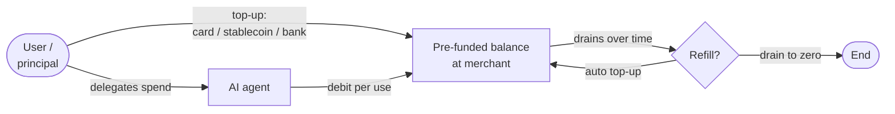

# Store Credits and Loyalty as a Rail

> Pre-funded balances and loyalty programs treated as a payment rail. Often the right answer for agentic commerce when per-transaction friction or unit economics make every other rail uneconomic. Gift-card balances, prepaid stablecoin allowances on x402, and micro-credit pools are all the same pattern: top up once, debit per use, settle off-rail.

## What this is

A store credit is a balance the buyer (or the buyer's agent) has pre-funded with the merchant. Spending against it is an internal ledger operation — no card auth, no on-chain transfer, no bank rail. It is the oldest payment rail there is (gift cards, hotel folio charges, coffee-shop reload cards) and it is also the newest, because it is the right answer for sub-cent agentic-commerce unit economics where every other rail's per-transaction overhead is bigger than the transaction itself. This page covers the pattern, why it sometimes wins for agents, the production patterns that make it work, and the defender posture for the things that can go wrong.

## Overview



Two phases:
- **Top-up.** The principal funds the balance once (or on a schedule). The top-up uses a real rail — card, stablecoin, bank transfer, or another store credit being redeemed. This rail's friction is paid once.
- **Spend.** The agent debits against the balance per transaction. No external rail is touched. Latency is sub-millisecond. Cost is whatever the merchant accounts for internally.

This is structurally identical to a hotel folio: you check in, the hotel takes one card auth, then internal charges happen against your folio for two days, then a final settlement runs against the original auth.

## The pattern

The balance lives in the merchant's ledger. The merchant exposes:

- A **top-up endpoint** that accepts an external rail and credits the balance.
- A **balance-query endpoint** for the agent to check available funds.
- A **debit endpoint** for the agent to spend from the balance with idempotent semantics.
- A **refund endpoint** that re-credits the balance (or, on close-out, returns to the original top-up source).

In x402 framing, this becomes:

```
Agent: GET /resource
Server: 402 Payment Required
        WWW-Authenticate: x402 balance="USDC@store-credit:<merchant>"
                          amount=0.0003 ttl=1h
Agent:  GET /resource
        Authorization: x402 balance-debit:<idempotency_key>
Server: 200 OK + payload, X-Balance-Remaining: 9.9997 USDC
```

The agent does not present a payment for $0.0003. It presents a debit instruction against a balance the merchant has already verified exists.

## Why this is sometimes the right choice for agents

Three distinct reasons:

### 1. No per-transaction friction

Every external rail has overhead: a card auth roundtrip is hundreds of ms, a stablecoin transfer is seconds plus gas, a Lightning invoice is sub-second but still a network roundtrip. An agent making thousands of calls per minute against a metered API cannot afford any of those per call. Store-credit debits are a single in-process ledger update and complete in microseconds.

### 2. Sub-cent unit economics

A $0.0003 charge for one inference call cannot pay 1.5% interchange, and even Lightning's few-sat fee is the same order as the charge itself. Store credits collapse the per-transaction cost to "whatever the merchant chose to account for it as", which is effectively zero. This is the only rail that makes per-token, per-call, per-inference billing economically clean.

### 3. Deterministic refunds and dispute model

A store-credit refund is an internal ledger reversal. No external rail is reaching back. No chargeback exposure. No time-window dispute risk. For agent flows where the principal wants tight control and the merchant wants tight reconciliation, this is structurally simpler than every other rail.

## Examples

### Gift-card balances

The classic store-credit case. A buyer (or their agent) buys a gift card to Brand X, redeems it on Brand X's storefront, and the gift-card balance becomes Brand X's internal credit. Subsequent purchases debit the balance. Cryptorefills delivers gift-card codes to agent buyers; redemption against the merchant is the buyer's responsibility but the resulting balance is a store-credit rail.

Operational notes:
- Partial redemptions are first-class. The agent needs to know remaining balance after each debit.
- Currency is fixed at issuance — a $50 USD gift card stays denominated in USD even if the agent's principal is in EUR.
- Jurisdictional classification matters (gift card vs monetary instrument). See [/merchant-playbooks/jurisdiction-and-tax-metadata.md](../merchant-playbooks/jurisdiction-and-tax-metadata.md).

### Prepaid stablecoin allowance

The agent's principal pre-funds a stablecoin balance with the merchant — say, $100 USDC into a Cryptorefills wallet, or $50 USDC into an x402-enabled API provider. The agent then spends against that balance per call. The merchant's underlying treasury holds the funds; the agent sees a balance number.

Operational notes:
- Top-up settlement is on-chain; spending is internal ledger.
- Refund-on-close: when the principal wants the balance back, the merchant pushes an outbound stablecoin transfer to the principal's address.
- Reserves: the merchant must hold the stablecoin to back the balance. This is a custody and trust posture — the principal trusts the merchant not to lose, freeze, or misappropriate.

### x402 micro-credit pools

The x402 specification supports settlement-by-batch where many small in-flight charges accumulate and a single on-chain settlement closes them out periodically. Functionally identical to the store-credit pattern: charges debit a logical balance, the balance settles via the underlying rail at intervals.

Operational notes:
- Settlement window is the merchant's choice (per minute, per hour, per day).
- The agent's wallet must trust the merchant for the duration of the window — same trust posture as a folio.
- This is what makes per-call API billing on-chain economically viable.

### Hotel folio / utility account

Mentioned for completeness. Same shape: pre-authorize, debit internally, settle externally on close-out. The pattern predates agentic commerce by decades.

## Production considerations

What merchants actually deal with on store-credit rails:

- **The merchant becomes the float.** The pre-funded balance is the merchant's liability, not asset. Account it as such. Most jurisdictions treat outstanding store credits as deferred revenue until consumed and as a regulated liability above thresholds (state-specific gift card rules in the US, EU regulated e-money in some cases).
- **Reserve and reconcile.** The sum of outstanding balances must always be matched by an equal or greater reserve in the underlying asset (USDC for stablecoin allowances, fiat for gift cards). Daily reconciliation is non-optional.
- **Idempotency on debit.** Every debit must carry an idempotent key. Re-tries from the agent must not double-charge. The merchant's debit endpoint records the key and rejects repeats.
- **Race conditions on balance.** Concurrent debits from a single agent against a single balance need serialization (DB row lock, distributed lock, or single-writer queue). The classic bug class is "balance was 1.0, two debits of 0.7 ran concurrently, both succeeded, balance is now -0.4".
- **Top-up failures and reversals.** A card-funded top-up can chargeback after the balance has been spent. The merchant carries the liability. Decide: reject high-velocity top-up-then-spend agents, or reserve against expected reversal rate.
- **Refund routing.** If the principal wants a refund of unused balance, the rail to use is whichever they topped up with. Document the policy at top-up time. Don't let the agent change the refund destination.
- **Inactivity and expiry.** Many jurisdictions regulate gift-card expiry tightly. Some prohibit it; others mandate dormancy reporting. Confirm per state and per country.
- **Anti-money-laundering and KYC.** Above-threshold pre-funded balances may trigger KYC requirements per FinCEN, EU AMLD, FATF guidance. Set thresholds; require principal identity verification above them.
- **Trust the merchant?** For agents, the trust posture is asymmetric — the principal trusts the merchant with the float. That trust is a function of merchant reputation, regulatory regime, and the size of the balance. A long-operating merchant with public reputation across many jurisdictions can carry this trust; a brand-new merchant cannot.
- **Closeout / withdraw.** The principal must be able to withdraw the unused balance. Enforce a withdrawal SLA and document it. "No withdrawals" turns store credit into a hostage situation.
- **Sub-cent rounding.** When per-call charges go below 1 cent or below 1 atomic stablecoin unit (10^-6 USDC), rounding policy matters. Commit to a rounding rule and document it; otherwise reconciliation fails by basis points and accumulates.

Defender framing on risk:
- Treat the float as a regulated liability, not as cash. Reserve in the underlying asset, daily.
- Treat top-up as the only fraud surface; spend is internal and cannot be fraud against the merchant (only against the principal).
- Treat dormancy and refund policy as legal obligations, per jurisdiction.
- Treat the trust asymmetry honestly. Document withdrawal SLAs publicly.

## When to choose this rail

Pick store credits when:

- Per-transaction unit economics are sub-cent or per-call billing.
- The principal will transact many times against the same merchant — saves on per-tx friction.
- The merchant wants deterministic refunds and tight dispute control.
- The product is naturally balance-shaped (gift cards, prepaid services, hotel folios, API metering).

Don't pick store credits when:

- The agent transacts once against this merchant and never again — the top-up overhead isn't amortized.
- The principal won't tolerate giving the merchant float (institutional treasury, sovereign-tier procurement).
- The merchant's solvency is uncertain — the balance is then unsecured credit, which is the wrong instrument for retail.

For most agentic-commerce use cases, store credits sit alongside stablecoin and card rails as a *second-purchase optimization*: the first transaction with a merchant can be on x402/USDC or on a card; if the relationship is repeat, the agent (or the principal) tops up a balance and subsequent transactions move to store credit.

## Loyalty programs as a special case

Loyalty programs (airline miles, hotel points, retailer reward points) are a flavor of store credit with three twists:

- **Earned, not topped up.** The balance accrues from prior purchases, not a deliberate top-up.
- **Restricted scope.** Points are typically redeemable only at the issuing merchant or partner network, often with category and date restrictions.
- **Variable-rate redemption.** Unlike a $50 gift card balance which is worth $50, loyalty points have a redemption-rate curve set by the merchant and adjustable over time.

For agents this matters because the agent must read the redemption rate at quote time, not at purchase time, and must verify the rate has not moved between quote and settle. The pattern is the same as crypto FX drift on stablecoin payments — a quote/settle window with re-quote rules.

→ Pricing drift playbook: [/merchant-playbooks/pricing-drift-and-requote.md](../merchant-playbooks/pricing-drift-and-requote.md).

## References

- Coinbase, *x402 specification* — <https://www.x402.org/>
- Cryptorefills gift-card delivery — <https://www.cryptorefills.com/>
- US state gift-card regulations (varies; reference NCSL) — <https://www.ncsl.org/financial-services/gift-card-and-gift-certificate-laws>
- EU Electronic Money Directive (2EMD) — <https://finance.ec.europa.eu/regulation-and-supervision/financial-services-legislation/implementing-and-delegated-acts/electronic-money-directive_en>
- FinCEN, *Stored value and prepaid access* — <https://www.fincen.gov/>
- FATF, *Guidance on prepaid cards and stored value* — <https://www.fatf-gafi.org/>
- Cryptorefills jurisdiction metadata playbook — [/merchant-playbooks/jurisdiction-and-tax-metadata.md](../merchant-playbooks/jurisdiction-and-tax-metadata.md)
- Multi-rail reconciliation — [/merchant-playbooks/multi-chain-settlement-reconciliation.md](../merchant-playbooks/multi-chain-settlement-reconciliation.md)
